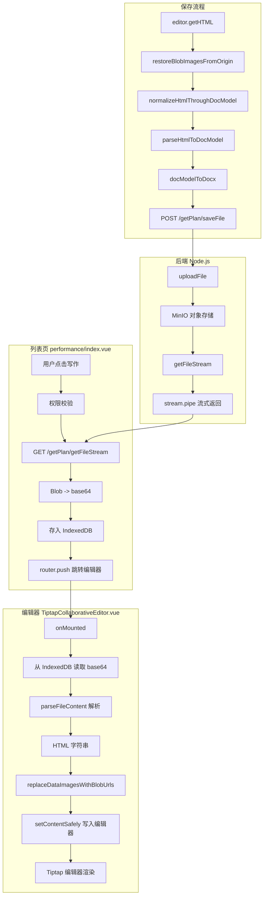
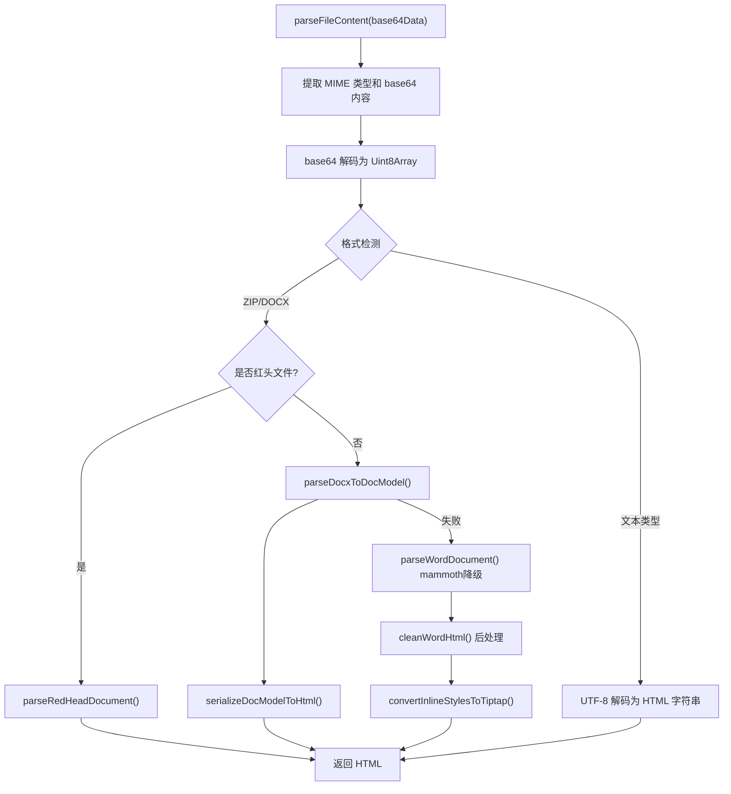
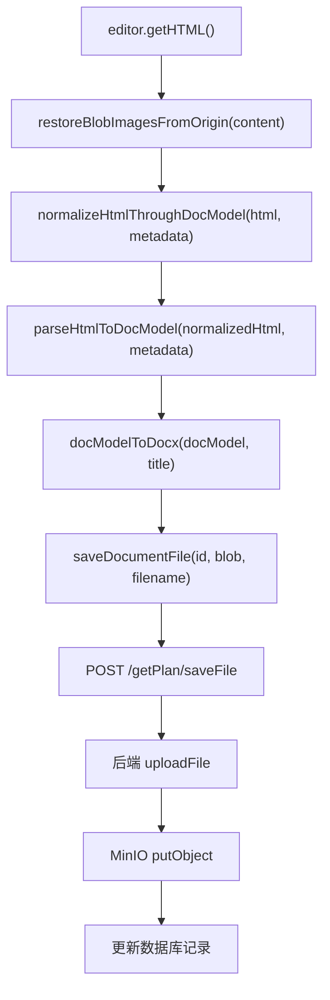

# 演训方案保存与获取文件流详细链路分析

## 一、整体架构概览




---

## 二、获取文件流链路（列表页 -> 编辑器展示）

### 阶段 1：列表页触发文件流下载

**入口**: [performance/index.vue](src/views/training/performance/index.vue) `handleEdit` 函数（行 695-815）

```
用户点击"写作" -> handleEdit(row)
  1. 权限校验: PerformanceApi.checkWritePermission({ id, userId })
     - API: POST /getPlan/getPermissionCheck
  2. 获取文件流: PerformanceApi.getFileStream(row.id)
     - API: GET /getPlan/getFileStream?id={id}
     - 返回: Blob 对象
  3. 转换: blobToBase64(blob) -> data URL 格式的 base64 字符串
  4. 缓存: saveDocContent(row.id, base64Content) -> IndexedDB
  5. 文档信息: sessionStorage.setItem(`doc_info_${row.id}`, JSON.stringify(documentInfo))
  6. 路由跳转: router.push({ name: 'DocumentEdit', params: { id: row.id } })
```

**关键 API 定义**: [src/api/training/index.ts](src/api/training/index.ts) 行 118-140

```typescript
getFileStream: async (id: string): Promise<Blob | null> => {
  const response = await javaRequest.download('/getPlan/getFileStream', { id })
  // 处理 JSON 错误响应 vs 二进制 Blob
  return response instanceof Blob && response.size > 0 ? response : null
}
```

### 阶段 2：后端文件流处理

**路由**: [collabedit-node-backend/src/routes/training.ts](../collabedit-node-backend/src/routes/training.ts) 行 83-141

```
GET /getPlan/getFileStream?id={id}
  1. 查询演训记录 -> 获取 plan.fileId
  2. fileService.getFileStream(plan.fileId)
     -> 从 MinIO 获取文件流 (getObject)
  3. 设置响应头 Content-Type / Content-Disposition
  4. stream.pipe(res) 流式返回
```

**文件服务**: [collabedit-node-backend/src/services/file.service.ts](../collabedit-node-backend/src/services/file.service.ts) 行 137-142

```typescript
export const getFileStream = async (fileId: string) => {
  const file = await prisma.fileObject.findUnique({ where: { id: fileId } })
  if (!file) return null
  const stream = await minioClient.getObject(file.bucket, file.objectKey)
  return { file, stream }
}
```

### 阶段 3：编辑器加载与解析

**入口**: [TiptapCollaborativeEditor.vue](src/views/training/document/TiptapCollaborativeEditor.vue) `onMounted`（行 1330-1432）

```
onMounted
  1. getDocContent(documentId) -> 从 IndexedDB 读取 base64 缓存
  2. parseFileContent(cachedContent) -> 解析为 HTML
  3. preloadedContent.value = parsedContent
  4. shouldDelayCollaborationConnect = true (延迟协同连接)
  5. tryApplyPreloadedContent()
  6. loadDocument() -> 从 sessionStorage 加载文档信息
  7. initCollaboration({ autoConnect: false })
  8. 4秒超时保护 -> 强制连接协同
```

**IndexedDB 读取**: [docStorage.ts](src/views/utils/docStorage.ts) `getDocContent`（行 73-106）

- 数据库: `doc_storage_db`，对象存储: `doc_contents`
- 存储键: `doc_content_{docId}`
- 过期时间: 20 分钟

### 阶段 4：文件流解析管道

**入口**: [wordParser.pipeline.ts](src/views/training/document/utils/wordParser.pipeline.ts) `parseFileContent`（行 32-232）




**解析策略优先级**:

1. 红头文件检测 -> `parseRedHeadDocument`
2. DocModel 解析 -> `parseDocxToDocModel` + `serializeDocModelToHtml`
3. Mammoth 降级 -> `parseWordDocument`（mammoth.convertToHtml）

**Mammoth 解析器**: [wordParser.mammoth.ts](src/views/training/document/utils/wordParser.mammoth.ts)（行 73-171）

- 加载 mammoth 库动态导入
- 使用 `mammothStyleMap` 映射标题样式
- 图片处理: 图片转 base64 data URL
- 后处理: `cleanWordHtml` + `convertLargeFontParagraphsToHeadings` + `convertInlineStylesToTiptap`

### 阶段 5：内容应用到编辑器

**函数链**:

1. `tryApplyPreloadedContent`（行 983-988）-- 前置条件检查
2. `applyPreloadedContent`（行 990-1165）-- 实际应用逻辑

`**applyPreloadedContent` 核心流程**:

```
preloadedContent.value (HTML字符串)
  -> normalizePreloadedHtml(content) -- 规范化预加载 HTML
  -> sanitizeImagesIfNeeded(normalizedContent, 'preload') -- 清理图片
  -> replaceDataImagesWithBlobUrls(safeContent) -- data URL -> blob URL
     (通过 ImageStore.replaceDataImagesWithBlobUrls)
     - 解析 HTML，找 
     - 将 data URL 转为 blob URL（优化内存）
     - 保存原始 data URL 到 data-origin-src 属性
  -> setContentSafely(contentWithBlobs, emitUpdate=true) -- 写入编辑器
  -> 200ms 后验证内容是否应用成功
     - 成功: preloadedApplied = true，连接协同
     - 样式丢失: 强制恢复样式
     - 失败: 最多重试 5 次，每次间隔 300ms
```

**关键条件判断**（是否应用预加载内容）:

- 编辑器为空（`<p></p>` 或纯空白）
- 预加载内容有样式但当前内容无样式 (`shouldForceApply`)
- 首次加载且当前文本长度 < 10

**协同连接时序**:

- 预加载内容成功应用后才连接协同（`connectProvider()`）
- 避免协同同步覆盖本地预加载内容
- 4 秒超时保护：即使预加载未应用也强制连接

### 阶段 6：图片处理

**ImageStore**: [imageStore.ts](src/views/training/document/utils/imageStore.ts)（行 3-91）

```
replaceDataImagesWithBlobUrls(html)
  - 查找所有 
  - 调用 createBlobUrlFromDataUrl(dataUrl)
    - 优先: normalizeDataImageUrl() + fetch() 创建 Blob
    - 降级: atob() 手动解码 + Uint8Array + new Blob()
  - 替换 src 为 blob URL
  - 将原始 data URL 保存到 data-origin-src 属性
  - 无效图片标记 data-image-invalid="true"
```

---

## 三、保存文档链路（编辑器 -> 后端）

### 触发方式

1. **手动保存**: 用户触发 `handleSave`
2. **自动保存**: `handleContentUpdate` -> 3 秒防抖 -> `performAutoSave` -> `handleSave`
  - 条件: 用户已编辑 (`hasUserEdited`) 且内容哈希有变化

### 保存流程

**函数**: `handleSave`（行 1176-1231）




**步骤详解**:

1. **获取 HTML**: `editorInstance.value.getHTML()` -- Tiptap 编辑器导出 HTML
2. **恢复图片**: `restoreBlobImagesFromOrigin(content)` -- blob URL -> data URL（使用 data-origin-src）
3. **HTML 规范化**: `normalizeHtmlThroughDocModel(html, { source: 'html', method: 'tiptap-html' })`
  - 内部: `parseHtmlToDocModel` -> `serializeDocModelToHtml`（往返转换，规范化结构）
4. **解析为 DocModel**: `parseHtmlToDocModel(normalizedHtml, metadata)` -- [htmlParser.ts](src/views/training/document/utils/docModel/htmlParser.ts) 行 397-443
5. **生成 DOCX**: `docModelToDocx(docModel, title)` -- DocModel -> 真实 .docx 文件 Blob
6. **上传保存**: `saveDocumentFile(id, blob, filename)` -- FormData POST

**后端上传**: [training.ts](../collabedit-node-backend/src/routes/training.ts) 行 144-161

```
POST /getPlan/saveFile (multipart/form-data)
  - multer 解析 file 字段
  - uploadFile(file, userId, existingFileId)
    -> MinIO putObject 上传
    -> 创建/更新 fileObject 数据库记录
    -> 如果是覆盖，创建 fileOverwriteLog
  - 更新演训记录的 fileId
```

---

## 四、关键文件清单


| 文件                                                                                         | 职责                          |
| ------------------------------------------------------------------------------------------ | --------------------------- |
| [performance/index.vue](src/views/training/performance/index.vue)                          | 列表页，文件流下载入口                 |
| [TiptapCollaborativeEditor.vue](src/views/training/document/TiptapCollaborativeEditor.vue) | 编辑器主组件，协调加载/保存              |
| [TiptapEditor.vue](src/views/training/document/components/TiptapEditor.vue)                | Tiptap 编辑器内核                |
| [wordParser.pipeline.ts](src/views/training/document/utils/wordParser.pipeline.ts)         | 文件解析管道入口                    |
| [wordParser.mammoth.ts](src/views/training/document/utils/wordParser.mammoth.ts)           | Mammoth 降级解析器               |
| [htmlParser.ts](src/views/training/document/utils/docModel/htmlParser.ts)                  | HTML -> DocModel 解析         |
| [serializer.ts](src/views/training/document/utils/docModel/serializer.ts)                  | DocModel -> HTML 序列化        |
| [imageStore.ts](src/views/training/document/utils/imageStore.ts)                           | 图片 data URL <-> blob URL 管理 |
| [docStorage.ts](src/views/utils/docStorage.ts)                                             | IndexedDB 文档缓存              |
| [fileUtils.ts](src/views/utils/fileUtils.ts)                                               | 文件转换工具集                     |
| [documentApi.ts](src/views/training/document/api/documentApi.ts)                           | 文档保存 API                    |
| [ExportToolbar.vue](src/views/training/document/components/toolbar/ExportToolbar.vue)      | 客户端导出功能                     |
| [training.ts (后端)](../collabedit-node-backend/src/routes/training.ts)                      | 后端 API 路由                   |
| [file.service.ts (后端)](../collabedit-node-backend/src/services/file.service.ts)            | MinIO 文件服务                  |


---

## 五、获取文件流解析展示链路关键修改点

后续如需修改"获取文件流解析后展示在编辑器中"的链路，需关注以下关键节点：

1. **API 层** (`src/api/training/index.ts` `getFileStream`): Blob 获取方式
2. **缓存层** (`docStorage.ts`): IndexedDB 存取策略（base64 格式）
3. **解析层** (`wordParser.pipeline.ts` `parseFileContent`): 解析策略分发（红头/DocModel/Mammoth）
4. **图片层** (`imageStore.ts`): data URL -> blob URL 转换
5. **应用层** (`TiptapCollaborativeEditor.vue` `applyPreloadedContent`): 内容写入编辑器的时序控制与重试机制
6. **协同层**: 预加载内容与协同同步的竞态处理（延迟连接策略）

