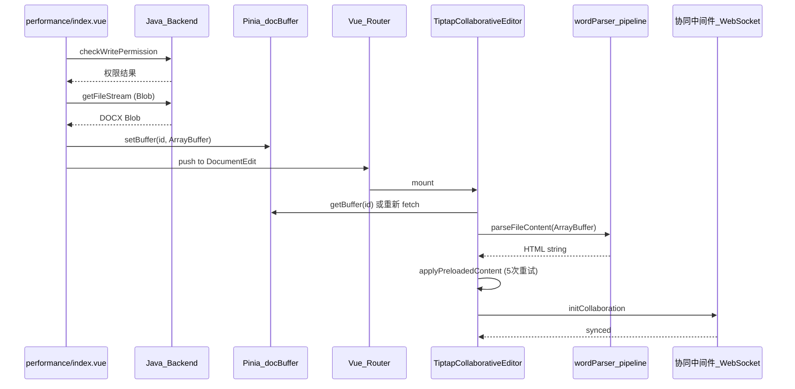

# 演训方案编辑链路重构计划

## 现状分析

当前从演训方案列表点击"写作"到编辑器的链路：



## 核心问题

### 1. 日志泛滥

- [performance/index.vue](collabedit-fe/src/views/training/performance/index.vue): `handleEdit` 中有 ~15 条 console.log
- [TiptapCollaborativeEditor.vue](collabedit-fe/src/views/training/document/TiptapCollaborativeEditor.vue): ~35 条 console.log/warn/error，还有 console.error/warn/info 的全局 patch（第 827-864 行）
- [wordParser.pipeline.ts](collabedit-fe/src/views/training/document/utils/wordParser.pipeline.ts): ~20 条 console.log/info/warn
- [wordParser.shared.ts](collabedit-fe/src/views/training/document/utils/wordParser.shared.ts): ~10 条 console.warn/info
- [imageStore.ts](collabedit-fe/src/views/training/document/utils/imageStore.ts): ~8 条 console.warn/info
- [fileUtils.ts](collabedit-fe/src/views/utils/fileUtils.ts): ~12 条各类 console 语句

### 2. 废弃/冗余代码

- [docStorage.ts](collabedit-fe/src/views/utils/docStorage.ts): IndexedDB 存储方案已废弃（无任何地方引用），应删除
- `TiptapCollaborativeEditor.vue` 中的 `installDebugCollectors` (第 827-864 行) 全局 patch console，侵入性强
- `TiptapCollaborativeEditor.vue` 中挂载 `globalThis.__exportDocDebug` 等调试函数（第 1329-1335 行）
- `fileUtils.ts` 中大量 doc-stream 调试功能（`addDocStreamSnapshot`, `exportDocStreamReport`, `compareDocStreamReport` 等）

### 3. 重复代码

- `normalizeCssColor`（[TiptapEditor.vue](collabedit-fe/src/views/training/document/components/TiptapEditor.vue) 第 744-778 行）与 `normalizeColor`（[wordParser.shared.ts](collabedit-fe/src/views/training/document/utils/wordParser.shared.ts) 第 449-503 行）功能重复
- `hasStyleHints`（TiptapCollaborativeEditor.vue 第 750-755 行）与 `hasStyleHintsInHtml`（wordParser.shared.ts）功能重复
- `sanitizeImagesIfNeeded` 在 `TiptapCollaborativeEditor.vue`（第 737-748 行）和 `wordParser.pipeline.ts`（第 40-51 行）中各定义了一份
- `generateFullHtml` 在 `TiptapEditor.vue`（第 832 行）和 `ExportToolbar.vue`（第 175 行）中各有一份

### 4. applyPreloadedContent 逻辑过于复杂

- 5 次重试 + 200ms 验证定时器 + 样式恢复 fallback + 纯文本 fallback
- 多层嵌套 setTimeout 管理困难
- 与协同同步存在竞态条件（`shouldDelayCollaborationConnect` + 4 秒超时强制连接）

### 5. 文件解析健壮性不足

- `wordParser.pipeline.ts` 中 DocModel 解析失败直接 fallback 到 mammoth，丢失错误上下文
- 图片 base64 验证不严格（过大图片仅 warn、过短图片仍处理）
- `normalizeBase64` 中 padding 修复可能产生无效 base64

### 6. Tiptap 格式匹配不完善

- 字体映射虽然有 100+ 中文字体，但 `serializer.ts` 输出时不加 fallback，Tiptap 渲染时可能找不到字体
- 颜色归一化不完整，部分命名色映射缺失
- `htmlParser.ts` 中 `parseRunStyle` 提取 font-family 时不清理引号
- ResizableImage 高度处理不一致，可能导致图片变形

---

## 重构方案

### Phase 1: 清理冗余代码和日志

**1.1 删除废弃文件**

- 删除 [docStorage.ts](collabedit-fe/src/views/utils/docStorage.ts)（IndexedDB 方案已废弃，无引用）

**1.2 统一日志策略**

- 在 [fileUtils.ts](collabedit-fe/src/views/utils/fileUtils.ts) 中新增轻量 `logger` 工具函数：仅在 `import.meta.env.DEV` 下输出，生产环境静默
- 将所有 `console.log` / `console.info` / `console.warn` 替换为 `logger.debug` / `logger.info` / `logger.warn`
- 保留 `console.error` 用于真正的错误（但减少冗余的错误日志）
- 删除 `TiptapCollaborativeEditor.vue` 中的 `installDebugCollectors`（全局 console patch，第 827-864 行）和 `exportDebugArtifacts`（第 866-978 行），以及 `onMounted` 中挂载到 `globalThis` 的调试函数

**1.3 精简 doc-stream 调试代码**

- 将 `fileUtils.ts` 中的 `addDocStreamSnapshot`, `exportDocStreamReport`, `compareDocStreamReport`, `printDocStreamCompareResult`, `exportSuspectImagesReport`, `collectDataImageStats`, `summarizeDataImageStats`, `collectDataImageAnomalies` 等调试函数标记为可选（仅在开发模式启用），或直接移除（如果已不再需要）
- 清理 `TiptapCollaborativeEditor.vue` 中所有 `docStreamDebug` 相关调用

### Phase 2: 消除重复代码

**2.1 统一颜色归一化**

- 保留并增强 `wordParser.shared.ts` 中的 `normalizeColor` 函数，补全命名色映射
- 删除 `TiptapEditor.vue` 中的 `normalizeCssColor`，改为引用 `normalizeColor`

**2.2 统一样式检测**

- 保留 `wordParser.shared.ts` 中的 `hasStyleHintsInHtml`
- 删除 `TiptapCollaborativeEditor.vue` 中的本地 `hasStyleHints`，改为引用共享版本

**2.3 统一图片清理**

- 将 `sanitizeImagesIfNeeded` 提取到 `wordParser.shared.ts` 中作为公共函数
- `TiptapCollaborativeEditor.vue` 和 `wordParser.pipeline.ts` 均引用同一份

**2.4 统一 HTML 生成**

- 将 `generateFullHtml` 提取到共享工具文件中
- `TiptapEditor.vue` 和 `ExportToolbar.vue` 均引用同一份

### Phase 3: 重构内容加载与应用逻辑

**3.1 简化 `handleEdit` (performance/index.vue)**

- 减少中间日志，仅保留关键步骤的 logger.debug
- 移除 doc-stream 快照调用
- 清理类型断言 `as PerformanceApi.checkWriteData` 的冗余写法

**3.2 重构 `applyPreloadedContent` (TiptapCollaborativeEditor.vue)**

当前问题：5 次重试 + 嵌套 setTimeout + 竞态条件。重构为清晰的状态机模式：

```typescript
// 简化为：等待编辑器就绪 → 一次性应用 → 验证 → 连接协同
const applyPreloadedContent = async () => {
  if (!editorInstance.value || !preloadedContent.value || preloadedApplied.value) return

  const html = normalizeAndSanitize(preloadedContent.value)
  if (!html || isEmptyHtml(html)) return

  const contentWithBlobs = await replaceDataImagesIfNeeded(html)

  // 尝试设置内容（最多 3 次，每次间隔递增）
  let applied = false
  for (let i = 0; i < 3 && !applied; i++) {
    if (i > 0) await sleep(300 * i)
    applied = trySetContent(contentWithBlobs)
  }

  if (applied) {
    preloadedApplied.value = true
    connectCollaborationIfNeeded()
    ElMessage.success('文档内容已加载')
  } else {
    // 最终 fallback：纯文本
    trySetPlainTextFallback(preloadedContent.value)
    connectCollaborationIfNeeded()
  }
}
```

**3.3 优化协同连接时序**

- 将 4 秒超时改为基于事件的触发：内容应用完成后立即连接，无需 setTimeout
- 简化 `shouldDelayCollaborationConnect` 逻辑

**3.4 简化 onMounted 流程**

- 移除 globalThis 调试挂载
- 移除 doc-stream 快照相关代码
- 清晰分离：获取 buffer → 解析 → 应用 → 连接协同

### Phase 4: 增强文件解析健壮性

**4.1 优化 `parseFileContent` (wordParser.pipeline.ts)**

- 移除冗余日志，改用 logger
- DocModel 解析失败时记录详细错误信息再 fallback
- 增加解析结果的基本验证（非空、包含有效 HTML 标签）

**4.2 增强图片处理**

- `validateAndFixImages`：对超大图片（>2MB base64）进行压缩或拒绝，而非仅 warn
- `imageStore.ts`：添加 blob URL 数量限制和自动清理
- `normalizeBase64`：对无法修复的 base64 返回空而非可能无效的结果

**4.3 增强错误恢复**

- `parseFileContent` 每个 fallback 阶段记录前一阶段的失败原因
- 最终解析失败时返回明确的错误信息而非 throw（让 UI 层展示友好提示）

### Phase 5: 优化 Tiptap 格式匹配

**5.1 字体处理优化**

- `serializer.ts` 的 `styleToCssText`：输出 font-family 时自动调用 `getFontWithFallback`，确保包含备选字体
- `htmlParser.ts` 的 `parseRunStyle`：清理 font-family 值中的引号（`'`、`"`）
- 确保 `FontFamily` 扩展能正确解析带引号和 fallback 的 font-family

**5.2 颜色处理优化**

- 增强 `normalizeColor`：补全 W3C 命名颜色（目前仅 ~30 个，标准有 148 个）
- `htmlParser.ts`：解析颜色时调用 `normalizeColor` 归一化
- `serializer.ts`：输出颜色时确保格式统一（#RRGGBB）

**5.3 字号处理优化**

- `htmlParser.ts` 的 `parsePxValue`：支持 em/rem/% 单位换算为 px
- `serializer.ts`：字号输出统一为 px 格式

**5.4 图片渲染优化**

- `ResizableImage.ts`：优化 `parseHTML` 逻辑，正确处理宽高比
- `ResizableImageComponent.vue`：加载失败时提供重试按钮，而非仅显示占位符
- 确保 blob URL 图片在编辑器销毁时正确清理

**5.5 修复 ExportToolbar.vue 异步 bug**

- `exportPdf` 中 `generateFullHtml()` 缺少 `await`，需修复

---

## 中间件部分

经分析，协同中间件（`collaborative-middleware`）代码质量良好：

- 使用 NestJS Logger 而非 console.log
- 错误处理完善
- 职责单一（仅处理 Y.js WebSocket 同步）
- **无需修改**，本次重构集中在前端

---

## 涉及文件清单

| 文件 | 操作 |
| --- | --- |
| `src/views/utils/docStorage.ts` | 删除 |
| `src/views/utils/fileUtils.ts` | 新增 logger 工具；精简调试函数 |
| `src/views/training/performance/index.vue` | 清理日志、精简 handleEdit |
| `src/views/training/document/TiptapCollaborativeEditor.vue` | 重构 applyPreloadedContent、清理日志/调试代码、消除重复 |
| `src/views/training/document/components/TiptapEditor.vue` | 删除重复的 normalizeCssColor、引用共享函数 |
| `src/views/training/document/components/toolbar/ExportToolbar.vue` | 修复 async bug、消除重复 generateFullHtml |
| `src/views/training/document/utils/wordParser.pipeline.ts` | 清理日志、增强错误处理 |
| `src/views/training/document/utils/wordParser.shared.ts` | 增强 normalizeColor、提取公共函数 |
| `src/views/training/document/utils/imageStore.ts` | 清理日志、增加限制 |
| `src/views/training/document/utils/docModel/htmlParser.ts` | 优化字体/颜色解析 |
| `src/views/training/document/utils/docModel/serializer.ts` | 输出时加字体 fallback、颜色归一化 |
| `src/views/training/document/components/toolbar/extensions/ResizableImage.ts` | 优化宽高比处理 |
| `src/views/training/document/components/toolbar/extensions/ResizableImageComponent.vue` | 加载失败优化 |
