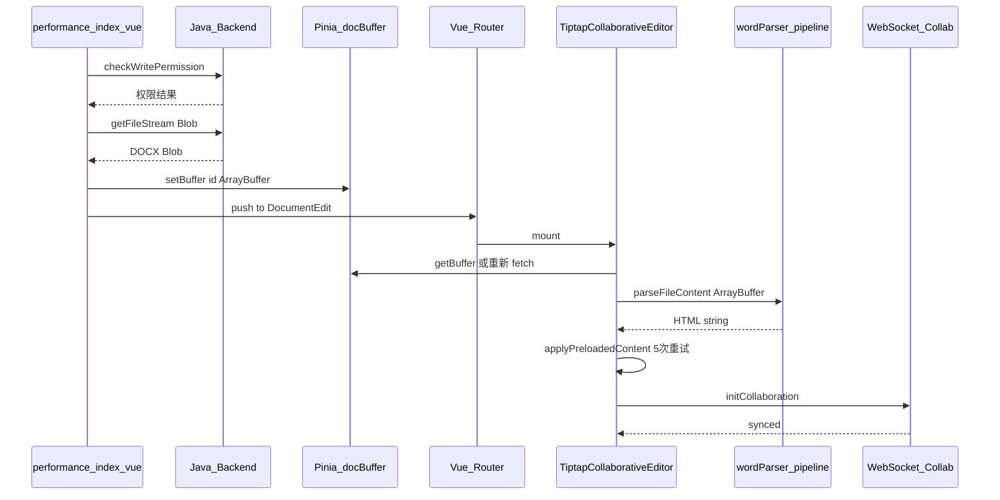
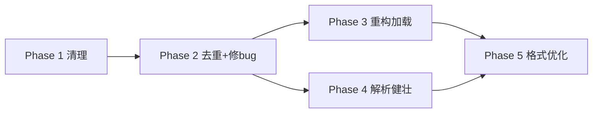

# 演训方案编辑链路重构 — 终版方案

## 现状分析

当前从演训方案列表点击"写作"到编辑器的链路：



## 核心问题（已验证）

- **日志泛滥**：performance/index.vue ~30 条、TiptapCollaborativeEditor.vue ~32 条、wordParser.pipeline.ts ~16 条、其他文件 ~30 条
- **废弃文件**：`docStorage.ts` 标注 `@deprecated`、全项目零引用，已被 `docBuffer.ts` (Pinia Store) 替代
- **侵入性调试代码**：`installDebugCollectors` 全局 patch console、`globalThis.__exportDocDebug` 等调试挂载
- **重复代码 4 组**：normalizeCssColor x3、sanitizeImagesIfNeeded x2、hasStyleHints x2、generateFullHtml x3
- **applyPreloadedContent 过于复杂**：5 次重试 + 嵌套 setTimeout + 竞态条件
- **ExportToolbar async bug**：`generateFullHtml()` 是 async 函数，但 5 处调用中有 4 处缺少 `await`

---

## 重构方案

### Phase 1: 清理冗余代码和日志（低风险）

**1.1 删除废弃文件**

- 删除 [src/views/utils/docStorage.ts](src/views/utils/docStorage.ts)（IndexedDB 方案，全项目零引用）

**1.2 新增独立 logger 工具**

- **修正**：不放在 `fileUtils.ts` 中，新建独立文件 `src/views/utils/logger.ts`
- 仅在 `import.meta.env.DEV` 下输出，生产环境静默
- 提供 `logger.debug` / `logger.info` / `logger.warn` / `logger.error` 四级接口
- 保留 `console.error` 用于真正需要上报的错误

**1.3 替换所有 console 语句**

- 涉及文件：performance/index.vue、TiptapCollaborativeEditor.vue、wordParser.pipeline.ts、wordParser.shared.ts、imageStore.ts、fileUtils.ts
- 将 `console.log`/`console.info` 替换为 `logger.debug`/`logger.info`
- 将 `console.warn` 替换为 `logger.warn`
- 删减冗余的中间步骤日志，仅保留关键节点

**1.4 删除调试代码**

- 删除 TiptapCollaborativeEditor.vue 中的：
  - `installDebugCollectors`（~第 827-864 行，全局 console patch）
  - `exportDebugArtifacts`（~第 866-978 行）
  - `onMounted` 中挂载到 `globalThis` 的调试函数（~第 1329-1335 行）
- 精简 fileUtils.ts 中的 doc-stream 调试函数（`addDocStreamSnapshot`、`exportDocStreamReport` 等），标记为 DEV-only 或直接移除
- 清理 TiptapCollaborativeEditor.vue 中所有 `docStreamDebug` 相关调用

---

### Phase 2: 消除重复代码 + 修复 async bug（低-中风险）

**2.1 统一颜色归一化**

- 保留并增强 [wordParser.shared.ts](src/views/training/document/utils/wordParser.shared.ts) 中的 `normalizeColor`
- 删除以下 **3 处** `normalizeCssColor`（**修正**：原方案遗漏了 StartToolbar.vue）：
  - [TiptapEditor.vue](src/views/training/document/components/TiptapEditor.vue) 第 744 行
  - [StartToolbar.vue](src/views/training/document/components/toolbar/StartToolbar.vue) 第 789 行
  - 两处均改为 `import { normalizeColor } from '../utils/wordParser.shared'`

**2.2 统一样式检测**

- 保留 `wordParser.shared.ts` 中的 `hasStyleHintsInHtml`
- 删除 TiptapCollaborativeEditor.vue 中的本地 `hasStyleHints`，改为引用共享版本

**2.3 统一图片清理**

- 将 `sanitizeImagesIfNeeded` 提取到 `wordParser.shared.ts` 中作为公共函数
- TiptapCollaborativeEditor.vue 和 wordParser.pipeline.ts 均引用同一份

**2.4 统一 HTML 生成（与 async bug 修复合并）**

- **关键修正**：`generateFullHtml` 实际存在于 **3 处**（原方案遗漏了 MarkdownEditor.vue）：
  - [TiptapEditor.vue](src/views/training/document/components/TiptapEditor.vue) 第 832 行 — **同步**版本
  - [ExportToolbar.vue](src/views/training/document/components/toolbar/ExportToolbar.vue) 第 175 行 — **异步**版本
  - [MarkdownEditor.vue](src/views/template/editor/components/MarkdownEditor.vue) 第 1441 行 — **同步**版本
- 策略：将 `generateFullHtml` 提取到共享工具文件中，**统一为异步版本**（因为需要 `await restoreBlobImagesFromOriginAsync`）
- TiptapEditor.vue 和 MarkdownEditor.vue 中所有调用方加 `await`（注意 `defineExpose` 返回的类型也变为 async）

**2.5 修复 ExportToolbar.vue 全部 async 缺失（原 Phase 5.5 提前）**

- **修正**：不仅 `exportPdf` 缺 await，共有 **5 处**缺少 `await`：
  - 第 274 行 `exportPdf` — `const html = generateFullHtml()` 缺 await
  - 第 307 行 `copyHtml` — 同上
  - 第 317 行 `downloadHtml` — 同上
  - 第 326 行 `printDocument` — 同上
  - 第 346 行 `printPreview` — 同上
  - （第 241 行 `exportHtml` 已正确使用 `await`）
- 全部改为 `const html = await generateFullHtml()`，对应函数标记为 `async`

---

### Phase 3: 重构内容加载与应用逻辑（高风险）

**3.1 简化 `handleEdit` (performance/index.vue)**

- 减少中间日志，仅保留关键步骤的 `logger.debug`
- 移除 doc-stream 快照调用
- 清理类型断言冗余写法

**3.2 重构 `applyPreloadedContent` (TiptapCollaborativeEditor.vue)**

当前问题：177 行，5 次重试 + 嵌套 setTimeout + 竞态条件。重构为：

```typescript
const applyPreloadedContent = async () => {
  if (!editorInstance.value || !preloadedContent.value || preloadedApplied.value) return

  const html = normalizeAndSanitize(preloadedContent.value)
  if (!html || isEmptyHtml(html)) return

  const contentWithBlobs = await replaceDataImagesIfNeeded(html)

  let applied = false
  for (let i = 0; i < 3 && !applied; i++) {
    if (i > 0) await sleep(300 * i)
    applied = trySetContent(contentWithBlobs)
  }

  if (applied) {
    preloadedApplied.value = true
    connectCollaborationIfNeeded()
    ElMessage.success('文档内容已加载')
  } else {
    trySetPlainTextFallback(preloadedContent.value)
    connectCollaborationIfNeeded()
  }
}
```

**重要：重写时必须保留以下边界处理**（评审指出的遗漏）：

- `trySetContent` 中需要检测编辑器 DOM 是否就绪（不能简单调 `setContent`）
- 样式恢复 fallback 逻辑（当前代码有专门处理样式丢失的逻辑，不能丢弃）
- 协同连接在内容应用过程中抢先 sync 的防护

**3.3 优化协同连接时序**

- 将 4 秒 setTimeout 超时改为基于事件触发：内容应用完成后立即连接
- 简化 `shouldDelayCollaborationConnect` 逻辑

**3.4 简化 onMounted 流程**

- 移除 `globalThis` 调试挂载（Phase 1 已删除相关函数）
- 清晰分离：获取 buffer -> 解析 -> 应用 -> 连接协同

---

### Phase 4: 增强文件解析健壮性（中风险）

**4.1 优化 `parseFileContent` (wordParser.pipeline.ts)**

- 移除冗余日志，改用 logger
- DocModel 解析失败时**记录详细错误信息**（包含错误类型、堆栈）再 fallback 到 mammoth
- 每个 fallback 阶段记录前一阶段的失败原因，形成链式错误上下文
- 增加解析结果的基本验证（非空、包含有效 HTML 标签）

**4.2 增强图片处理**

- `validateAndFixImages`：超大图片（>2MB base64）进行压缩或拒绝（当前仅 warn）
- `imageStore.ts`：添加 blob URL 数量限制和自动清理（防止内存泄漏）
- `normalizeBase64`：对无法修复的 base64 返回空字符串而非可能无效的结果

**4.3 增强错误恢复**

- 最终解析失败时返回 `{ html: '', error: ErrorInfo }` 而非 throw，让 UI 层展示友好提示

---

### Phase 5: 优化 Tiptap 格式匹配（中-低风险）

**5.1 字体处理优化**

- `serializer.ts` 的 `styleToCssText`：输出 font-family 时自动调用 `getFontWithFallback`，确保包含备选字体
- `htmlParser.ts` 的 `parseRunStyle`：清理 font-family 值中的引号（`'`、`"`）
- 确保 `FontFamily` 扩展能正确解析带引号和 fallback 的 font-family

**5.2 颜色处理优化（降低范围）**

- **修正**：不补全到 148 个 W3C 命名颜色（DOCX 很少用命名色，性价比低）
- 保持当前 ~30 个常用色，仅在实际遇到解析失败时逐步补充
- `htmlParser.ts`：解析颜色时调用 `normalizeColor` 归一化
- `serializer.ts`：输出颜色时确保格式统一（#RRGGBB）

**5.3 字号处理优化（降低优先级）**

- **修正**：DOCX 文件中字号通常以 `pt`（半点）或 `px` 为单位，`em`/`rem`/`%` 极少出现
- 先统计实际解析中是否出现过这些单位
- 仅做 `pt -> px` 的可靠换算，`em`/`rem`/`%` 暂不处理（或仅日志记录）

**5.4 图片渲染优化**

- `ResizableImage.ts`：优化 `parseHTML` 逻辑，正确处理宽高比
- `ResizableImageComponent.vue`：加载失败时提供重试按钮
- 确保 blob URL 图片在编辑器销毁时正确清理

---

## 中间件部分

经分析，协同中间件（`collaborative-middleware`）代码质量良好，使用 NestJS Logger，错误处理完善，**无需修改**。

---

## 执行顺序（调整后）



- **Phase 1** — 优先，风险最低，收益明显
- **Phase 2**（含原 5.5 提前）— 紧随，修复功能性 bug 优先级高
- **Phase 3** / **Phase 4** — 可并行推进，Phase 3 需更多测试
- **Phase 5** — 最后，优先级可按实际需求调整

---

## 测试策略（补充）

- **Phase 2.5 async bug 修复**：手动测试导出 PDF、复制 HTML、下载 HTML、打印、打印预览 5 个功能
- **Phase 3 applyPreloadedContent 重写**：准备关键路径回归测试用例
  - 正常 DOCX 打开
  - 含图片的 DOCX 打开
  - 编辑器 DOM 延迟就绪场景
  - 协同连接在内容应用期间抢先 sync 的场景
  - 样式密集型文档（字体/颜色/字号）的内容保真度
- **Phase 4 parseFileContent 增强**：使用多种格式的 DOCX 文件测试 fallback 链路

## 回滚方案（补充）

- **每个 Phase 单独一个 commit**（或一组紧密相关的 commits）
- 如果 Phase 3 引入回归，可以通过 `git revert` 快速回滚该 Phase 的提交
- `docBuffer.ts` 当前为 untracked 新文件，确认其状态稳定后再开始重构

---

## 涉及文件清单（更新）

- `src/views/utils/docStorage.ts` — 删除
- `src/views/utils/logger.ts` — **新增**独立 logger 工具
- `src/views/utils/fileUtils.ts` — 精简调试函数，替换 console 为 logger
- `src/views/training/performance/index.vue` — 清理日志、精简 handleEdit
- `src/views/training/document/TiptapCollaborativeEditor.vue` — 重构 applyPreloadedContent、清理日志/调试代码、消除重复
- `src/views/training/document/components/TiptapEditor.vue` — 删除重复的 normalizeCssColor、引用共享函数、generateFullHtml 改 async
- `src/views/training/document/components/toolbar/StartToolbar.vue` — **新增**删除重复的 normalizeCssColor
- `src/views/training/document/components/toolbar/ExportToolbar.vue` — 修复 5 处 async bug、消除重复 generateFullHtml
- `src/views/template/editor/components/MarkdownEditor.vue` — **新增**统一 generateFullHtml
- `src/views/training/document/utils/wordParser.pipeline.ts` — 清理日志、增强错误处理
- `src/views/training/document/utils/wordParser.shared.ts` — 增强 normalizeColor、提取公共函数
- `src/views/training/document/utils/imageStore.ts` — 清理日志、增加限制
- `src/views/training/document/utils/docModel/htmlParser.ts` — 优化字体/颜色解析
- `src/views/training/document/utils/docModel/serializer.ts` — 输出时加字体 fallback、颜色归一化
- `src/views/training/document/components/toolbar/extensions/ResizableImage.ts` — 优化宽高比处理
- `src/views/training/document/components/toolbar/extensions/ResizableImageComponent.vue` — 加载失败优化
- `src/store/modules/docBuffer.ts` — 确认状态稳定（已在 git untracked 中）
