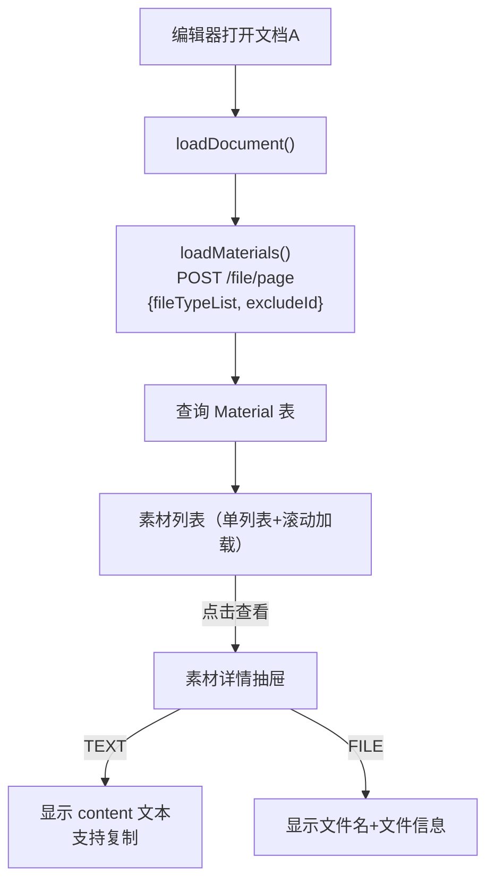

# 独立素材库方案（简化版 — 纯浏览，无新建/上传/收藏）

## 一、数据模型设计

### 新增 `Material` 素材表（[prisma/schema.prisma](e:\job-project\collabedit-node-backend\prisma\schema.prisma)）

```prisma
model Material {
  id           String   @id @default(uuid())
  title        String
  content      String?  @db.Text
  materialType String   @map("material_type")  // TEXT / FILE
  fileType     String?  @map("file_type")       // 关联文档类型 code（YXFA/ZZJH 等）
  fileId       String?  @map("file_id")         // 关联 FileObject.id（FILE 类型时）
  fileName     String?  @map("file_name")       // 原始文件名
  fileMime     String?  @map("file_mime")       // 文件 MIME 类型
  fileSize     Int?     @map("file_size")       // 文件大小
  delFlg       Int      @default(0) @map("del_flg")
  createBy     String?  @map("create_by")
  createTime   DateTime @default(now()) @map("create_time")
  updateTime   DateTime @updatedAt @map("update_time")

  @@index([fileType])
  @@index([materialType])
  @@index([createTime])
}
```

**字段说明**:

- `materialType`: `TEXT`（纯文本素材）或 `FILE`（文件素材，通过 `fileId` 关联 MinIO 中的 `FileObject`）
- `fileType`: 素材所属文档类型分类，用于全局素材池按类型筛选

## 二、后端 API 设计

改造 [src/routes/file.ts](e:\job-project\collabedit-node-backend\src\routes\file.ts)，将当前查询 `TrainingPerformance` 改为查询新的 `Material` 表。

### 接口（仅 1 个）

- **POST `/file/page`** — 全局素材分页查询（改为查 Material 表）

### 关键改动

`**POST /file/page` 改造（当前查 `trainingPerformance` -> 改为查 `material`）:

- 新增参数 `excludeId`：排除指定 ID 的素材（可选），后端 where 条件加 `id: { not: excludeId }`
- 新增参数 `materialType`：按素材类型筛选（TEXT/FILE，可选）
- `fileTypeList` 保持不变，改为筛选 `Material.fileType`

### Seed 数据（[src/seed.ts](e:\job-project\collabedit-node-backend\src\seed.ts)）

新增 `seedMaterials` 函数，插入丰富的初始素材数据，覆盖各 fileType 分类，TEXT 和 FILE 类型各多条：

- YXFA（演训方案）：3-4 条 TEXT 素材
- ZZJH（作战计划）：3-4 条 TEXT 素材
- DDJH（导调计划）：2-3 条 TEXT 素材
- ZZWS（作战文书）：2-3 条 TEXT 素材
- QTLA（企图立案）：2-3 条 TEXT 素材
- 每个分类额外 1-2 条 FILE 类型素材（fileId 可为空，仅占位展示）

总计约 20-25 条初始素材。

## 三、字段映射（重要）

`/file/page` 返回结构从 `TrainingPerformanceVO` 变为 `MaterialVO`，前端需要同步适配字段名：

- `planName` -> `title`（CollaborationPanel 卡片标题、抽屉标题）
- `description` -> `content`（抽屉正文内容、复制内容）
- `createTime` -> `createTime`（不变）
- `createBy` -> `createBy`（不变）

新增字段（FILE 类型素材）：

- `materialType`（TEXT / FILE）
- `fileId`、`fileName`、`fileMime`、`fileSize`

## 四、前端改动

### 1. 类型定义（[src/api/training/index.ts](e:\job-project\collabedit-fe\src\api\training\index.ts)）

新增 `MaterialVO` 类型，适配 `getFilePage` 的参数和返回值：

```typescript
interface MaterialVO {
  id: string
  title: string
  content?: string
  materialType: 'TEXT' | 'FILE'
  fileType?: string
  fileId?: string
  fileName?: string
  fileMime?: string
  fileSize?: number
  createBy?: string
  createTime: string
}
```

### 2. Mock 数据（[src/mock/training/performance.ts](e:\job-project\collabedit-fe\src\mock\training\performance.ts)）

- 新增丰富的 `mockMaterialList`（约 20-25 条，覆盖各 fileType，TEXT 和 FILE 类型混合）
- `getFilePage` 改为查询 `mockMaterialList` 而非 `mockDataList`，支持 `excludeId` 参数

### 3. 编辑器组件（[TiptapCollaborativeEditor.vue](e:\job-project\collabedit-fe\src\views\training\document\TiptapCollaborativeEditor.vue)）

- `loadMaterials` 的 params 中加入 `excludeId: documentId.value` 排除当前文档
- 抽屉标题从 `currentMaterial?.planName` 改为 `currentMaterial?.title`
- 抽屉正文从 `currentMaterial.description` 改为 `currentMaterial.content`
- 复制按钮从 `copyContent(currentMaterial.description)` 改为 `copyContent(currentMaterial.content)`
- 抽屉内根据 `materialType` 区分展示：TEXT 用 `v-html` 渲染 content（兼容纯文本和 HTML 混合内容），FILE 显示文件名+文件信息

### 4. 协同面板（[CollaborationPanel.vue](e:\job-project\collabedit-fe\src\lmComponents\collaboration\CollaborationPanel.vue)）

- 卡片标题从 `item.planName` 改为 `item.title`
- `createTime`、`createBy` 保持不变
- 素材卡片根据 `materialType` 显示不同图标（文本/文件）
- 文件素材卡片额外显示文件名、大小

## 五、数据流



## 六、影响范围与评审结论

### 不影响的现有功能（已验证）

- 演训方案列表页 `performance/index.vue` — 使用 `getPageList`，不涉及 `/file/page`
- `usePerformanceList.ts` 中的分类筛选逻辑 — 只影响列表页
- `FileApi.getFilePage`（`/infra/file/page`）— 完全不同的接口，来自 `@/api/infra/file`
- `/file/page` 的唯一前端调用点仅在 `TiptapCollaborativeEditor.vue` 的 `loadMaterials` 中

### 需要改动的文件（共 7 个）

- **后端**：`schema.prisma`、`file.ts`、`seed.ts`
- **前端**：`api/training/index.ts`、`mock/training/performance.ts`、`TiptapCollaborativeEditor.vue`、`CollaborationPanel.vue`

### 数据库

- 需要 Prisma migrate 生成 `Material` 一张新表
- 不需要修改 `TrainingPerformance` 表

## 七、后续可扩展

1. **新建/上传素材**：新增 `POST /file/material`、`POST /file/material/upload` 接口，面板底部增加按钮
2. **编辑/删除素材**：新增 `PUT /file/material/:id`、`DELETE /file/material/:id` 接口
3. **文档级收藏/关联**：补建 `DocumentMaterial` 关联表，新增绑定/解绑接口，面板增加双 tab
