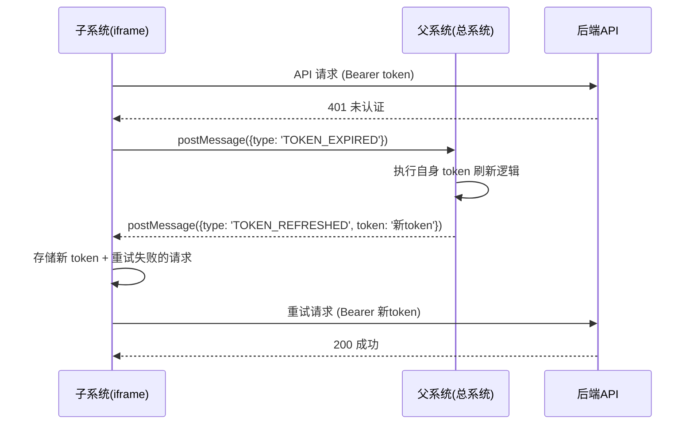

# 移除 refreshToken，改用 iframe postMessage 通信刷新方案

## 可行性分析

**结论：完全可行。** 理由如下：

1. 项目已有成熟的外部 Token 嵌入模式（`VITE_EXTERNAL_TOKEN_LOGIN=true`），生产环境通过 URL 参数从父系统接收 token
2. 父系统已有 `handleIframeMessage` 监听器处理 `ROUTER_PUSH`、`ROUTER_REPLACE`、`RELOAD` 等消息类型，扩展新消息类型（`TOKEN_EXPIRED`）无障碍
3. 前端认证模块分层清晰（`auth.ts`、`refreshToken.ts`、`service.ts`），改动范围可控
4. 旧代码全部注释保留，可随时回滚

## 通信流程




## 改动文件清单

### 前端（collabedit-fe）- 6 个文件

#### 1. 新增 `src/utils/iframeMessage.ts` — iframe 通信工具

新建 iframe 通信工具模块，负责：

- 向父窗口发送 `TOKEN_EXPIRED` 消息
- 监听父窗口回传的 `TOKEN_REFRESHED` 消息
- 提供 Promise 化的 `requestTokenRefresh()` 函数（带超时机制）

```typescript
// 核心函数签名
export function requestTokenRefresh(timeoutMs = 30000): Promise<string>
export function setupIframeMessageListener(): void
export function destroyIframeMessageListener(): void
```

#### 2. 修改 `[src/config/axios/refreshToken.ts](src/config/axios/refreshToken.ts)` — 核心改动

- **注释** `doRefreshToken()` 函数（第 56-76 行，整个函数体用 `/* ... */` 包裹）
- **注释** `handle401` 中调用 `doRefreshToken` 的逻辑（第 98-126 行）
- **新增** `handle401` 改用 `requestTokenRefresh()` 通过 iframe postMessage 请求父系统刷新：
  - 401 时调用 `window.parent.postMessage({ type: 'TOKEN_EXPIRED' }, '*')`
  - 等待父系统返回 `TOKEN_REFRESHED` 并携带新 token
  - 收到新 token 后用 `setAccessTokenOnly()` 存储，然后重试请求队列
  - 超时或失败则走 `handleAuthorized()` 登出流程
- `handleAuthorized()` 逻辑保持不变（外部模式弹窗提示，标准模式提示重新登录）

#### 3. 修改 `[src/config/axios/service.ts](src/config/axios/service.ts)` — 注释 refreshToken 请求头

注释第 48-52 行（发送 refreshToken 请求头的代码）：

```typescript
// 【已注释】改用 iframe postMessage 通信，不再通过请求头传递 refreshToken
// if (getRefreshToken()) {
//   config.headers['refreshToken'] = getRefreshToken()
// }
```

#### 4. 修改 `[src/config/axios/javaService.ts](src/config/axios/javaService.ts)` — 注释 refreshToken 请求头

注释第 66-71 行（同上）：

```typescript
// 【已注释】改用 iframe postMessage 通信，不再通过请求头传递 refreshToken
// const refreshToken = getRefreshToken()
// if (refreshToken) {
//   config.headers['refreshToken'] = refreshToken
// }
```

#### 5. 修改 `[src/utils/auth.ts](src/utils/auth.ts)` — 注释 refreshToken 存取

- 注释 `getRefreshToken()` 函数（第 17-20 行），但**保留导出**（避免 import 报错），改为返回空字符串
- 注释 `setToken()` 中写入 refreshToken 的行（第 24 行）
- 注释 `removeToken()` 中删除 refreshToken 的行（第 31 行）
- 注释 `setExternalRefreshToken()` 函数（第 53-56 行）
- 新增 `setAccessTokenOnly(token: string)` 函数，仅存储 accessToken（供 iframe 通信刷新后使用）

#### 6. 修改 `[src/permission.ts](src/permission.ts)` — 放宽凭证校验

- 第 112-119 行：注释 `urlRefreshToken` 的读取和存储逻辑
- 第 152-153 行：将 `getAccessToken() && getRefreshToken()` 改为只检查 `getAccessToken()`
- 第 192-206 行：更新缺凭证提示文案，去掉 refreshToken 相关描述

### 后端（collabedit-node-backend）- 2 个文件

#### 7. 修改 `[src/services/auth.service.ts](e:/job-project/collabedit-node-backend/src/services/auth.service.ts)`

- 注释 `issueTokens` 中 refreshToken 的生成和入库逻辑（第 26-37 行），只返回 `{ accessToken }`
- 注释整个 `rotateRefreshToken` 函数（第 42-60 行）

```typescript
export const issueTokens = async (userId: number, username: string, tenantId?: number) => {
  const payload = { uid: userId, un: username, tid: tenantId }
  const accessToken = jwt.sign(payload, env.jwtSecret, { expiresIn: env.jwtExpiresIn } as any)
  // 【已注释】改用父系统刷新 token，不再生成 refreshToken
  // const refreshToken = jwt.sign(...)
  // await prisma.refreshToken.create(...)
  return { accessToken }
}
```

#### 8. 修改 `[src/routes/auth.ts](e:/job-project/collabedit-node-backend/src/routes/auth.ts)`

- 注释 `POST /system/auth/refresh-token` 路由（第 79-90 行）
- 注释 `GET/POST /sjrh/permission/refreshToken` 路由（第 250-262 行）

## 父系统需配合的改动（不在本项目范围，需通知父系统开发者）

父系统的 `handleIframeMessage` 需新增两个消息类型的处理：

```typescript
// 父系统 handleIframeMessage 中新增：
if (data.type === 'TOKEN_EXPIRED') {
  // 调用父系统自身的 token 刷新逻辑
  refreshToken().then((newToken) => {
    // 将新 token 发送回 iframe
    iframeElement.contentWindow.postMessage(
      { type: 'TOKEN_REFRESHED', token: newToken },
      '*'
    )
  }).catch(() => {
    // 刷新失败，可选择重新登录或通知 iframe
    iframeElement.contentWindow.postMessage(
      { type: 'TOKEN_REFRESH_FAILED' },
      '*'
    )
  })
}
```

## 注意事项

- 所有旧代码用 `/* 【已注释】改用 iframe postMessage ... */` 格式注释，方便搜索和回滚
- `getRefreshToken()` 保留导出但返回空字符串，避免其他文件 import 报错
- 开发环境（非 iframe 嵌入）可通过 `VITE_SKIP_AUTH=true` 跳过认证，不受影响
- `TokenType` 类型定义中的 `refreshToken` 字段标记为可选（`refreshToken?: string`），保持类型兼容

