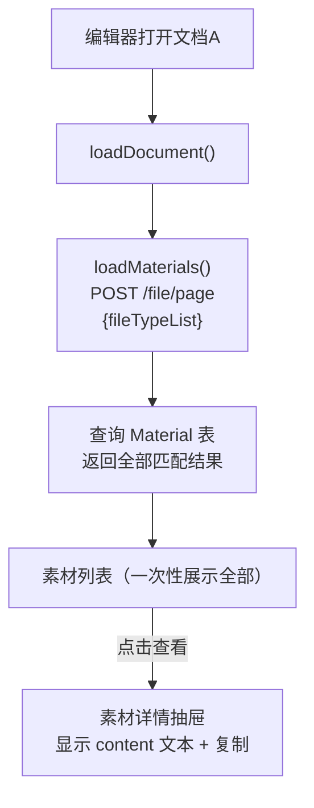

# 简化素材库方案（详细排查版）

## 变更概述

对已完成的素材库功能做四处简化：

1. **移除 `materialType`** -- 只有 TEXT 内容，不需要区分类型
2. **移除分页** -- 查询直接返回全部结果，前端不做滚动加载
3. **移除 `excludeId`** -- Material.id 与 documentId 不同体系，无实际作用
4. **移除 FILE 相关字段** -- fileId/fileName/fileMime/fileSize 一并清理

**数据库不做 migrate，用户将手动重置所有数据（drop + re-seed）。**

## 现有功能影响评估

- 演训方案列表页 `performance/index.vue` -- 使用 `getPageList`，不涉及 `/file/page`，**不受影响**
- `usePerformanceList.ts` 中的分类筛选逻辑 -- 只影响列表页，**不受影响**
- `FileApi.getFilePage`（`/infra/file/page`）-- 完全不同的接口，来自 `@/api/infra/file`，**不受影响**
- `/file/page` 的唯一前端调用点仅在 `TiptapCollaborativeEditor.vue` 的 `loadMaterials` 中
- `CollaborationPanel.vue` 只被 `TiptapCollaborativeEditor.vue` 以 `mode="materials"` 使用

---

## 一、后端改动（3 个文件）

### 1. [prisma/schema.prisma](e:\job-project\collabedit-node-backend\prisma\schema.prisma) -- 第 382-400 行

**删除字段**：`materialType`(386)、`fileId`(388)、`fileName`(389)、`fileMime`(390)、`fileSize`(391) **删除索引**：`@@index([materialType])`(398)

改造后：

```prisma
model Material {
  id           String   @id @default(uuid())
  title        String
  content      String?  @db.Text
  fileType     String?  @map("file_type")
  delFlg       Int      @default(0) @map("del_flg")
  createBy     String?  @map("create_by")
  createTime   DateTime @default(now()) @map("create_time")
  updateTime   DateTime @updatedAt @map("update_time")

  @@index([fileType])
  @@index([createTime])
}
```

### 2. [src/routes/file.ts](e:\job-project\collabedit-node-backend\src\routes\file.ts) -- 全文改造（41 行）

逐行变更清单：

- **第 8 行**：`pageNo = 1, pageSize = 10, fileTypeList, excludeId, materialType` -> 只保留 `fileTypeList`
- **第 19-21 行**：删除 `excludeId` 的 where 条件块
- **第 23-25 行**：删除 `materialType` 的 where 条件块
- **第 31 行**：删除 `skip: ...`
- **第 32 行**：删除 `take: ...`
- **第 34 行**：删除 `prisma.material.count({ where })` 调用（不再需要 Promise.all）
- **第 37 行**：`total` 改为 `list.length`

改造后完整代码：

```typescript
router.post('/file/page', async (req, res) => {
  const { fileTypeList } = req.body ?? {}
  const where: any = { delFlg: 0 }

  if (fileTypeList) {
    const types = Array.isArray(fileTypeList) ? fileTypeList : [fileTypeList]
    if (types.length > 0) {
      where.fileType = { in: types.map(String) }
    }
  }

  const list = await prisma.material.findMany({
    where,
    orderBy: { createTime: 'desc' }
  })

  return ok(res, { records: list, total: list.length })
})
```

### 3. [src/seed.ts](e:\job-project\collabedit-node-backend\src\seed.ts) -- seedMaterials 函数（约第 318-358 行）

逐条变更：

- **所有素材对象**：移除 `materialType` 属性
- **删除 FILE 类型条目**（5 条）：
  - `演训方案参考模板.docx`（YXFA FILE）
  - `作战计划标准格式.docx`（ZZJH FILE）
  - `导调计划模板.xlsx`（DDJH FILE）
  - `企图立案参考案例.pdf`（QTLA FILE）
- 每条 FILE 条目同时带有 `fileName`/`fileMime`/`fileSize`，全部删除
- 保留的 15 条 TEXT 素材只保留 `title`、`fileType`、`createBy`、`content` 字段

---

## 二、前端改动（4 个文件）

### 4. [src/api/training/index.ts](e:\job-project\collabedit-fe\src\api\training\index.ts)

**javaApi.getFilePage**（第 258 行）：

```typescript
// 改前
getFilePage: async (params: { pageNo?: number; pageSize?: number; fileTypeList?: string[] | string; excludeId?: string; materialType?: string }) => {

// 改后
getFilePage: async (params: { fileTypeList?: string[] | string }) => {
```

**mockApi.getFilePage**（第 381 行）：同样简化参数类型

```typescript
// 改前
getFilePage: async (params: { pageNo?: number; pageSize?: number; fileTypeList?: string[] | string; excludeId?: string; materialType?: string }) => {

// 改后
getFilePage: async (params: { fileTypeList?: string[] | string }) => {
```

**注释更新**（第 479-483 行）：更新 `getFilePage` 的 JSDoc 注释

```typescript
// 改前
/**
 * 参考素材分页查询
 * POST /file/page
 * @param params { pageNo, pageSize, fileTypeList }
 */

// 改后
/**
 * 参考素材查询
 * POST /file/page
 * @param params { fileTypeList }
 */
```

### 5. [src/mock/training/performance.ts](e:\job-project\collabedit-fe\src\mock\training\performance.ts)

**MockMaterial 接口**（第 836-849 行）：

```typescript
// 改前
interface MockMaterial {
  id: string
  title: string
  content?: string
  materialType: 'TEXT' | 'FILE'
  fileType: string
  fileId?: string
  fileName?: string
  fileMime?: string
  fileSize?: number
  createBy: string
  createTime: string
  delFlg: number
}

// 改后
interface MockMaterial {
  id: string
  title: string
  content?: string
  fileType: string
  createBy: string
  createTime: string
  delFlg: number
}
```

**mockMaterialList**（第 851-881 行）：

- 删除所有条目中的 `materialType` 属性
- 删除 5 条 FILE 类型条目：`mat-005`、`mat-009`、`mat-013`、`mat-020`（实际上 mat-005/009/013/020 是 FILE 类型）
- 保留 15 条 TEXT 素材，每条只保留 `id`、`title`、`fileType`、`createBy`、`createTime`、`delFlg`、`content`

**getFilePage 函数**（第 883-922 行）：

```typescript
// 改前
export const getFilePage = async (params: {
  pageNo?: number
  pageSize?: number
  fileTypeList?: string[] | string
  excludeId?: string
  materialType?: string
}) => {
  await mockDelay()
  let filteredList = mockMaterialList.filter((item) => item.delFlg === 0)

  if (params.fileTypeList) { ... }
  if (params.excludeId) {
    filteredList = filteredList.filter((item) => item.id !== params.excludeId)
  }
  if (params.materialType) {
    filteredList = filteredList.filter((item) => item.materialType === params.materialType)
  }

  const pageNo = params.pageNo || 1
  const pageSize = params.pageSize || 10
  const startIndex = (pageNo - 1) * pageSize
  const endIndex = startIndex + pageSize
  const list = filteredList.slice(startIndex, endIndex)

  return {
    code: 200,
    data: { records: list, total: filteredList.length },
    msg: 'success'
  }
}

// 改后
export const getFilePage = async (params: {
  fileTypeList?: string[] | string
}) => {
  await mockDelay()
  let filteredList = mockMaterialList.filter((item) => item.delFlg === 0)

  if (params.fileTypeList) {
    const types = Array.isArray(params.fileTypeList)
      ? params.fileTypeList
      : [params.fileTypeList]
    if (types.length > 0) {
      filteredList = filteredList.filter((item) => types.includes(item.fileType))
    }
  }

  return {
    code: 200,
    data: { records: filteredList, total: filteredList.length },
    msg: 'success'
  }
}
```

### 6. [TiptapCollaborativeEditor.vue](e:\job-project\collabedit-fe\src\views\training\document\TiptapCollaborativeEditor.vue)

#### template 部分

**第 53 行**：删除 `:material-total="materialTotal"` prop 传递 **第 57 行**：删除 `@load-more-materials="loadMoreMaterials"` 事件绑定

**第 124-141 行**：删除 `materialType === 'FILE'` 的 template 分支（文件展示区域）

```html
<!-- 删除整个 FILE 分支 -->
<template v-if="currentMaterial.materialType === 'FILE'"> ...（第 124-141 行全部删除） </template>
<template v-else> <!-- 改为不需要 v-else，直接渲染 --></template>
```

改造后抽屉内容区域简化为：

```html
<div
  class="prose prose-sm flex-1 overflow-y-auto border p-3 rounded bg-gray-50 mb-4"
  v-html="currentMaterial.content || '暂无内容'"
>
</div>
```

**第 148-155 行**：删除 `v-if="currentMaterial.materialType !== 'FILE'"` 条件（复制按钮始终显示）

```html
<!-- 改前 -->
<el-button v-if="currentMaterial.materialType !== 'FILE'" type="primary" ...>
  <!-- 改后 -->
  <el-button type="primary" ...></el-button
></el-button>
```

#### script 部分

**第 200 行**：删除 `import { Document } from '@element-plus/icons-vue'`（FILE 图标不再需要）

**第 427-429 行**：删除分页相关 ref

```typescript
// 删除这 3 行
const materialPageNo = ref(1)
const materialPageSize = ref(10)
const materialTotal = ref(0)
```

**第 433-456 行**：简化 `loadMaterials` 函数

```typescript
// 改后
const loadMaterials = async () => {
  materialLoading.value = true
  try {
    const params: any = {}
    if (currentFileType.value) {
      params.fileTypeList = [currentFileType.value]
    }
    const res = await getFilePage(params)
    referenceMaterials.value = res.records || []
  } catch (error) {
    console.error('获取参考素材失败:', error)
  } finally {
    materialLoading.value = false
  }
}
```

**第 458-463 行**：删除 `loadMoreMaterials` 函数

```typescript
// 整个函数删除
const loadMoreMaterials = async () => { ... }
```

**第 1076 行**：删除 `materialPageNo.value = 1`（在 loadDocument 中）

#### style 部分

无需改动。

### 7. [CollaborationPanel.vue](e:\job-project\collabedit-fe\src\lmComponents\collaboration\CollaborationPanel.vue)

#### template 部分

**第 67 行**：删除滚动事件监听 `@scroll="handleMaterialScroll"`

**第 76-78 行**：删除 `materialType === 'FILE'` 图标判断，统一使用 Memo 图标

```html
<!-- 改前 -->
<el-icon v-if="item.materialType === 'FILE'" class="..." :size="14"><Document /></el-icon>
<el-icon v-else class="..." :size="14"><Memo /></el-icon>

<!-- 改后 -->
<el-icon class="text-gray-400 flex-shrink-0" :size="14"><Memo /></el-icon>
```

**第 85-87 行**：删除 FILE 文件信息展示

```html
<!-- 删除 -->
<div v-if="item.materialType === 'FILE' && item.fileName" class="text-xs text-gray-400 mt-1">
  {{ item.fileName }} · {{ item.fileSize ? (item.fileSize / 1024).toFixed(1) + ' KB' : '' }}
</div>
```

**第 88-89 行**：删除加载状态和"已加载全部"提示

```html
<!-- 删除 -->
<div v-if="materialLoading" class="text-center text-gray-400 py-2 text-xs">加载中...</div>
<div v-else-if="materials.length >= materialTotal" class="text-center text-gray-400 py-2 text-xs"
  >已加载全部</div
>
```

#### script 部分

**Props 定义**（约第 132-158 行）：

- 删除 `materialTotal` prop 及其默认值
- 删除 `materialLoading` prop 及其默认值

```typescript
// 删除这两个 prop
materialTotal?: number
materialLoading?: boolean

// 删除对应默认值
materialTotal: 0,
materialLoading: false
```

**Emit 定义**（约第 164-173 行）：

- 删除 `(e: 'load-more-materials'): void` emit
- 删除 `handleMaterialScroll` 函数

```typescript
// 改前
const emit = defineEmits<{
  (e: 'click-material', item: any): void
  (e: 'load-more-materials'): void
}>()

const handleMaterialScroll = (e: Event) => {
  const el = e.target as HTMLElement
  if (el.scrollTop + el.clientHeight >= el.scrollHeight - 20) {
    emit('load-more-materials')
  }
}

// 改后
const emit = defineEmits<{
  (e: 'click-material', item: any): void
}>()
```

**Import**：检查是否有 `Document` 图标导入，如果有则删除（只保留 `Memo`）

---

## 三、不需要数据库迁移

用户将手动重置数据库（drop Material 表后重新 `npx prisma db push` + `npx ts-node src/seed.ts`），无需生成 migration 文件。

## 四、简化后的数据流



## 五、改动文件总览（7 个文件）

| 文件                             | 操作 | 关键改动                                              |
| -------------------------------- | ---- | ----------------------------------------------------- |
| prisma/schema.prisma             | 改   | 删 5 个字段 + 1 个索引                                |
| src/routes/file.ts               | 改   | 删分页/excludeId/materialType，改全量查询             |
| src/seed.ts                      | 改   | 删 FILE 条目、删 materialType/FILE 字段               |
| src/api/training/index.ts        | 改   | javaApi + mockApi 参数简化                            |
| src/mock/training/performance.ts | 改   | 接口/数据/函数全面简化                                |
| TiptapCollaborativeEditor.vue    | 改   | 删分页 ref/excludeId/loadMore/FILE 模板/Document 导入 |
| CollaborationPanel.vue           | 改   | 删 materialType 判断/文件信息/滚动加载/多余 props     |
