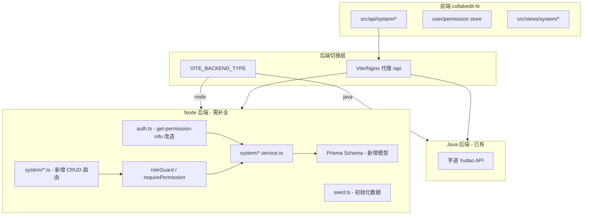

# Node 后端系统管理模块 100% 补全方案

## 一、整体架构设计



保持 `VITE_BACKEND_TYPE` 切换机制不变，Node 后端实现与 Java 后端完全一致的 API 接口和响应格式。

---

## 一-B、与 Java 真实接口对比验证（基于 userinfo.json）

对比 `fix-img2/userinfo.json`（Java 后端 get-permission-info 真实返回）发现以下关键差异，已全部修正到本方案中：

### 差异 1：响应 code 必须为 0（非 200）

Java 返回 `"code": 0`，当前 Node 返回 `code: 200`。前端 `service.ts` 第 175 行虽然兼容 `code === 200 || code === 0`，但为保证 Java/Node 切换无感，**必须**将 `ok()` 函数的 code 改为 `0`。

### 差异 2：需要补充 `rolesVoList` 字段

Java 返回额外的 `rolesVoList` 字段（角色 VO 完整对象数组），包含 `{ id, code, dataScope, dataScopeDeptIds, name, remark, sort, status, type }`。前端当前未使用此字段，但为了 100% 格式对齐，Node 后端应一并返回。

### 差异 3：角色 code 拼写 — `super_admin`（非 `supper_admin`）

Java 后端返回 `"supper_admin"`（双 P，系 Java 端拼写错误），但前端代码 `hasRole.ts:10` 和 `permission.ts:25` 硬编码检查的是 `'super_admin'`（单 P）。这意味着 Java 端的角色判断实际无法匹配，依赖的是 `*:*:` 权限通配。**Node 后端使用 `super_admin`（匹配前端代码）**。

### 差异 4：`menus` 字段格式确认

`userinfo.json` 中 `menus` 为权限字符串数组，但这来自 Java 自定义端点 `/sjrh/permission/getPermission`（`externalUser.ts` 使用）。标准流程 `getInfo()` 调用 `/system/auth/get-permission-info`，前端 `generateRoute()` 需要**菜单树对象**（AppCustomRouteRecordRaw[]）。Node 后端必须返回菜单树格式。

### 差异 5：User 返回字段为子集

Java 响应中 `user` 只含 6 个字段：`{ id, deptId, nickname, username, email, avatar }`。User 数据模型含更多字段，但 `get-permission-info` 只返回此子集。

### 差异 6：`*:*:` 权限通配

前端 `hasPermi.ts` 判断 `userStore.permissions.has('*:*:*')`。super_admin 角色的 permissions 必须包含 `*:*:`，使其自动通过所有权限检查。

---

## 二、User ID 类型统一方案

**关键决策：将 User.id 从 String UUID 改为 Int 自增**

原因：

- 芋道 Java 后端使用 Long(bigint) 作为所有实体 ID
- 前端 TypeScript 类型全部定义为 `id: number`
- 菜单/部门的 `parentId` 依赖 `parentId === 0` 判断根节点
- 保持 Java/Node 切换兼容性

影响范围：

- [prisma/schema.prisma](e:\job-project\collabedit-node-backend\prisma\schema.prisma) - User.id 改为 Int
- [src/services/auth.service.ts](e:\job-project\collabedit-node-backend\src\services\auth.service.ts) - JWT payload userId 改为 Int
- [src/middleware/auth.ts](e:\job-project\collabedit-node-backend\src\middleware\auth.ts) - AuthPayload 类型
- [src/routes/auth.ts](e:\job-project\collabedit-node-backend\src\routes\auth.ts) - 所有 userId 引用
- [src/seed.ts](e:\job-project\collabedit-node-backend\src\seed.ts) - 用户种子数据
- 业务路由中引用 `req.auth.userId` 的地方

迁移方式：`pnpm db:reset && pnpm seed`（开发环境重建）

---

## 三、Prisma 数据模型（完整 Schema）

### 3.1 改造现有模型

**User（改造）**：

```prisma
model User {
  id         Int      @id @default(autoincrement())
  username   String   @unique
  password   String
  nickname   String?
  email      String?
  mobile     String?
  sex        Int      @default(0)          // 0=未知 1=男 2=女
  avatar     String?
  deptId     Int?     @map("dept_id")
  tenantId   Int?     @map("tenant_id")    // 保留租户字段（tenantGuard 使用）
  status     Int      @default(0)          // 0=正常 1=禁用（对齐芋道，原 active/disabled 改为 0/1）
  loginIp    String?  @map("login_ip")
  loginDate  DateTime? @map("login_date")
  remark     String?
  creator    String?
  createdAt  DateTime @default(now()) @map("created_at")
  updatedAt  DateTime @updatedAt @map("updated_at")

  dept       Dept?    @relation(fields: [deptId], references: [id])
  tokens     RefreshToken[]
  userRoles  UserRole[]
  userPosts  UserPost[]
}
```

> **status 类型变更影响**：`auth.ts` 中 `user.status !== 'active'` 需改为 `user.status !== 0`，`seed.ts` 中 `status: 'active'` 改为 `status: 0`。

**RefreshToken（改造 userId 类型）**：

```prisma
model RefreshToken {
  id         String   @id @default(uuid())
  userId     Int      @map("user_id")
  token      String   @unique @db.VarChar(500)
  expiresAt  DateTime @map("expires_at")
  createdAt  DateTime @default(now()) @map("created_at")
  user       User     @relation(fields: [userId], references: [id])
}
```

**DictItem（改造，增加字段对齐芋道）**：

```prisma
model DictItem {
  id         Int      @id @default(autoincrement())
  dictType   String   @map("dict_type")
  value      String
  label      String
  sort       Int      @default(0)
  status     Int      @default(0)          // 0=正常 1=禁用
  colorType  String?  @map("color_type")
  cssClass   String?  @map("css_class")
  remark     String?
  createdAt  DateTime @default(now()) @map("created_at")
  updatedAt  DateTime @updatedAt @map("updated_at")

  @@index([dictType])
}
```

### 3.2 新增模型

**Role（角色）**：

```prisma
model Role {
  id              Int      @id @default(autoincrement())
  name            String
  code            String   @unique
  sort            Int      @default(0)
  status          Int      @default(0)     // 0=正常 1=禁用
  type            Int      @default(2)     // 1=内置 2=自定义
  dataScope       Int      @default(1)     // 1=全部 2=自定义 3=本部门 4=本部门及以下 5=仅本人
  dataScopeDeptIds String? @map("data_scope_dept_ids") // JSON 数组
  remark          String?
  creator         String?
  createdAt       DateTime @default(now()) @map("created_at")
  updatedAt       DateTime @updatedAt @map("updated_at")

  userRoles       UserRole[]
  roleMenus       RoleMenu[]
}
```

**UserRole（用户-角色关联）**：

```prisma
model UserRole {
  id       Int  @id @default(autoincrement())
  userId   Int  @map("user_id")
  roleId   Int  @map("role_id")

  user     User @relation(fields: [userId], references: [id])
  role     Role @relation(fields: [roleId], references: [id])

  @@unique([userId, roleId])
}
```

**Menu（菜单）**：

```prisma
model Menu {
  id            Int      @id @default(autoincrement())
  name          String                     // 菜单名称
  permission    String?                    // 权限标识 如 system:user:query
  type          Int                        // 1=目录 2=菜单 3=按钮
  sort          Int      @default(0)
  parentId      Int      @default(0) @map("parent_id")  // 0=顶级
  path          String?                    // 路由路径
  icon          String?
  component     String?                    // 组件路径 如 system/user/index
  componentName String?  @map("component_name")
  status        Int      @default(0)       // 0=正常 1=禁用
  visible       Boolean  @default(true)    // 是否可见
  keepAlive     Boolean  @default(true) @map("keep_alive")
  alwaysShow    Boolean  @default(true) @map("always_show")
  creator       String?
  createdAt     DateTime @default(now()) @map("created_at")
  updatedAt     DateTime @updatedAt @map("updated_at")

  roleMenus     RoleMenu[]
}
```

**RoleMenu（角色-菜单关联）**：

```prisma
model RoleMenu {
  id       Int  @id @default(autoincrement())
  roleId   Int  @map("role_id")
  menuId   Int  @map("menu_id")

  role     Role @relation(fields: [roleId], references: [id])
  menu     Menu @relation(fields: [menuId], references: [id])

  @@unique([roleId, menuId])
}
```

**Dept（部门）**：

```prisma
model Dept {
  id           Int      @id @default(autoincrement())
  name         String
  parentId     Int      @default(0) @map("parent_id")
  sort         Int      @default(0)
  leaderUserId Int?     @map("leader_user_id")
  phone        String?
  email        String?
  status       Int      @default(0)        // 0=正常 1=禁用
  creator      String?
  createdAt    DateTime @default(now()) @map("created_at")
  updatedAt    DateTime @updatedAt @map("updated_at")

  users        User[]
}
```

**Post（岗位）**：

```prisma
model Post {
  id        Int      @id @default(autoincrement())
  code      String   @unique
  name      String
  sort      Int      @default(0)
  status    Int      @default(0)
  remark    String?
  creator   String?
  createdAt DateTime @default(now()) @map("created_at")
  updatedAt DateTime @updatedAt @map("updated_at")

  userPosts UserPost[]
}
```

**UserPost（用户-岗位关联）**：

```prisma
model UserPost {
  id       Int  @id @default(autoincrement())
  userId   Int  @map("user_id")
  postId   Int  @map("post_id")

  user     User @relation(fields: [userId], references: [id])
  post     Post @relation(fields: [postId], references: [id])

  @@unique([userId, postId])
}
```

**DictType（字典类型 - 新增）**：

```prisma
model DictType {
  id        Int      @id @default(autoincrement())
  name      String
  type      String   @unique              // 字典类型标识
  status    Int      @default(0)
  remark    String?
  creator   String?
  createdAt DateTime @default(now()) @map("created_at")
  updatedAt DateTime @updatedAt @map("updated_at")
}
```

**OperateLog（操作日志）**：

```prisma
model OperateLog {
  id            Int      @id @default(autoincrement())
  userId        Int?     @map("user_id")
  userName      String?  @map("user_name")
  type          String?                    // 操作类型
  subType       String?  @map("sub_type")
  bizId         Int?     @map("biz_id")
  action        String?  @db.Text
  extra         String?  @db.Text
  requestMethod String?  @map("request_method")
  requestUrl    String?  @map("request_url")
  userIp        String?  @map("user_ip")
  userAgent     String?  @map("user_agent") @db.Text
  creator       String?
  createdAt     DateTime @default(now()) @map("created_at")
}
```

**LoginLog（登录日志）**：

```prisma
model LoginLog {
  id         Int      @id @default(autoincrement())
  logType    Int?     @map("log_type")     // 1=登录 2=登出
  userId     Int?     @map("user_id")
  username   String?
  result     Int?                           // 0=成功 1=失败
  userIp     String?  @map("user_ip")
  userAgent  String?  @map("user_agent") @db.Text
  createdAt  DateTime @default(now()) @map("created_at")
}
```

**Notice（通知公告）**：

```prisma
model Notice {
  id        Int      @id @default(autoincrement())
  title     String
  type      Int                             // 1=通知 2=公告
  content   String   @db.Text
  status    Int      @default(0)            // 0=草稿 1=发布
  remark    String?
  creator   String?
  createdAt DateTime @default(now()) @map("created_at")
  updatedAt DateTime @updatedAt @map("updated_at")
}
```

---

## 四、实施顺序（模块清单）

### Phase 1: 数据基础层

| 序号 | 模块 | 子任务 | 文件 |
| --- | --- | --- | --- |
| 1.1 | Schema 改造 | User.id 改为 Int, 增加字段(mobile,sex,loginIp,loginDate,remark) | `prisma/schema.prisma` |
| 1.2 | Schema 改造 | RefreshToken.userId 改为 Int | `prisma/schema.prisma` |
| 1.3 | Schema 改造 | DictItem 增加字段(colorType,cssClass,remark,updatedAt), id 改 Int | `prisma/schema.prisma` |
| 1.4 | Schema 改造 | Permission.userId 改为 Int | `prisma/schema.prisma` |
| 1.5 | Schema 新增 | Role 模型 | `prisma/schema.prisma` |
| 1.6 | Schema 新增 | UserRole 关联表 | `prisma/schema.prisma` |
| 1.7 | Schema 新增 | Menu 模型 | `prisma/schema.prisma` |
| 1.8 | Schema 新增 | RoleMenu 关联表 | `prisma/schema.prisma` |
| 1.9 | Schema 新增 | Dept 模型 | `prisma/schema.prisma` |
| 1.10 | Schema 新增 | Post 模型 | `prisma/schema.prisma` |
| 1.11 | Schema 新增 | UserPost 关联表 | `prisma/schema.prisma` |
| 1.12 | Schema 新增 | DictType 模型 | `prisma/schema.prisma` |
| 1.13 | Schema 新增 | OperateLog 模型 | `prisma/schema.prisma` |
| 1.14 | Schema 新增 | LoginLog 模型 | `prisma/schema.prisma` |
| 1.15 | Schema 新增 | Notice 模型 | `prisma/schema.prisma` |

### Phase 2: 种子数据

| 序号 | 数据       | 说明                                                |
| ---- | ---------- | --------------------------------------------------- |
| 2.1  | 部门       | 根部门(id=100) + 研发部/测试部/运维部等             |
| 2.2  | 角色       | super_admin(id=1, type=1内置), common(id=2)         |
| 2.3  | 岗位       | 总经理、项目经理、普通员工                          |
| 2.4  | 用户       | admin(id=1), testuser(id=2), disabled-user(id=3)    |
| 2.5  | 用户-角色  | admin → super_admin, testuser → common              |
| 2.6  | 用户-岗位  | admin → 总经理                                      |
| 2.7  | 系统菜单树 | 完整菜单（详见下方 4.1 节）                         |
| 2.8  | 角色-菜单  | super_admin 拥有所有菜单                            |
| 2.9  | 字典类型   | system_user_sex, common_status, system_menu_type 等 |
| 2.10 | 字典数据   | 保留现有 FILE_TYPE + 新增系统字典                   |

### Phase 3: 核心基础设施改造

| 序号 | 模块 | 子任务 | 文件 |
| --- | --- | --- | --- |
| 3.1 | Auth 改造 | JWT payload userId 改为 Int | `src/services/auth.service.ts` |
| 3.2 | Auth 改造 | AuthPayload 类型更新 | `src/middleware/auth.ts` |
| 3.3 | Auth 改造 | login 路由适配 Int userId | `src/routes/auth.ts` |
| 3.4 | 新增中间件 | requirePermission(permissions: string[]) | `src/middleware/permission.ts` |
| 3.5 | 新增中间件 | requireRole(roles: string[]) | `src/middleware/permission.ts` |
| 3.6 | 响应格式 | ok() code **必须改为 0**（对齐芋道 Java 后端，非 200） | `src/utils/response.ts` |
| 3.6b | status 适配 | auth.ts/login 中 `status !== 'active'` 改为 `status !== 0` | `src/middleware/auth.ts`, `src/routes/auth.ts` |
| 3.7 | 分页工具 | 新增 parsePage(query) 工具函数 | `src/utils/page.ts` |
| 3.8 | 业务路由适配 | training/template/exam 路由中 userId 类型适配 | 各业务路由文件 |

### Phase 4: get-permission-info 改造（核心）

| 序号 | 子任务               | 说明                                                             |
| ---- | -------------------- | ---------------------------------------------------------------- |
| 4.1  | 查询用户角色         | 通过 UserRole 关联查询用户所有角色 code + 完整 Role VO           |
| 4.2  | 查询角色权限         | 通过 RoleMenu 查询所有角色关联的 Menu(type=3/按钮) 的 permission |
| 4.3  | 构建菜单树           | 查询角色关联的 Menu(type=1,2/目录+菜单)，构建树形结构            |
| 4.4  | super_admin 特殊处理 | super_admin 角色返回所有菜单 + permissions 包含 `*:*:`           |
| 4.5  | 返回格式对齐         | `{ user, roles, rolesVoList, permissions, menus }` 完整返回      |

**完整响应格式（对齐 Java 真实返回 + 前端需要）**：

```typescript
{
  code: 0,           // 必须为 0（非 200）
  data: {
    user: {
      id: 1,         // Int，非 UUID
      deptId: 100,
      nickname: '管理员',
      username: 'admin',
      email: 'admin@collabedit.local',
      avatar: ''     // 只返回这 6 个字段
    },
    roles: ['super_admin', 'common'],   // 角色 code 字符串数组
    rolesVoList: [                       // 角色完整 VO（对齐 Java）
      {
        id: 1, code: 'super_admin', dataScope: 1,
        dataScopeDeptIds: null, name: '超级管理员',
        remark: '超级管理员', sort: 1, status: 0, type: 1
      }
    ],
    permissions: ['*:*:*'],             // super_admin 返回通配
    menus: [                             // 菜单树（AppCustomRouteRecordRaw 格式）
      {
        path: '/system',
        name: '系统管理',
        icon: 'ep:tools',
        visible: true,
        keepAlive: true,
        alwaysShow: true,
        component: '',
        componentName: '',
        parentId: 0,
        children: [
          {
            path: 'user',
            name: '用户管理',
            icon: 'ep:user',
            visible: true,
            keepAlive: true,
            component: 'system/user/index',
            componentName: 'SystemUser',
            parentId: 1,
            children: []     // 按钮不返回，仅目录+菜单
          }
        ]
      }
    ]
  },
  msg: 'success'
}
```

> **注意**：`menus` 必须是菜单树对象数组（非权限字符串），因为前端 `generateRoute()` 需要 `path/component/children` 等字段来生成动态路由。`userinfo.json` 中 menus 为字符串是因为来自不同端点 `/sjrh/permission/getPermission`。

### Phase 5: 部门管理 CRUD

| 序号 | 接口     | 方法   | 路径                            |
| ---- | -------- | ------ | ------------------------------- |
| 5.1  | 部门列表 | GET    | `/system/dept/list`             |
| 5.2  | 简单列表 | GET    | `/system/dept/simple-list`      |
| 5.3  | 部门详情 | GET    | `/system/dept/get?id=`          |
| 5.4  | 创建部门 | POST   | `/system/dept/create`           |
| 5.5  | 更新部门 | PUT    | `/system/dept/update`           |
| 5.6  | 删除部门 | DELETE | `/system/dept/delete?id=`       |
| 5.7  | 批量删除 | DELETE | `/system/dept/delete-list?ids=` |

文件：`src/routes/system/dept.ts` + `src/services/system/dept.service.ts`

### Phase 6: 角色管理 CRUD

| 序号 | 接口       | 方法   | 路径                            |
| ---- | ---------- | ------ | ------------------------------- |
| 6.1  | 角色分页   | GET    | `/system/role/page`             |
| 6.2  | 简单列表   | GET    | `/system/role/simple-list`      |
| 6.3  | 角色详情   | GET    | `/system/role/get?id=`          |
| 6.4  | 创建角色   | POST   | `/system/role/create`           |
| 6.5  | 更新角色   | PUT    | `/system/role/update`           |
| 6.6  | 删除角色   | DELETE | `/system/role/delete?id=`       |
| 6.7  | 批量删除   | DELETE | `/system/role/delete-list?ids=` |
| 6.8  | 导出 Excel | GET    | `/system/role/export-excel`     |

文件：`src/routes/system/role.ts` + `src/services/system/role.service.ts`

### Phase 7: 菜单管理 CRUD

| 序号 | 接口     | 方法   | 路径                       |
| ---- | -------- | ------ | -------------------------- |
| 7.1  | 菜单列表 | GET    | `/system/menu/list`        |
| 7.2  | 简单列表 | GET    | `/system/menu/simple-list` |
| 7.3  | 菜单详情 | GET    | `/system/menu/get?id=`     |
| 7.4  | 创建菜单 | POST   | `/system/menu/create`      |
| 7.5  | 更新菜单 | PUT    | `/system/menu/update`      |
| 7.6  | 删除菜单 | DELETE | `/system/menu/delete?id=`  |

文件：`src/routes/system/menu.ts` + `src/services/system/menu.service.ts`

### Phase 8: 用户管理 CRUD

| 序号 | 接口         | 方法   | 路径                                   |
| ---- | ------------ | ------ | -------------------------------------- |
| 8.1  | 用户分页     | GET    | `/system/user/page`                    |
| 8.2  | 简单列表     | GET    | `/system/user/simple-list`             |
| 8.3  | 用户详情     | GET    | `/system/user/get?id=`                 |
| 8.4  | 创建用户     | POST   | `/system/user/create`                  |
| 8.5  | 更新用户     | PUT    | `/system/user/update`                  |
| 8.6  | 删除用户     | DELETE | `/system/user/delete?id=`              |
| 8.7  | 批量删除     | DELETE | `/system/user/delete-list?ids=`        |
| 8.8  | 重置密码     | PUT    | `/system/user/update-password`         |
| 8.9  | 修改状态     | PUT    | `/system/user/update-status`           |
| 8.10 | 导出 Excel   | GET    | `/system/user/export-excel`            |
| 8.11 | 个人信息     | GET    | `/system/user/profile/get`             |
| 8.12 | 更新个人信息 | PUT    | `/system/user/profile/update`          |
| 8.13 | 修改个人密码 | PUT    | `/system/user/profile/update-password` |

文件：`src/routes/system/user.ts` + `src/services/system/user.service.ts`

### Phase 9: 权限分配

| 序号 | 接口         | 方法 | 路径                                         |
| ---- | ------------ | ---- | -------------------------------------------- |
| 9.1  | 角色菜单列表 | GET  | `/system/permission/list-role-menus?roleId=` |
| 9.2  | 分配角色菜单 | POST | `/system/permission/assign-role-menu`        |
| 9.3  | 分配数据权限 | POST | `/system/permission/assign-role-data-scope`  |
| 9.4  | 用户角色列表 | GET  | `/system/permission/list-user-roles?userId=` |
| 9.5  | 分配用户角色 | POST | `/system/permission/assign-user-role`        |

文件：`src/routes/system/permission.ts` + `src/services/system/permission.service.ts`

### Phase 10: 字典管理 CRUD

| 序号  | 接口               | 方法   | 路径                            |
| ----- | ------------------ | ------ | ------------------------------- |
| 10.1  | 字典类型分页       | GET    | `/system/dict-type/page`        |
| 10.2  | 字典类型简单列表   | GET    | `/system/dict-type/simple-list` |
| 10.3  | 字典类型详情       | GET    | `/system/dict-type/get?id=`     |
| 10.4  | 创建字典类型       | POST   | `/system/dict-type/create`      |
| 10.5  | 更新字典类型       | PUT    | `/system/dict-type/update`      |
| 10.6  | 删除字典类型       | DELETE | `/system/dict-type/delete?id=`  |
| 10.7  | 字典数据分页       | GET    | `/system/dict-data/page`        |
| 10.8  | 字典数据简单列表   | GET    | `/system/dict-data/simple-list` |
| 10.9  | 字典数据详情       | GET    | `/system/dict-data/get?id=`     |
| 10.10 | 按类型查询字典数据 | GET    | `/system/dict-data/type?type=`  |
| 10.11 | 创建字典数据       | POST   | `/system/dict-data/create`      |
| 10.12 | 更新字典数据       | PUT    | `/system/dict-data/update`      |
| 10.13 | 删除字典数据       | DELETE | `/system/dict-data/delete?id=`  |
| 10.14 | 保留旧接口         | GET    | `/dict/list`（向后兼容）        |

文件：`src/routes/system/dict.ts` + `src/services/system/dict.service.ts`

### Phase 11: 岗位管理 CRUD

| 序号 | 接口     | 方法   | 路径                       |
| ---- | -------- | ------ | -------------------------- |
| 11.1 | 岗位分页 | GET    | `/system/post/page`        |
| 11.2 | 简单列表 | GET    | `/system/post/simple-list` |
| 11.3 | 岗位详情 | GET    | `/system/post/get?id=`     |
| 11.4 | 创建岗位 | POST   | `/system/post/create`      |
| 11.5 | 更新岗位 | PUT    | `/system/post/update`      |
| 11.6 | 删除岗位 | DELETE | `/system/post/delete?id=`  |

文件：`src/routes/system/post.ts` + `src/services/system/post.service.ts`

### Phase 12: 日志模块

| 序号 | 接口         | 方法     | 路径                       |
| ---- | ------------ | -------- | -------------------------- |
| 12.1 | 操作日志分页 | GET      | `/system/operate-log/page` |
| 12.2 | 登录日志分页 | GET      | `/system/login-log/page`   |
| 12.3 | 登录日志记录 | 内部调用 | login/logout 时自动写入    |

文件：`src/routes/system/log.ts` + `src/services/system/log.service.ts`

### Phase 13: 通知公告 CRUD

| 序号 | 接口     | 方法   | 路径                        |
| ---- | -------- | ------ | --------------------------- |
| 13.1 | 通知分页 | GET    | `/system/notice/page`       |
| 13.2 | 通知详情 | GET    | `/system/notice/get?id=`    |
| 13.3 | 创建通知 | POST   | `/system/notice/create`     |
| 13.4 | 更新通知 | PUT    | `/system/notice/update`     |
| 13.5 | 删除通知 | DELETE | `/system/notice/delete?id=` |

文件：`src/routes/system/notice.ts` + `src/services/system/notice.service.ts`

---

## 五、路由注册方式

修改 [src/main.ts](e:\job-project\collabedit-node-backend\src\main.ts)，新增系统管理路由：

```typescript
// 新增导入
import systemUserRoutes from './routes/system/user.js'
import systemRoleRoutes from './routes/system/role.js'
import systemMenuRoutes from './routes/system/menu.js'
import systemDeptRoutes from './routes/system/dept.js'
import systemPermissionRoutes from './routes/system/permission.js'
import systemDictRoutes from './routes/system/dict.js'
import systemPostRoutes from './routes/system/post.js'
import systemLogRoutes from './routes/system/log.js'
import systemNoticeRoutes from './routes/system/notice.js'

// apiRouter 中注册（在 authGuard 之后）
apiRouter.use(systemUserRoutes)
apiRouter.use(systemRoleRoutes)
apiRouter.use(systemMenuRoutes)
apiRouter.use(systemDeptRoutes)
apiRouter.use(systemPermissionRoutes)
apiRouter.use(systemDictRoutes)
apiRouter.use(systemPostRoutes)
apiRouter.use(systemLogRoutes)
apiRouter.use(systemNoticeRoutes)
```

---

## 六、权限中间件设计

新增文件 `src/middleware/permission.ts`：

```typescript
// 权限标识检查：requirePermission('system:user:create')
export const requirePermission = (...permissions: string[]) => {
  return async (req, res, next) => {
    const userId = req.auth.userId
    // 1. 查询用户角色
    const userRoles = await prisma.userRole.findMany({
      where: { userId },
      include: { role: true }
    })
    // 2. super_admin 直接放行
    if (userRoles.some((ur) => ur.role.code === 'super_admin')) return next()
    // 3. 查询角色关联的菜单权限
    const roleIds = userRoles.map((ur) => ur.roleId)
    const menus = await prisma.roleMenu.findMany({
      where: { roleId: { in: roleIds } },
      include: { menu: { select: { permission: true } } }
    })
    const userPermissions = new Set(menus.map((rm) => rm.menu.permission).filter(Boolean))
    // 4. 检查是否包含所需权限
    if (permissions.some((p) => userPermissions.has(p))) return next()
    return fail(res, '没有该操作权限', 403)
  }
}

// 角色检查：requireRole('super_admin')
export const requireRole = (...roles: string[]) => {
  return async (req, res, next) => {
    const userRoles = await prisma.userRole.findMany({
      where: { userId: req.auth.userId },
      include: { role: { select: { code: true } } }
    })
    const userRoleCodes = userRoles.map((ur) => ur.role.code)
    if (roles.some((r) => userRoleCodes.includes(r))) return next()
    return fail(res, '没有该角色权限', 403)
  }
}
```

---

## 七、种子数据详细设计

### 7.1 系统菜单树（核心，匹配前端 views）

以下是需要初始化的**完整系统管理菜单树**，`id` 使用固定值确保可重复执行：

```
系统管理 (id=1, type=1/目录, path=/system, icon=ep:tools, parentId=0)
  ├── 用户管理 (id=100, type=2/菜单, path=user, component=system/user/index, parentId=1)
  │   ├── 用户查询 (id=1001, type=3/按钮, permission=system:user:query, parentId=100)
  │   ├── 用户创建 (id=1002, type=3/按钮, permission=system:user:create, parentId=100)
  │   ├── 用户修改 (id=1003, type=3/按钮, permission=system:user:update, parentId=100)
  │   ├── 用户删除 (id=1004, type=3/按钮, permission=system:user:delete, parentId=100)
  │   ├── 用户导出 (id=1005, type=3/按钮, permission=system:user:export, parentId=100)
  │   └── 用户导入 (id=1006, type=3/按钮, permission=system:user:import, parentId=100)
  ├── 角色管理 (id=101, type=2/菜单, path=role, component=system/role/index, parentId=1)
  │   ├── 角色查询 (id=1011, type=3/按钮, permission=system:role:query, parentId=101)
  │   ├── 角色创建 (id=1012, type=3/按钮, permission=system:role:create, parentId=101)
  │   ├── 角色修改 (id=1013, type=3/按钮, permission=system:role:update, parentId=101)
  │   ├── 角色删除 (id=1014, type=3/按钮, permission=system:role:delete, parentId=101)
  │   └── 角色导出 (id=1015, type=3/按钮, permission=system:role:export, parentId=101)
  ├── 菜单管理 (id=102, type=2/菜单, path=menu, component=system/menu/index, parentId=1)
  │   ├── 菜单查询 (id=1021, type=3/按钮, permission=system:menu:query, parentId=102)
  │   ├── 菜单创建 (id=1022, type=3/按钮, permission=system:menu:create, parentId=102)
  │   ├── 菜单修改 (id=1023, type=3/按钮, permission=system:menu:update, parentId=102)
  │   └── 菜单删除 (id=1024, type=3/按钮, permission=system:menu:delete, parentId=102)
  ├── 部门管理 (id=103, type=2/菜单, path=dept, component=system/dept/index, parentId=1)
  │   ├── 部门查询 (id=1031, type=3/按钮, permission=system:dept:query, parentId=103)
  │   ├── 部门创建 (id=1032, type=3/按钮, permission=system:dept:create, parentId=103)
  │   ├── 部门修改 (id=1033, type=3/按钮, permission=system:dept:update, parentId=103)
  │   └── 部门删除 (id=1034, type=3/按钮, permission=system:dept:delete, parentId=103)
  ├── 岗位管理 (id=104, type=2/菜单, path=post, component=system/post/index, parentId=1)
  │   ├── 岗位查询 (id=1041, type=3/按钮, permission=system:post:query, parentId=104)
  │   ├── 岗位创建 (id=1042, type=3/按钮, permission=system:post:create, parentId=104)
  │   ├── 岗位修改 (id=1043, type=3/按钮, permission=system:post:update, parentId=104)
  │   └── 岗位删除 (id=1044, type=3/按钮, permission=system:post:delete, parentId=104)
  ├── 字典管理 (id=105, type=2/菜单, path=dict, component=system/dict/index, parentId=1)
  │   ├── 字典查询 (id=1051, type=3/按钮, permission=system:dict:query, parentId=105)
  │   ├── 字典创建 (id=1052, type=3/按钮, permission=system:dict:create, parentId=105)
  │   ├── 字典修改 (id=1053, type=3/按钮, permission=system:dict:update, parentId=105)
  │   └── 字典删除 (id=1054, type=3/按钮, permission=system:dict:delete, parentId=105)
  ├── 通知公告 (id=107, type=2/菜单, path=notice, component=system/notice/index, parentId=1)
  │   ├── 通知查询 (id=1071, type=3/按钮, permission=system:notice:query, parentId=107)
  │   ├── 通知创建 (id=1072, type=3/按钮, permission=system:notice:create, parentId=107)
  │   ├── 通知修改 (id=1073, type=3/按钮, permission=system:notice:update, parentId=107)
  │   └── 通知删除 (id=1074, type=3/按钮, permission=system:notice:delete, parentId=107)
  ├── 操作日志 (id=108, type=2/菜单, path=operate-log, component=system/operatelog/index, parentId=1)
  │   └── 日志查询 (id=1081, type=3/按钮, permission=system:operate-log:query, parentId=108)
  └── 登录日志 (id=109, type=2/菜单, path=login-log, component=system/loginlog/index, parentId=1)
      └── 日志查询 (id=1091, type=3/按钮, permission=system:login-log:query, parentId=109)

权限分配按钮（挂在角色管理和用户管理下）：
  - 分配角色菜单 (id=1016, permission=system:permission:assign-role-menu, parentId=101)
  - 分配角色数据权限 (id=1017, permission=system:permission:assign-role-data-scope, parentId=101)
  - 分配用户角色 (id=1007, permission=system:permission:assign-user-role, parentId=100)
```

### 7.2 部门树

```
总公司 (id=100, parentId=0, sort=0)
  ├── 研发部 (id=101, parentId=100, sort=1)
  ├── 测试部 (id=102, parentId=100, sort=2)
  └── 运维部 (id=103, parentId=100, sort=3)
```

### 7.3 角色

```
超级管理员 (id=1, code=super_admin, name=超级管理员, type=1/内置, dataScope=1/全部, sort=1)
普通用户   (id=2, code=common, name=普通用户, type=2/自定义, dataScope=5/仅本人, sort=2)

> 注意：Java 后端 userinfo.json 中角色 code 为 "supper_admin"（双 P），系 Java 端拼写错误。
> 前端 hasRole.ts 硬编码检查 'super_admin'（单 P）。Node 后端使用 super_admin 以匹配前端。
```

### 7.4 岗位

```
总经理   (id=1, code=ceo, sort=1)
项目经理 (id=2, code=pm, sort=2)
普通员工 (id=3, code=staff, sort=3)
```

### 7.5 字典类型

```
用户性别     (type=system_user_sex)
通用状态     (type=common_status)
菜单类型     (type=system_menu_type)
角色类型     (type=system_role_type)
数据权限     (type=system_data_scope)
登录结果     (type=system_login_result)
登录类型     (type=system_login_type)
通知类型     (type=system_notice_type)
文件类型     (type=FILE_TYPE, 保留现有)
```

---

## 八、新增文件清单

```
src/
  middleware/
    permission.ts          (新增) - requirePermission / requireRole
  routes/
    system/
      user.ts              (新增) - 用户管理路由
      role.ts              (新增) - 角色管理路由
      menu.ts              (新增) - 菜单管理路由
      dept.ts              (新增) - 部门管理路由
      permission.ts        (新增) - 权限分配路由
      dict.ts              (新增) - 字典管理路由（含 dict-type + dict-data）
      post.ts              (新增) - 岗位管理路由
      log.ts               (新增) - 日志路由
      notice.ts            (新增) - 通知公告路由
  services/
    system/
      user.service.ts      (新增) - 用户管理服务
      role.service.ts      (新增) - 角色管理服务
      menu.service.ts      (新增) - 菜单管理服务
      dept.service.ts      (新增) - 部门管理服务
      permission.service.ts (新增) - 权限分配服务
      dict.service.ts      (新增) - 字典管理服务
      post.service.ts      (新增) - 岗位管理服务
      log.service.ts       (新增) - 日志服务
      notice.service.ts    (新增) - 通知公告服务
  utils/
    page.ts                (新增) - 分页工具
    tree.ts                (新增) - 树形结构构建工具
```

修改文件：

- `prisma/schema.prisma` - 改造 + 新增模型
- `src/main.ts` - 注册新路由
- `src/middleware/auth.ts` - userId 类型改为 Int
- `src/services/auth.service.ts` - JWT payload 适配
- `src/routes/auth.ts` - get-permission-info 从数据库查询真实数据
- `src/seed.ts` - 增加系统管理种子数据
- `src/utils/response.ts` - 可能调整 code 格式
- `src/routes/dict.ts` - 旧字典接口保留兼容
- 业务路由文件适配 userId: Int

---

## 九、关键实现注意事项

1. **super_admin 特殊处理**：角色 code 为 `super_admin` 时，permissions 必须包含 `'*:*:*'`（前端 hasPermi.ts 依赖此通配符），菜单返回全部，requirePermission 中间件直接放行
2. **菜单树构建**：数据库存储扁平菜单（parentId 表示层级），服务层查询后构建为树形结构返回。type=3（按钮）不放入菜单树，只用于 permissions 数组
3. **分页格式**：统一使用 `{ list: T[], total: number }` 格式，分页参数为 `pageNo`（从 1 开始）+ `pageSize`（默认 10）
4. **状态值对齐**：所有 status 字段统一使用 Int `0=正常, 1=禁用`。改造时需同步修改 auth.ts 和 middleware/auth.ts 中的 status 判断
5. **响应 code 字段**：**必须**改为 `code: 0`（对齐 Java 后端）。`ok()` 函数 `{ code: 0, data, msg }`，`fail()` 函数保持错误码（401/403/500 等）
6. **rolesVoList 字段**：get-permission-info 除返回 `roles`（string[]）外，还需返回 `rolesVoList`（Role VO 数组），包含 `{ id, code, dataScope, dataScopeDeptIds, name, remark, sort, status, type }`
7. **角色 code 拼写**：使用 `super_admin`（匹配前端 hasRole.ts），非 Java 端的 `supper_admin`
8. **menus 格式**：必须是 AppCustomRouteRecordRaw[] 菜单树对象（含 path/name/icon/component/componentName/visible/keepAlive/alwaysShow/parentId/children），非权限字符串
9. **User 返回子集**：get-permission-info 中 user 对象只返回 `{ id, deptId, nickname, username, email, avatar }` 6 个字段
10. **Excel 导出**：初期可返回简单 CSV 或暂返回空实现，后续再完善
11. **向后兼容**：保留 `/dict/list` 旧接口，业务模块继续使用
12. **tenantId 保留**：User 模型保留 tenantId 字段，tenantGuard 中间件和 JWT payload 均依赖此字段
13. **Permission 模型说明**：现有 Permission 模型是业务写作权限（bizId/bizType/canWrite），系统级权限来自 Menu.permission + RoleMenu 关联，二者不冲突
