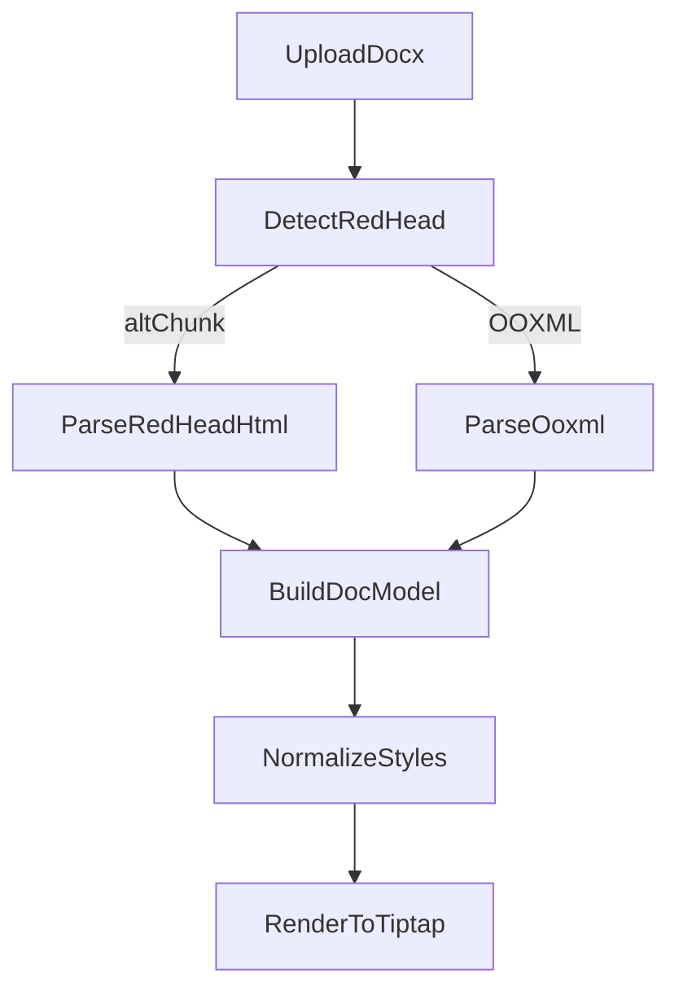

# 纯前端 99%+ 还原合并计划

## 目标与约束

- **目标**：导入 docx/WPS(docx) → Tiptap 可编辑 → 导出/预览一致，工程级 99%+。
- **约束**：纯前端、离线、Chromium；包体积增量可扩到 ~40MB；不引入大型 WASM。
- **重构范围**：`[e:\job-project\collabedit-fe\src\views\training\document](e:\job-project\collabedit-fe\src\views\training\document)` 可全量重构（导入链路、解析与样式、资源管理）。

---

## 现状评估（基于现有代码）

- 多解析器链路：`mammoth` / `docx-preview` / OOXML 解析混用，逻辑分散。
- HTML 清理与样式转换重复，导致还原不稳定。
- 图片使用 `data:image` 在浏览器触发 URL 长度/编码异常，导致 `ERR_INVALID_URL`。

关键入口：

- [e:\job-project\collabedit-fe\src\views\training\document\components\toolbar\StartToolbar.vue](e:\job-project\collabedit-fe\src\views\training\document\components\toolbar\StartToolbar.vue)
- [e:\job-project\collabedit-fe\src\views\training\document\utils\wordParser.ooxml.ts](e:\job-project\collabedit-fe\src\views\training\document\utils\wordParser.ooxml.ts)
- [e:\job-project\collabedit-fe\src\views\training\document\utils\wordParser.postprocess.ts](e:\job-project\collabedit-fe\src\views\training\document\utils\wordParser.postprocess.ts)
- [e:\job-project\collabedit-fe\src\views\training\document\utils\wordParser.redhead.ts](e:\job-project\collabedit-fe\src\views\training\document\utils\wordParser.redhead.ts)
- [e:\job-project\collabedit-fe\src\views\training\document\utils\wordParser.shared.ts](e:\job-project\collabedit-fe\src\views\training\document\utils\wordParser.shared.ts)

---

## 依赖策略

当前依赖已包含：`docx-preview`, `mammoth`, `jszip`, `fast-xml-parser`, `docx`。

允许新增（纯 JS，体积可控）：

- **docx4js**：作为结构解析补强（更完整的 OOXML 结构访问）[https://www.npmjs.com/package/docx4js](https://www.npmjs.com/package/docx4js)
- **@zip.js/zip.js**：处理 >10MB 文件的流式解压/低内存读取[https://gildas-lormeau.github.io/zip.js/api/index.html](https://gildas-lormeau.github.io/zip.js/api/index.html)

---

## 方案设计（统一结构化路径）

### 1) 统一解析为“结构模型 DocModel”

新增模块：`src/views/training/document/utils/docModel/*`

- `types.ts`：段落、Run、表格、图片、列表、页眉页脚、脚注/尾注、分节/分页
- `parser.ts`：OOXML → DocModel（支持 docx4js 作为结构补强）
- `serializer.ts`：DocModel → HTML（供 Tiptap 使用）

目的：避免 HTML 解析造成语义丢失，保证导入与导出一致。

### 2) 导入链路重构（去多重回退）

改造 [StartToolbar.vue](e:\job-project\collabedit-fe\src\views\training\document\components\toolbar\StartToolbar.vue)：

- 主路径：OOXML → DocModel → Tiptap
- `docx-preview` 仅作为“视觉比对/预览模式”，不作为编辑内容来源
- `mammoth` 仅作为兜底（极端异常）

### 3) 红头文件专项增强

扩展 [wordParser.redhead.ts](e:\job-project\collabedit-fe\src\views\training\document\utils\wordParser.redhead.ts)：

- altChunk 中提取红头元素（红头标题、红线、发文机关/字号）并映射到 DocModel/HTML
- 若 altChunk 不完整，回退到 OOXML 并合并页眉/正文样式

### 4) 图片资源管理（彻底解决 data:image）

新增 `ImageStore`：

- 导入期将图片转 `Blob URL`，编辑期只使用 blob
- 导出时再还原 base64 或写入 docx 媒体包
- 防止浏览器 `ERR_INVALID_URL`

### 5) 文本样式（字体/颜色/背景色）还原

- 补齐 `w:rPr`/`w:shd`/`w:color`/`w:highlight` 映射（run 级）
- 使用 `wordParser.shared.ts` 的字体回退链，确保未安装字体时的降级展示

### 6) 排版级样式与结构还原

- 段落对齐、缩进、行距、段前后、悬挂缩进
- 页眉页脚、页码、脚注/尾注、分节/分页
- 中文排版增强：`text-spacing-trim`、`hanging-punctuation`（带兼容性 fallback）

### 7) 表格/列表/标题增强

- `w:gridSpan / w:vMerge` → colspan/rowspan
- `w:num / w:abstractNum` → 有序/无序列表完整还原
- 标题识别优先 `w:outlineLvl + styleName`

### 8) 大文件处理（>10MB）

- `@zip.js/zip.js` 流式解压
- Worker 中分块解析 XML，避免一次性加载整包

---

## 执行步骤（可落地）

1. **引入 DocModel 结构**（新增目录与类型）
2. **统一解析管线**（docx4js/zip.js 接入，主链路 OOXML → DocModel → Tiptap）
3. **红头 altChunk + OOXML 合并**（公文头/红线/标题与正文样式）
4. **实现 ImageStore**（替换 data:image）
5. **补齐 run/段落/分页级样式**（字体/颜色/背景色/排版）
6. **补齐表格/列表/标题层级**
7. **完善导入导出一致性映射**
8. **大文件流式解析（可选但建议）**

---

## 验收与对比方式

- 导入对比：Word/WPS 与编辑器截图对比（红头、公文、字体、颜色、背景色、排版）
- 导出对比：导出 docx → Word/WPS 打开人工比对
- 重点指标：红头结构、字体/颜色/背景色、表格/列表、页眉页脚、分页分节

---

## 关键链路示意

