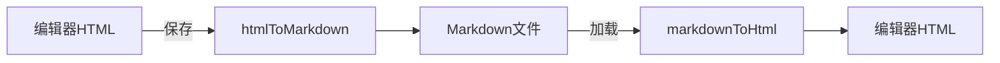

# 红头文件 Markdown 转换 100% 实现方案

## 问题分析

当前数据流：



**核心问题**：标准 Markdown 无法表示红头文件的特殊样式（红色文字、无边框表格、红色横线），导致转换时样式丢失。

## 解决方案：使用自定义标记块

### 设计原理

在 Markdown 中使用 **HTML 注释标记** 包裹完整的红头文件 HTML 代码：

```markdown
普通文本...

<!-- REDHEADER:standard -->

<完整的红头文件 HTML 代码>

<!-- /REDHEADER -->

继续正文...
```

**优势**：

- Markdown 原生支持 HTML 嵌入
- HTML 注释作为标记，不影响其他渲染
- 完整保留所有样式和结构
- 解析简单可靠，不依赖复杂正则

---

## 具体实现

### 1. 修改 htmlToMarkdown 函数 ([fileParser.ts](e:\job-project\collabedit-fe\src\views\template\editor\utils\fileParser.ts))

**核心逻辑**：检测红头文件特征，整块保留为带标记的 HTML

```typescript
// 红头文件特征检测正则
const RED_HEADER_PATTERN =
  /<h1[^>]*>[\s\S]*?<span[^>]*color[^>]*#ff0000[\s\S]*?<\/h1>[\s\S]*?<hr[^>]*(?:data-line-color|red-line)[^>]*>/i

// 如果检测到红头文件，提取并标记
function extractRedHeader(html: string): { header: string; rest: string } | null {
  // 查找红头文件区块（从开头到红色横线）
  const match = html.match(/^([\s\S]*?<hr[^>]*(?:data-line-color|class="[^"]*red)[^>]*\/?>)/i)
  if (match && match[1].includes('color') && match[1].includes('ff0000')) {
    return {
      header: match[1],
      rest: html.slice(match[0].length)
    }
  }
  return null
}

export const htmlToMarkdown = (htmlContent: string): string => {
  // 1. 检测并提取红头文件
  const redHeader = extractRedHeader(htmlContent)

  let result = ''
  let contentToConvert = htmlContent

  if (redHeader) {
    // 红头文件使用标记块保留完整 HTML
    result = `<!-- REDHEADER:standard -->\n${redHeader.header}\n<!-- /REDHEADER -->\n\n`
    contentToConvert = redHeader.rest
  }

  // 2. 转换剩余内容为标准 Markdown
  const markdown = convertToMarkdown(contentToConvert)

  return result + markdown
}
```

### 2. 修改 markdownToHtml 函数 ([MarkdownCollaborativeEditor.vue](e:\job-project\collabedit-fe\src\views\template\editor\MarkdownCollaborativeEditor.vue))

**核心逻辑**：识别红头文件标记，直接输出 HTML

```typescript
const markdownToHtml = (markdown: string): string => {
  if (isEmpty(markdown)) return ''

  // 1. 提取红头文件标记块
  const redHeaderPattern = /<!-- REDHEADER:(\w+) -->\n([\s\S]*?)\n<!-- \/REDHEADER -->/g
  const redHeaders: { placeholder: string; html: string }[] = []
  let index = 0

  let content = markdown.replace(redHeaderPattern, (_, type, html) => {
    const placeholder = `__REDHEADER_${index++}__`
    redHeaders.push({ placeholder, html: html.trim() })
    return placeholder
  })

  // 2. 转换剩余 Markdown 为 HTML
  let html = convertMarkdownToHtml(content)

  // 3. 还原红头文件 HTML
  redHeaders.forEach(({ placeholder, html: headerHtml }) => {
    html = html.replace(placeholder, headerHtml)
  })

  return html
}
```

### 3. 保存后的 Markdown 文件示例

```markdown
<!-- REDHEADER:standard -->
<p>000001</p>
<p>机密</p>
<p>特急</p>
<h1 style="text-align: center"><span style="color: #ff0000">XXXXXXX文件</span></h1>
<table style="width:100%;border:none;border-collapse:collapse;margin:8px 0 16px;">
  <tr style="border:none;">
    <td style="border:none;padding:0;background:transparent;"><p>XX〔2025〕01 号</p></td>
    <td style="border:none;padding:0;background:transparent;text-align:right;"><p style="text-align:right">签发人：</p></td>
  </tr>
</table>
<hr data-line-color="red" class="red-line">
<!-- /REDHEADER -->

## 正文标题

这里是正文内容...
```

---

## 需要修改的文件

| 文件 | 修改内容 |

|-----|---------|

| `fileParser.ts` | 重写 `htmlToMarkdown` 函数，添加红头文件检测和标记逻辑 |

| `MarkdownCollaborativeEditor.vue` | 重写 `markdownToHtml` 函数，添加红头文件标记解析逻辑 |

---

## 兼容性处理

对于已保存的旧文档（没有标记的纯 Markdown），保持现有解析逻辑作为降级处理。

```typescript
// 检查是否有红头文件标记
if (markdown.includes('<!-- REDHEADER:')) {
  // 新逻辑：解析标记块
} else {
  // 旧逻辑：尝试从纯文本还原（降级）
}
```
