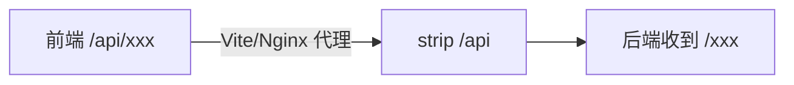
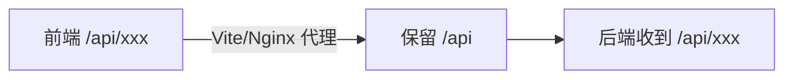
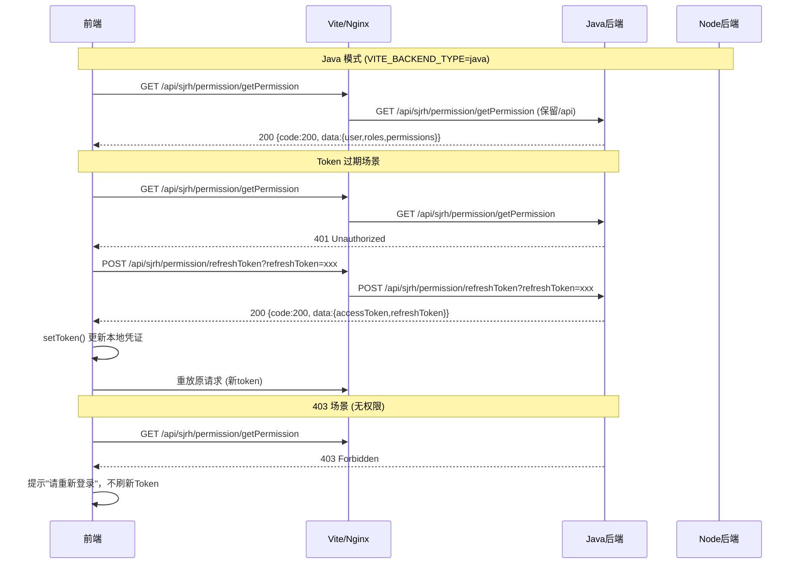

# 统一 /api 前缀与 Java 权限接口方案

## 一、当前架构问题



- 前端 `service.ts` / `javaService.ts` 的 baseURL 都是 `/api`
- Vite 代理和 Nginx 代理都会 **strip 掉 `/api**`，后端实际收到的是裸路径 `/xxx`
- 但现在 **Java 后端统一加了 `/api**`，strip 后就变成了 404

## 二、目标架构



- Java 后端已有 `/api` 前缀 -- 不再 strip
- Node 后端也统一加 `/api` 前缀 -- 不再 strip
- Vite 和 Nginx 代理 **透传 `/api**`，不做 rewrite

## 三、变更详情

### 3.1 前端 - Vite 代理 ([vite.config.ts](vite.config.ts))

**改动**：注释掉 rewrite 规则，保留 `/api` 前缀透传到后端。

```js
// 当前（strip /api）：
rewrite: (path) => path.replace(/^\/api/, ''),

// 改为（保留 /api）：
// rewrite: (path) => path.replace(/^\/api/, ''),  // 后端已统一 /api 前缀，无需 strip
```

### 3.2 前端 - Nginx ([nginx.conf](nginx.conf))

**改动**：`proxy_pass` 去掉尾部 `/`，保留 `/api` 前缀。

```nginx
# 当前（strip /api）：
proxy_pass http://java_backend/;

# 改为（保留 /api）：
proxy_pass http://java_backend;
```

### 3.3 前端 - Java Service 直连模式 ([src/config/axios/javaService.ts](src/config/axios/javaService.ts))

**改动**：直连模式 baseURL 加上 `/api` 后缀。

```js
// 当前：
return import.meta.env.VITE_JAVA_API_URL || 'http://192.168.20.199:8081'

// 改为：
return (import.meta.env.VITE_JAVA_API_URL || 'http://192.168.20.199:8081') + '/api'
```

### 3.4 前端 - 刷新 Token 逻辑（核心变更）([src/config/axios/service.ts](src/config/axios/service.ts))

**改动 1**：`refreshToken()` 函数根据 `VITE_BACKEND_TYPE` 使用不同的刷新接口。

```js
// 当前：
const refreshToken = async () => {
  axios.defaults.headers.common['tenant-id'] = getTenantId()
  return await axios.post(base_url + '/system/auth/refresh-token?refreshToken=' + getRefreshToken())
}

// 改为：
const backendType = import.meta.env.VITE_BACKEND_TYPE || 'node'
const REFRESH_TOKEN_URL: Record<string, string> = {
  java: '/sjrh/permission/refreshToken',
  node: '/system/auth/refresh-token'
}
const refreshToken = async () => {
  axios.defaults.headers.common['tenant-id'] = getTenantId()
  const refreshUrl = REFRESH_TOKEN_URL[backendType] || REFRESH_TOKEN_URL.node
  return await axios.post(base_url + refreshUrl + '?refreshToken=' + getRefreshToken())
}
```

Java 刷新接口返回格式 `{code:200, data:{accessToken:'...', refreshToken:'...'}}` 与现有 `setToken((await res).data.data)` 解构完全兼容，无需额外适配。

**改动 2**：响应拦截器 - 增加 body `code === 403` 处理（不刷新，提示重新登录）。

在现有 `code === 401` 分支之后添加：

```js
} else if (code === 403) {
  // 403：权限被拒绝，不尝试刷新，直接提示重新登录
  return handleAuthorized()
}
```

**改动 3**：错误拦截器 - 增加 HTTP 401 / 403 处理。

当前错误拦截器只显示消息。需要增加 HTTP 状态码判断：

```js
(error: AxiosError) => {
  const status = error.response?.status
  if (status === 401) {
    // HTTP 401：复用同样的刷新逻辑
    // 从 error.response 中提取 config，走 refreshToken 流程
    return handle401Error(error)
  }
  if (status === 403) {
    // HTTP 403：不刷新，直接提示重新登录
    return handleAuthorized()
  }
  // 其余错误保持原有逻辑
  ...
}
```

其中 `handle401Error` 复用已有的 isRefreshToken / requestList 队列机制，仅将触发来源从"body code 401"扩展到"HTTP status 401"。

### 3.5 前端 - Java Service 401/403 处理 ([src/config/axios/javaService.ts](src/config/axios/javaService.ts))

**改动**：在 `javaService` 的响应错误拦截器中，增加 HTTP 401/403 处理逻辑。

- HTTP 401：调用 Java 刷新接口 `/api/sjrh/permission/refreshToken`，成功后重试请求
- HTTP 403：提示"请重新登录"，不刷新
- 共享 `service.ts` 的刷新状态（`isRefreshToken` / `requestList`），避免两个 service 并发刷新冲突

为此，将刷新状态和核心逻辑提取到共享模块 `src/config/axios/refreshToken.ts`，供两个 service 共同使用。

### 3.6 前端 - 外部用户权限接口 ([src/store/modules/externalUser.ts](src/store/modules/externalUser.ts))

**改动**：Java 模式下使用真实权限接口路径。

```js
// 当前：
const USER_INFO_API: Record<string, string> = {
  java: '/system/auth/get-permission-info',
  node: '/system/auth/get-permission-info'
}

// 改为：
const USER_INFO_API: Record<string, string> = {
  java: '/sjrh/permission/getPermission',
  node: '/system/auth/get-permission-info'
}
```

Java 返回格式与 Node 一致（含 `user`, `roles`, `permissions`），现有 `adaptUserInfo` 适配器无需修改。

### 3.7 Node 后端 - 统一 /api 前缀 ([collabedit-node-backend/src/main.ts](collabedit-node-backend/src/main.ts))

**改动**：启用 apiRouter，所有路由统一挂载到 `/api` 下。

```js
// 注释掉平铺路由（第 22-31 行）
// app.use(authRoutes)
// app.use(tenantGuard)
// ...

// 取消注释 apiRouter（第 34-42 行）
const apiRouter = Router()
apiRouter.use(authRoutes)
apiRouter.use(tenantGuard)
apiRouter.use(authGuard)
apiRouter.use(trainingRoutes)
apiRouter.use(templateRoutes)
apiRouter.use(examRoutes)
apiRouter.use(dictRoutes)
app.use('/api', apiRouter)
```

### 3.8 Node 后端 - 修复遗留路由 ([collabedit-node-backend/src/routes/auth.ts](collabedit-node-backend/src/routes/auth.ts))

**改动**：旧接口 `/api/user/info` 路径已自带 `/api`，挂载到 apiRouter 后会变成 `/api/api/user/info`。需改为 `/user/info`。

```js
// 当前：
router.get('/api/user/info', authGuard, async (req, res) => { ... })

// 改为：
router.get('/user/info', authGuard, async (req, res) => { ... })
```

## 四、数据流总结



## 五、影响范围与风险

- `**.env` 文件：`VITE_API_URL=/api` 和 `VITE_BACKEND_TYPE` 无需修改，配置兼容
- **前端所有 API 调用路径**：由于 baseURL 仍是 `/api`，各业务接口的相对路径（如 `/getPlan/getPageList`）不变，代理透传后变为 `/api/getPlan/getPageList`，与 Node 后端 apiRouter 挂载后的路由一致
- **Node 后端**：所有路由自动加 `/api` 前缀，唯一需手动修复的是 `/api/user/info` 遗留路由
- **WebSocket**：走 `/ws` 代理，不受 `/api` 变更影响
