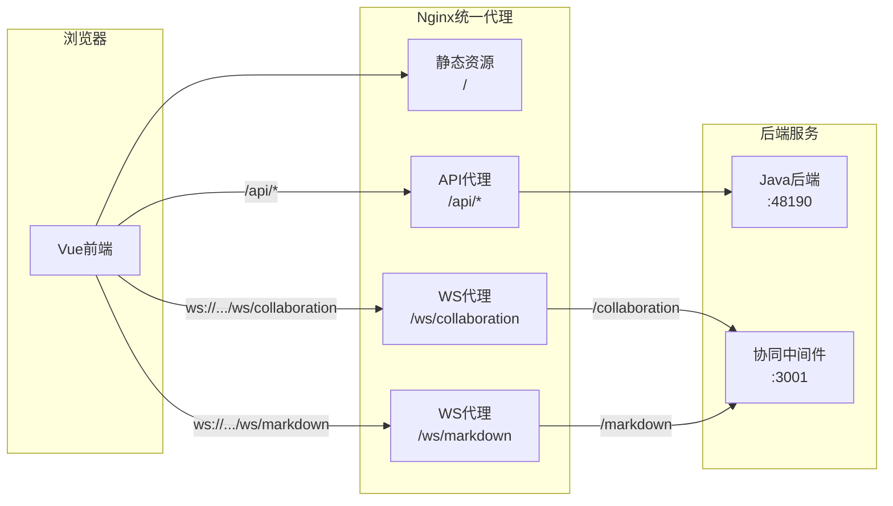
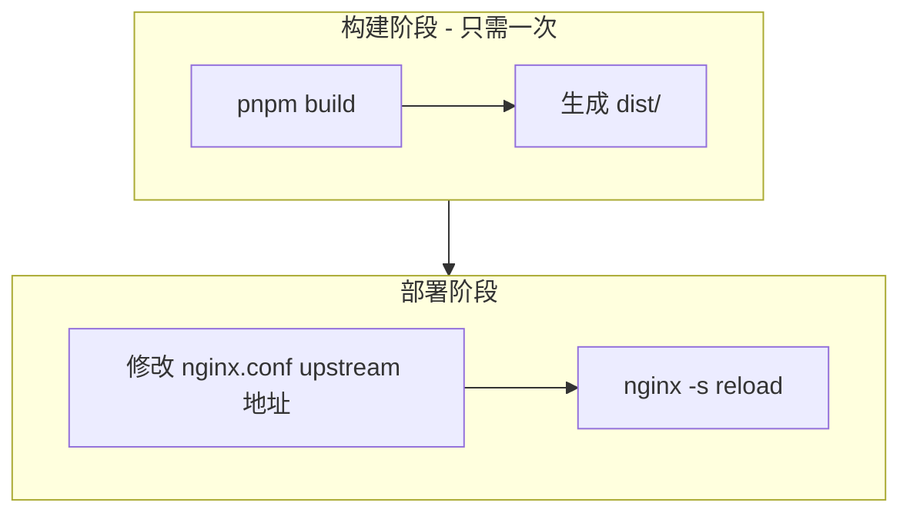

# WebSocket 相对路径与 Nginx 统一代理整合方案

## 一、方案目标

将 WebSocket 连接从硬编码的完整 URL 改为相对路径，通过 Nginx 统一代理前端静态资源、Java API 和 WebSocket 中间件，实现：

- **一次构建，多环境部署**：前端代码只需构建一次，部署时仅修改 Nginx 配置
- **统一入口**：所有请求通过 Nginx 代理，便于管理、监控和安全配置
- **HTTP/HTTPS 无缝切换**：WebSocket 自动根据页面协议选择 `ws://` 或 `wss://`

## 二、架构图



## 三、前端代码修改

### 3.1 通用 WebSocket URL 解析工具函数

在三个配置文件中都需要添加相对路径解析逻辑。建议抽取为一个通用函数：

```typescript
/**
 * 解析 WebSocket URL，支持相对路径
 * @param basePath 相对路径或完整 URL
 * @param suffix 路径后缀 (如 /collaboration, /markdown)
 */
const resolveWsUrl = (basePath: string, suffix: string): string => {
  // 如果是相对路径 (以 / 开头但不是 //)
  if (basePath.startsWith('/') && !basePath.startsWith('//')) {
    const protocol = window.location.protocol === 'https:' ? 'wss:' : 'ws:'
    const host = window.location.host
    const normalized = basePath.replace(/\/+$/, '')
    return `${protocol}//${host}${normalized}${suffix}`
  }

  // 完整 URL 格式
  const normalized = basePath.replace(/\/+$/, '')
  return normalized.endsWith(suffix) ? normalized : `${normalized}${suffix}`
}
```

### 3.2 修改文件清单

**文件 1: [src/lmHooks/useEditorConfig.ts](src/lmHooks/useEditorConfig.ts)**

当前代码 (第 60-67 行)：

```typescript
const getWsBaseUrl = (): string => {
  const envUrl = import.meta.env.VITE_WS_URL as string | undefined
  if (envUrl) {
    return envUrl.replace(/\/+$/, '')
  }
  return 'ws://localhost:3001'
}
```

修改为：

```typescript
const getWsBaseUrl = (): string => {
  const envUrl = import.meta.env.VITE_WS_URL as string | undefined
  if (!envUrl) {
    return 'ws://localhost:3001'
  }

  // 如果是相对路径，根据当前页面 host 动态构建完整 URL
  if (envUrl.startsWith('/') && !envUrl.startsWith('//')) {
    const protocol = window.location.protocol === 'https:' ? 'wss:' : 'ws:'
    const host = window.location.host
    return `${protocol}//${host}${envUrl.replace(/\/+$/, '')}`
  }

  return envUrl.replace(/\/+$/, '')
}
```

---

**文件 2: [src/views/training/document/config/editorConfig.ts](src/views/training/document/config/editorConfig.ts)**

当前代码 (第 24-28 行)：

```typescript
const resolveWsUrl = () => {
  const envUrl = (import.meta.env.VITE_WS_URL as string | undefined) || 'ws://localhost:3001'
  const normalized = envUrl.replace(/\/+$/, '')
  return normalized.endsWith('/collaboration') ? normalized : `${normalized}/collaboration`
}
```

修改为：

```typescript
const resolveWsUrl = () => {
  const envUrl = (import.meta.env.VITE_WS_URL as string | undefined) || 'ws://localhost:3001'

  // 如果是相对路径，根据当前页面 host 动态构建完整 URL
  if (envUrl.startsWith('/') && !envUrl.startsWith('//')) {
    const protocol = window.location.protocol === 'https:' ? 'wss:' : 'ws:'
    const host = window.location.host
    const basePath = envUrl.replace(/\/+$/, '')
    return `${protocol}//${host}${basePath}/collaboration`
  }

  // 兼容完整 URL 格式
  const normalized = envUrl.replace(/\/+$/, '')
  return normalized.endsWith('/collaboration') ? normalized : `${normalized}/collaboration`
}
```

---

**文件 3: [src/views/template/editor/config/markdownConfig.ts](src/views/template/editor/config/markdownConfig.ts)**

当前代码 (第 23-30 行)：

```typescript
const getWsBaseUrl = (): string => {
  const envUrl = import.meta.env.VITE_WS_URL
  if (envUrl) {
    return envUrl.endsWith('/') ? envUrl.slice(0, -1) : envUrl
  }
  return 'ws://localhost:3001'
}
```

修改为：

```typescript
const getWsBaseUrl = (): string => {
  const envUrl = import.meta.env.VITE_WS_URL

  // 如果是相对路径，根据当前页面 host 动态构建完整 URL
  if (envUrl?.startsWith('/') && !envUrl.startsWith('//')) {
    const protocol = window.location.protocol === 'https:' ? 'wss:' : 'ws:'
    const host = window.location.host
    return `${protocol}//${host}${envUrl.replace(/\/+$/, '')}`
  }

  if (envUrl) {
    return envUrl.endsWith('/') ? envUrl.slice(0, -1) : envUrl
  }
  return 'ws://localhost:3001'
}
```

---

**文件 4: `.env.prod`**

修改为相对路径：

```bash
# WebSocket - 使用相对路径，由 Nginx 代理
VITE_WS_URL=/ws
```

## 四、Nginx 配置

在项目根目录创建 [nginx.conf](nginx.conf)：

```nginx
# ==========================================
# 协同编辑平台 Nginx 配置
# 部署时只需修改以下 upstream 地址
# ==========================================

# === 后端服务地址配置（部署时修改这里）===
upstream java_backend {
    server 192.168.8.104:48190;  # Java 后端地址
    keepalive 32;
}

upstream ws_middleware {
    server 192.168.8.104:3001;   # WebSocket 中间件地址
    keepalive 32;
}

# === HTTP 服务配置 ===
server {
    listen 80;
    server_name localhost;

    # 前端静态资源
    root /usr/share/nginx/html;
    index index.html;

    # 开启 gzip 压缩
    gzip on;
    gzip_types text/plain text/css application/json application/javascript text/xml application/xml;
    gzip_min_length 1000;

    # 前端路由 - SPA 支持
    location / {
        try_files $uri $uri/ /index.html;

        # 静态资源缓存
        location ~* \.(js|css|png|jpg|jpeg|gif|ico|svg|woff|woff2|ttf|eot)$ {
            expires 1y;
            add_header Cache-Control "public, immutable";
        }
    }

    # Java API 代理
    location /api/ {
        proxy_pass http://java_backend/;
        proxy_http_version 1.1;
        proxy_set_header Host $host;
        proxy_set_header X-Real-IP $remote_addr;
        proxy_set_header X-Forwarded-For $proxy_add_x_forwarded_for;
        proxy_set_header X-Forwarded-Proto $scheme;

        proxy_connect_timeout 60s;
        proxy_send_timeout 60s;
        proxy_read_timeout 60s;

        client_max_body_size 100m;
    }

    # WebSocket 协同编辑代理 (Tiptap)
    location /ws/collaboration {
        proxy_pass http://ws_middleware/collaboration;
        proxy_http_version 1.1;

        proxy_set_header Upgrade $http_upgrade;
        proxy_set_header Connection "upgrade";
        proxy_set_header Host $host;
        proxy_set_header X-Real-IP $remote_addr;
        proxy_set_header X-Forwarded-For $proxy_add_x_forwarded_for;

        proxy_read_timeout 3600s;
        proxy_send_timeout 3600s;
    }

    # WebSocket Markdown 协同代理
    location /ws/markdown {
        proxy_pass http://ws_middleware/markdown;
        proxy_http_version 1.1;

        proxy_set_header Upgrade $http_upgrade;
        proxy_set_header Connection "upgrade";
        proxy_set_header Host $host;
        proxy_set_header X-Real-IP $remote_addr;
        proxy_set_header X-Forwarded-For $proxy_add_x_forwarded_for;

        proxy_read_timeout 3600s;
        proxy_send_timeout 3600s;
    }

    # 健康检查端点
    location /health {
        return 200 'OK';
        add_header Content-Type text/plain;
    }
}
```

## 五、HTTPS 配置（可选）

如需启用 HTTPS，添加以下配置：

```nginx
server {
    listen 443 ssl http2;
    server_name your-domain.com;

    ssl_certificate /etc/nginx/ssl/cert.pem;
    ssl_certificate_key /etc/nginx/ssl/key.pem;
    ssl_protocols TLSv1.2 TLSv1.3;
    ssl_ciphers HIGH:!aNULL:!MD5;

    # ... 其余配置与 HTTP 相同 ...
}

# HTTP 重定向到 HTTPS
server {
    listen 80;
    server_name your-domain.com;
    return 301 https://$server_name$request_uri;
}
```

## 六、Docker Compose 部署（可选）

创建 [docker-compose.yml](docker-compose.yml)：

```yaml
version: '3.8'

services:
  nginx:
    image: nginx:alpine
    ports:
      - '80:80'
      - '443:443'
    volumes:
      - ./dist:/usr/share/nginx/html:ro
      - ./nginx.conf:/etc/nginx/conf.d/default.conf:ro
      - ./ssl:/etc/nginx/ssl:ro
    depends_on:
      - middleware
    restart: unless-stopped

  middleware:
    build: ./collaborative-middleware
    environment:
      - NODE_ENV=production
      - COLLABORATIVE_MIDDLEWARE_PORT=3001
    restart: unless-stopped
```

## 七、路径映射关系

- `/` - 前端静态资源
- `/api/*` - 代理到 Java 后端 `http://java_backend/*`
- `/ws/collaboration` - 代理到 WebSocket 中间件 `ws://ws_middleware/collaboration`
- `/ws/markdown` - 代理到 WebSocket 中间件 `ws://ws_middleware/markdown`

## 八、部署流程



**每次部署到新环境只需**：

1. 修改 `nginx.conf` 中的 `upstream` 地址（java_backend 和 ws_middleware）
2. 执行 `nginx -s reload` 重载配置

## 九、兼容性说明

修改后的代码同时支持：

- **相对路径**：`VITE_WS_URL=/ws`（生产环境推荐，通过 Nginx 代理）
- **完整 URL**：`VITE_WS_URL=ws://192.168.8.104:3001`（开发环境或直连场景）

开发环境 `.env.local` 可继续使用完整 URL，生产环境 `.env.prod` 使用相对路径。
