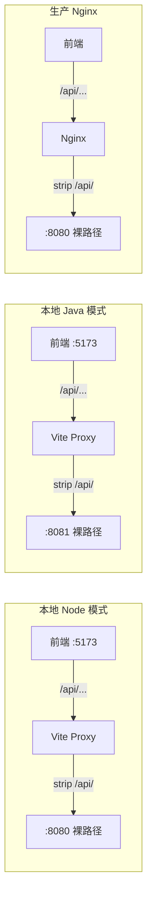

# 统一回滚：两端均无 /api + 注释备用方案

## 核心架构

两个后端都没有 `/api` 前缀，路由均为裸路径。`/api` 只是**前端代理层的路径标识**，Vite 和 Nginx 统一 strip 掉。



切换后端只需改 `VITE_BACKEND_TYPE` 一个变量。

---

## 1. Node 后端 - 恢复无 /api 前缀

### [main.ts](collabedit-node-backend/src/main.ts) - 移除 apiRouter，恢复平铺

```typescript
// 恢复为平铺结构（当前：Node 无 /api 前缀）
app.use(authRoutes)
app.use(tenantGuard)
app.use(authGuard)
app.use(trainingRoutes)
app.use(templateRoutes)
app.use(examRoutes)
app.use(dictRoutes)

// ===== 备用：如果需要 Node 所有路由统一 /api 前缀，取消下面注释并注释上面的平铺代码 =====
// const apiRouter = Router()
// apiRouter.use(authRoutes)
// apiRouter.use(tenantGuard)
// apiRouter.use(authGuard)
// apiRouter.use(trainingRoutes)
// apiRouter.use(templateRoutes)
// apiRouter.use(examRoutes)
// apiRouter.use(dictRoutes)
// app.use('/api', apiRouter)
```

### [auth.ts](collabedit-node-backend/src/routes/auth.ts) - 更新注释 + 旧接口路径

- 注释从 "注意：/api 前缀已由 main.ts 添加" 改为 "认证路由（无 /api 前缀）"
- `get-permission-info` 路由保持 `/system/auth/get-permission-info`（已正确）
- 旧接口 `/user/info` 恢复为 `/api/user/info`（向后兼容，原始定义就带 `/api`）

---

## 2. 前端 - Vite 代理统一 strip + 注释备用

### [vite.config.ts](collabedit-fe/vite.config.ts) 第 40-58 行

**关键变更**：proxy rewrite 始终 strip `/api/`（不再按 BACKEND_TYPE 条件判断），并增加 Java 有 /api 场景的注释备用代码：

```typescript
proxy: {
  '/api': {
    target: env.VITE_BACKEND_TYPE === 'node'
      ? (env.VITE_NODE_API_URL || 'http://localhost:8080')
      : (env.VITE_JAVA_API_URL || 'http://192.168.20.199:8081'),
    changeOrigin: true,
    // 如果后端接口路径不以 /api 开头，取消下面注释来重写路径
    // rewrite: (path) => path.replace(/^\/api/, ''),
    // ===== 当前：两端均无 /api 前缀，统一 strip =====
    rewrite: (path) => path.replace(/^\/api/, ''),
    // ===== 备用：如果 Java 后端有 /api 前缀（Java 不 strip，Node strip） =====
    // rewrite: env.VITE_BACKEND_TYPE === 'java'
    //   ? undefined
    //   : (path) => path.replace(/^\/api/, ''),
    configure: (proxy, options) => { ... }
  }
}
```

### [nginx.conf](collabedit-fe/nginx.conf) 第 44-46 行 - 恢复尾部 `/` + 注释备用

```nginx
    # Java API 代理（strip /api/ 前缀后转发，Java 后端路由无 /api）
    location /api/ {
        proxy_pass http://java_backend/;
        # 备用：如果 Java 后端有 /api 前缀，去掉尾部 / 保留 /api/ 前缀
        # proxy_pass http://java_backend;
```

### [javaService.ts](collabedit-fe/src/config/axios/javaService.ts) 第 30-31 行 - 移除 /api 后缀 + 注释备用

```typescript
// 直接请求后端（需后端配置 CORS）— Java 后端无 /api 前缀
return import.meta.env.VITE_JAVA_API_URL || 'http://192.168.20.199:8081'
// 备用：如果 Java 后端有 /api 前缀
// return (import.meta.env.VITE_JAVA_API_URL || 'http://192.168.20.199:8081') + '/api'
```

### [.env.local](collabedit-fe/.env.local) - Node 模式改为走代理

Node 也走 Vite 代理（`VITE_BASE_URL=''`），代理统一 strip `/api/`，切换后端只需改 `VITE_BACKEND_TYPE`：

```bash
# Node/Java 模式统一走 Vite 代理（代理会 strip /api/ 后转发到对应后端）
VITE_BASE_URL=''
# 备用：Node 直连模式（需同时设 VITE_API_URL 为空，否则请求带 /api 前缀 Node 无法匹配）
# VITE_BASE_URL='http://localhost:8080'
# VITE_API_URL=

VITE_API_URL=/api

# Java 后端地址（Java 后端路由无 /api 前缀）
VITE_JAVA_API_URL=http://192.168.20.199:8081
```

注释更新：移除所有提到 "Java 后端也有 /api" 的描述。

---

## 3. 回滚后的请求链路

```
本地 Node:  /api/system/auth/... → Vite strip /api/ → http://localhost:8080/system/auth/...
本地 Java:  /api/system/auth/... → Vite strip /api/ → http://192.168.20.199:8081/system/auth/...
生产 Nginx: /api/system/auth/... → Nginx strip /api/ → http://java_backend/system/auth/...
javaService直连: baseURL=http://192.168.20.199:8081 → /system/user/page（裸路径）
```

---

## 4. "Java 有 /api" 备用方案完整切换清单

如果开发环境的 Java 后端将来增加了 `/api` 前缀，只需按下表切换注释：

- **vite.config.ts** — 注释掉当前 `rewrite`，取消注释条件判断版（Java 不 strip，Node strip）
- **nginx.conf** — 注释掉 `proxy_pass http://java_backend/;`，取消注释 `proxy_pass http://java_backend;`（无尾部 `/`，保留 `/api/` 前缀）
- **javaService.ts** — 注释掉裸路径 return，取消注释带 `+ '/api'` 的 return
- **.env.local** — Java 有 /api 时可选直连：取消注释 `VITE_BASE_URL='http://192.168.20.199:8081'` + `VITE_API_URL=/api`（直连 Java），此时 base_url = `http://192.168.20.199:8081/api` 直达 Java 后端 /api 路由
- **Node main.ts** — 如果 Node 也需要 /api，取消注释 apiRouter 版本代码（当前方案中会保留为注释）

---

## 不需要改动的文件

- `.env.prod` / `.env.stage` / `.env.dev` — `VITE_BASE_URL=''`, `VITE_API_URL=/api` 已正确
- `externalUser.ts` — `USER_INFO_API` 路径 `/system/auth/get-permission-info` 是裸路径，拼上 `base_url=/api` 后由代理 strip 掉，正确
- `collaborationUser.ts` — nickname 逻辑不受影响
- `permission.ts` — 路由白名单不受影响
- `prisma/schema.prisma` — User 模型扩展不受影响
