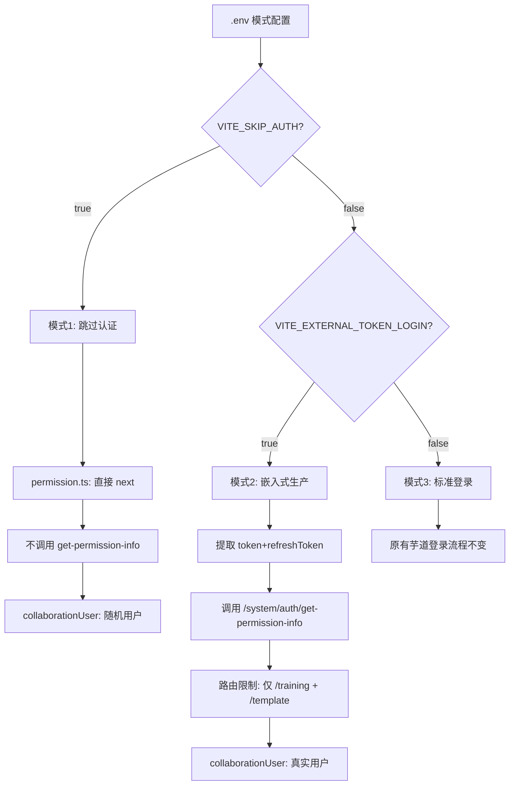

# 统一接口、路由限制与数据结构对齐方案

---

## 一、嵌入式模式路由限制

**文件**：[src/permission.ts](src/permission.ts)

**现状**：token 校验成功后 `next()` 放行所有页面。

**改动**：在外部Token模式的第 5 步（token 校验成功后），增加路由白名单判断。

```typescript
// 嵌入式模式下仅允许访问的路由前缀
const externalAllowedPaths = ['/training', '/template']

// 在 next() 之前增加判断
const isAllowed = externalAllowedPaths.some(prefix => to.path.startsWith(prefix))
if (!isAllowed) {
  ElMessageBox.alert('当前页面无访问权限，仅支持演训方案和模板管理', '访问受限', { ... })
  done(); loadDone(); return
}
next()
```

- `/training/performance`、`/training/editor/:id` -- 允许
- `/template/management`、`/template/editor/:id` -- 允许
- 其他所有页面 -- 弹窗阻止

---

## 二、统一 API 接口路径

**现状**：[src/store/modules/externalUser.ts](src/store/modules/externalUser.ts) 第 25-28 行根据 `VITE_BACKEND_TYPE` 映射不同接口：

```typescript
const USER_INFO_API = {
  java: '/system/auth/get-permission-info',
  node: '/api/user/info'
}
```

**改动**：两种后端统一使用 `/system/auth/get-permission-info`，移除 `USER_INFO_API` 映射：

```typescript
// 统一接口路径（Java 和 Node 后端均实现此接口）
const USER_INFO_API = '/system/auth/get-permission-info'
```

同时更新 `fetchUserInfo()` 中的调用和日志。

`VITE_BACKEND_TYPE` 环境变量保留，仅在 `adaptUserInfo()` 中用于兼容两种后端可能的格式差异。

---

## 三、数据结构对齐 userinfo.json

### 3.1 目标数据格式

```json
{
  "code": 0,
  "data": {
    "user": {
      "id": 1,
      "deptId": 2,
      "nickname": "admin",
      "username": "admin",
      "email": "admin@example.com",
      "avatar": "http://..."
    },
    "roles": ["common", "supper_admin"],
    "permissions": ["system:user:query", "..."],
    "buttons": ["..."],
    "menus": ["..."]
  }
}
```

### 3.2 前端 ExternalUserVO 扩展

**文件**：[src/store/modules/externalUser.ts](src/store/modules/externalUser.ts)

```typescript
export interface ExternalUserVO {
  id: string
  deptId: string // 新增
  nickname: string // 新增（替代 username 作为显示名）
  username: string
  email: string // 新增
  avatar: string // 新增
  roles: string[] // 新增
  permissions: string[]
}
```

移除 `level` 字段（无对应），改用 `roles` 表示用户角色。

`**adaptUserInfo()` 统一处理：由于 Java 和 Node 后端都返回相同的 `userinfo.json` 格式，可以简化为单一适配逻辑：

```typescript
const adaptUserInfo = (res: any): ExternalUserVO => {
  const user = res?.user || {}
  return {
    id: String(user.id || ''),
    deptId: String(user.deptId || ''),
    nickname: user.nickname || user.username || '未知用户',
    username: user.username || '',
    email: user.email || '',
    avatar: user.avatar || '',
    roles: res?.roles || [],
    permissions: res?.permissions || []
  }
}
```

保留 `backendType` 变量但简化 `adaptUserInfo` 为统一逻辑（两端格式一致）。

`**getUsername()` getter 适配：使用 `nickname` 作为显示名：

```typescript
getUsername(): string {
  return this.user?.nickname || this.user?.username || '未知用户'
}
```

移除 `getLevel()` getter，新增 `getRoles()` getter。

### 3.3 collaborationUser 适配

**文件**：[src/store/modules/collaborationUser.ts](src/store/modules/collaborationUser.ts)

当前第 155 行使用 `externalUser.username`，需改为 `externalUser.nickname`：

```typescript
name: externalUser.nickname || externalUser.username,
```

### 3.4 Node 后端新增接口

**文件**：[collabedit-node-backend/src/routes/auth.ts](e:/job-project/collabedit-node-backend/src/routes/auth.ts)

新增 `GET /system/auth/get-permission-info` 路由（在 `authGuard` 之前注册，路由本身加 `authGuard`）：

```typescript
router.get('/system/auth/get-permission-info', authGuard, async (req, res) => {
  const { userId, username } = req.auth!
  const user = await prisma.user.findUnique({
    where: { id: userId },
    select: { username: true, nickname: true, email: true, avatar: true, deptId: true }
  })
  return ok(res, {
    user: {
      id: userId,
      deptId: user?.deptId || null,
      nickname: user?.nickname || user?.username || username,
      username: user?.username || username,
      email: user?.email || '',
      avatar: user?.avatar || ''
    },
    roles: ['common'],
    permissions: ['read', 'write'],
    buttons: [],
    menus: []
  })
})
```

旧的 `/api/user/info` 路由保留作为向后兼容（可选择后续移除）。

### 3.5 Prisma User 模型扩展

**文件**：[collabedit-node-backend/prisma/schema.prisma](e:/job-project/collabedit-node-backend/prisma/schema.prisma)

User 模型新增字段（全部可选，不影响现有数据）：

```prisma
model User {
  id         String   @id @default(uuid())
  username   String   @unique
  password   String
  nickname   String?              // 新增：显示昵称
  email      String?              // 新增：邮箱
  avatar     String?              // 新增：头像URL
  deptId     String?  @map("dept_id")  // 新增：部门ID
  tenantId   String?  @map("tenant_id")
  status     String   @default("active")
  createdAt  DateTime @default(now()) @map("created_at")
  updatedAt  DateTime @updatedAt @map("updated_at")
  tokens     RefreshToken[]
}
```

需执行 `npx prisma migrate dev --name add-user-profile-fields` 生成迁移。

### 3.6 环境配置注释更新

**文件**：[.env.local](.env.local) / [.env.prod](.env.prod) / [.env.stage](.env.stage)

更新 `VITE_BACKEND_TYPE` 的注释，不再提及不同接口路径：

```bash
# 后端类型：java | node（统一使用 /system/auth/get-permission-info 接口）
```

---

## 四、不涉及改动

- **协同中间件** -- 无需改动，WebSocket 仍通过 userId/userName/deviceId 连接
- `**service.ts` / `javaService.ts**` -- 请求拦截器无需变动
- `**auth.ts`（前端工具） -- 无需变动

---

## 五、改动文件清单

### 前端 collabedit-fe（4 个文件 + 3 个 env 注释）

- `src/permission.ts` -- 路由白名单限制
- `src/store/modules/externalUser.ts` -- 统一接口 + 数据结构扩展
- `src/store/modules/collaborationUser.ts` -- nickname 适配
- `.env.local` / `.env.prod` / `.env.stage` -- 注释更新

### Node 后端 collabedit-node-backend（2 个文件 + 迁移）

- `src/routes/auth.ts` -- 新增 `/system/auth/get-permission-info` 接口
- `prisma/schema.prisma` -- User 模型扩展 4 个字段
- 数据库迁移 -- `prisma migrate dev`

### 协同中间件

- 无改动

---

## 六、模式兼容性验证


