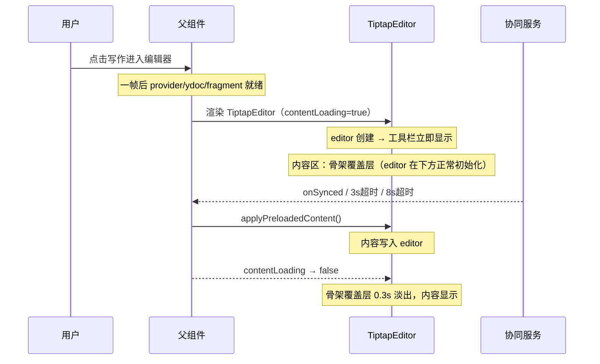

# 编辑器骨架屏加载优化方案（最终版）

## 现状分析

当前存在两层骨架屏，且都覆盖整个编辑器区域（包含工具栏位置）：

**第 1 层（删除）**：[TiptapCollaborativeEditor.vue](collabedit-fe/src/views/training/document/TiptapCollaborativeEditor.vue) 行 26-43

- 条件：`v-if="provider && ydoc && fragment"` 不满足时显示
- 经源码分析，`useCollaboration.ts` 的 `initCollaboration()` 中 ydoc/fragment/provider 三者是**同步创建**的（行 336-360），该骨架屏仅存在一个渲染帧，用户根本看不到，**可以删除**

**第 2 层（改造）**：[TiptapEditor.vue](collabedit-fe/src/views/training/document/components/TiptapEditor.vue) 行 12-14

- 条件：`loading || !editor`，editor 实例未创建时显示
- 覆盖整个内容区域（含工具栏位置）
- editor `onCreate` 后骨架消失，但此时内容仍为空（内容要等协同同步 + `applyPreloadedContent()` 完成才出现）

**核心问题**：骨架屏消失时机过早，导致编辑器出现**空白内容闪烁**。

## 修改方案

**原则**：删除父组件骨架屏层，所有骨架屏逻辑统一收敛到子组件 TiptapEditor，且仅覆盖内容区域，工具栏直接渲染。

### 修改 1：父组件 TiptapCollaborativeEditor.vue

**a) 新增 `isContentReady` 计算属性**（约行 375 附近）：

```typescript
// 内容是否真正加载完成（控制子组件骨架屏）
const isContentReady = computed(() => {
  // 预加载内容已应用（含"编辑器已有协同内容，跳过预加载"的情况）
  if (preloadedApplied.value) return true
  // 协同已同步 且 没有需要应用的预加载内容（空文档 / 仅靠协同同步的文档）
  if (isCollaborationSynced.value && !preloadedContent.value) return true
  return false
})
```

> 竞态安全：`onMounted` 中 `await parseFileContent()` 在 `initCollaboration()` 之前执行，`preloadedContent` 必定先于 sync 事件设置，无竞态风险。

**b) 修改模板**（行 26-43）：

将 `v-else` 的全区域骨架屏替换为空白占位容器，并给 TiptapEditor 传递 `contentLoading` prop：

```html
<!-- 改前 -->
<TiptapEditor v-if="provider && ydoc && fragment" ... :loading="false" ... />
<div v-else class="p-6 h-full">
  <el-skeleton :rows="12" animated />
</div>

<!-- 改后 -->
<TiptapEditor
  v-if="provider && ydoc && fragment"
  ...
  :loading="false"
  :content-loading="!isContentReady"
  ...
/>
<!-- provider/ydoc/fragment 同步创建，此处仅存在一帧，用空白占位即可 -->
<div v-else class="h-full bg-gray-100"></div>
```

### 修改 2：子组件 TiptapEditor.vue

**a) 新增 prop `contentLoading**`（在 defineProps 中）：

```typescript
contentLoading?: boolean  // 内容是否仍在加载中（由父组件控制）
```

**b) 工具栏：去掉 `loading` 条件**（行 5）：

```html
<!-- 改前 -->
<EditorToolbar v-if="editor && !loading && editable" :editor="editor" :save-status="saveStatus" />

<!-- 改后：editor 就绪即显示工具栏，不等待内容加载 -->
<EditorToolbar v-if="editor && editable" :editor="editor" :save-status="saveStatus" />
```

**c) 内容区域：从 v-if/v-else 改为"覆盖层 + 始终渲染"**（行 11-16+）：

```html
<!-- 改前 -->
<div class="tiptap-content-wrapper" ref="contentWrapperRef" @scroll="handleScroll">
  <div v-if="loading || !editor" class="p-6 h-full">
    <el-skeleton :rows="12" animated />
  </div>
  <template v-else>
    <div class="page-container"> ... </div>
  </template>
</div>

<!-- 改后 -->
<div class="tiptap-content-wrapper" ref="contentWrapperRef" @scroll="handleScroll">
  <!-- 内容加载骨架覆盖层（绝对定位，不影响编辑器初始化和内容接收） -->
  <Transition name="skeleton-fade">
    <div v-if="contentLoading || !editor" class="content-skeleton-overlay">
      <div class="a4-skeleton-box">
        <el-skeleton :rows="12" animated />
      </div>
    </div>
  </Transition>
  <!-- 编辑器内容（始终渲染，在覆盖层下方接收协同内容） -->
  <template v-if="editor">
    <div class="page-container"> ... (原有内容不变) </div>
  </template>
</div>
```

关键：编辑器 DOM 始终存在，协同内容可正常写入；骨架层仅做视觉遮盖。

**d) 回到顶部按钮：`!loading` 改为 `!contentLoading**`（行 149）：

```html
<!-- 改前 -->
<button v-show="showBackToTop && !loading" class="back-to-top-btn" ...>
  <!-- 改后：内容加载期间隐藏回到顶部按钮 -->
  <button v-show="showBackToTop && !contentLoading" class="back-to-top-btn" ...></button
></button>
```

> 由于 `loading` 原来始终为 `false`（父组件硬编码），此处行为不变。加入 `contentLoading` 后在内容加载期间也能正确隐藏（虽然覆盖层已遮挡，但保持逻辑一致）。

**e) 添加 CSS 样式**（在 `<style>` 中）：

```scss
// 补充：给 .tiptap-content-wrapper 添加 position: relative（当前未设置）
.tiptap-content-wrapper {
  position: relative; // 新增，作为覆盖层的定位上下文
  flex: 1;
  overflow-y: auto;
  overflow-x: auto;
  background: #e8eaed;
  // ... 其余样式不变
}

// 新增：内容骨架覆盖层
.content-skeleton-overlay {
  position: absolute;
  top: 0;
  left: 0;
  right: 0;
  bottom: 0;
  z-index: 10;
  background: #f3f4f6;
  overflow: hidden;
}
.a4-skeleton-box {
  max-width: 794px;
  margin: 24px auto;
  padding: 40px 60px;
  background: #fff;
  border-radius: 4px;
  box-shadow: 0 1px 3px rgba(0, 0, 0, 0.1);
}
.skeleton-fade-leave-active {
  transition: opacity 0.3s ease;
}
.skeleton-fade-leave-to {
  opacity: 0;
}
```

> z-index 层级关系：覆盖层 (10) < `.toolbar-content` (20) < `.back-to-top-btn` (100) < Element Plus 弹出层 (2000+)，互不冲突。

## 改后时序



## 安全保障（已内置，无需额外处理）

- **空文档**：`isCollaborationSynced && !preloadedContent` → `isContentReady = true` → 骨架正常消失
- **协同带来内容**：`applyPreloadedContent` 检测到非空 → `preloadedApplied = true` → 骨架消失
- **3s sync 超时**：`useCollaboration.ts` 行 470-480，连接建立但无 sync 事件时强制触发 `onSynced`
- **8s 安全超时**：`TiptapCollaborativeEditor.vue` 行 1138-1147，WebSocket 彻底连不上时兜底
- **用户误操作**：覆盖层默认阻止交互（`pointer-events: auto`），内容加载完成后才可编辑
