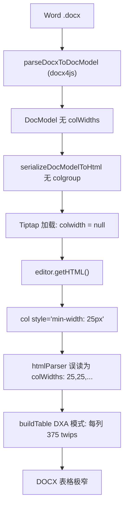

# 表格列宽保存失真根因修复

## 问题现象

编辑器中表格显示正常，但保存到 MinIO 后打开 DOCX 文件，表格极度窄小、文字挤压重叠。

## 根因分析（完整链路追踪）

问题由 **两阶段列宽丢失** 导致：

### 阶段 1：Word 导入时列宽丢失

- 默认导入路径使用 `docx4jsParser.ts`，其 `parseTableFromTree` 返回 `{ type: 'table', rows }` **不含 `colWidths`**
- DocModel 序列化为 HTML 时，无 `colWidths` → 不生成 `<colgroup>`
- HTML 加载到 Tiptap 后，单元格 `colwidth` 属性为 `null`

### 阶段 2：保存时 min-width 被误当作实际列宽（核心 Bug）

Tiptap 的 `createColGroup` 对没有 `colwidth` 的列输出 `<col style="min-width: 25px">`（25 = `cellMinWidth` 默认值），这只是 CSS 最小宽度约束——浏览器会根据内容自动分配列宽，所以编辑器中表格看起来正常。

但保存时，`[htmlParser.ts](collabedit-fe/src/views/training/document/utils/docModel/htmlParser.ts)` 第 432 行的优先级链：

```
return width || parsePxValue(colMap['min-width']) || parsePxValue(colMap['width']) || 0
```

将 `min-width: 25px` 解析为 `colWidths: [25, 25, ...]`。接着在 `buildTable` 中：

- `every(w => w > 0)` → `true`（25 > 0）
- 进入 DXA 模式：表格总宽 = 25 _ 15 _ N 列 = 极小值
- `columnWidths` = `[375, 375, ...]`（每列仅 375 twips ≈ 25px）
- 结果：Word/WPS 渲染出一个极窄的表格

### 为什么 `附件1.docx` 正常而 `宇视AI训练平台功能说明.docx` 有问题

- `附件1.docx` 可能走了 OOXML 路径（输出 `colwidth` 在 `<td>` 上），或其列宽碰巧被保留
- `宇视AI训练平台功能说明.docx` 走了 docx4js 路径，列宽在导入时丢失 → 全部变成 `min-width: 25px`



## 修复方案

### Fix 1: `htmlParser.ts` — 不再将 `min-width` 视为实际列宽

`[htmlParser.ts](collabedit-fe/src/views/training/document/utils/docModel/htmlParser.ts)` 第 432 行：

- **Before**: `return width || parsePxValue(colMap['min-width']) || parsePxValue(colMap['width']) || 0`
- **After**: `return width || parsePxValue(colMap['width']) || 0`

CSS `min-width` 语义是 "最小约束"，不是 "实际宽度"。Tiptap 仅对无存储宽度的列输出 `min-width`，移除后这些列返回 0。在 `buildTable` 中 `every(w > 0)` 判断为 `false` → 回退到百分比模式（100% 宽度），比极窄表格好得多。

### Fix 2: `serializer.ts` — 全零列宽时不输出 colgroup

`[serializer.ts](collabedit-fe/src/views/training/document/utils/docModel/serializer.ts)` 第 199 行：

- **Before**: `block.colWidths && block.colWidths.length`
- **After**: `block.colWidths?.length && block.colWidths.some(w => w > 0)`

当所有列宽为 0 时，输出 `<col style="width: 0px" width="0">` 无意义。改为仅在有实际宽度时输出 `<colgroup>`。`colwidth` 在 `<td>` 上的输出（第 214 行）已有 `widths.some(w => w > 0)` 守卫，无需额外修改。

### 已有修复保持不变

`[docModelToDocx.ts](collabedit-fe/src/views/training/document/utils/docModel/docModelToDocx.ts)` 中已完成的 `columnWidths` 参数传入和 `rowspanTracker` 追踪继续生效，当 `colWidths` 有效时正确传递给 `docx` 库。

## 回归影响评估

- **有显式列宽的表格**（如 `附件1.docx`）：`<col style="width: Xpx">` → 解析到 CSS `width` → 值不变 → 无影响
- **OOXML 路径导入的表格**：`<col style="width: Npx" width="N">` → HTML `width` 属性优先 → 无影响
- **无显式列宽的表格**：从"极窄表格"改善为"100% 宽度等列" → 显著改善
- **手动调整过列宽的表格**：Tiptap 存储 `colwidth` → 输出 `<col style="width: Xpx">` → 解析到 CSS `width` → 无影响
