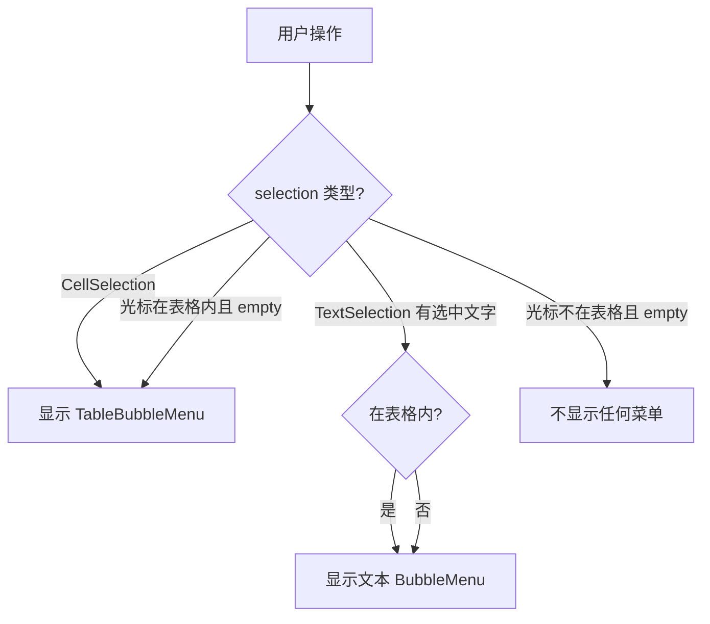
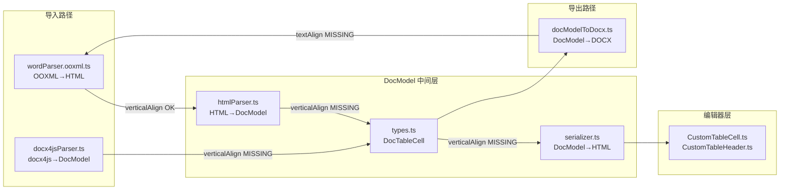

# 表格泡泡菜单 + 样式增强 + 合并单元格修复

---

## 一、表格基础样式增强（参考 Umo Editor）

### 1.1 表格 CSS 全面更新

**文件**: [TiptapEditor.vue](e:\job-project\collabedit-fe\src\views\training\document\components\TiptapEditor.vue) 第 1039-1062 行附近

参考 Umo Editor 的 `editor.less`，将编辑器内表格样式更新为：

```css
.tableWrapper {
  overflow-x: auto;
  max-width: 100%;
  margin: 1em 0;
}

table {
  border-collapse: collapse;
  table-layout: fixed;
  width: 100%;
  margin: 0;
  overflow: hidden;
}

table td,
table th {
  border: 1px solid #dee2e6;
  padding: 6px 10px;
  min-width: 1em;
  vertical-align: middle;
  box-sizing: border-box;
  position: relative;
}

table th {
  background: #f1f3f5;
  font-weight: 600;
}
```

**与当前的差异**:

- `table-layout: fixed` (当前无，支持 resizable 模式下更好的列宽控制)
- `overflow: hidden` (当前无)
- `vertical-align: middle` (当前为默认 baseline)
- `position: relative` on td/th (支持 selectedCell 伪元素)
- `box-sizing: border-box` (更精确的尺寸控制)
- `min-width: 1em` (当前 100px 太大，1em 更灵活)
- 边框颜色 `#dee2e6` (略深，更清晰)

### 1.2 selectedCell 选中高亮样式

ProseMirror 表格插件在选中单元格时自动添加 `.selectedCell` 类（包括多选、整行/列选中），添加：

```css
table .selectedCell::after {
  z-index: 2;
  position: absolute;
  content: '';
  left: 0;
  right: 0;
  top: 0;
  bottom: 0;
  background: rgba(200, 200, 255, 0.4);
  pointer-events: none;
}
```

> 颜色参考 Umo Editor 的 `--umo-content-table-selected-background`，比方案原来的 `rgba(59, 130, 246, 0.15)` 更明显。

### 1.3 column-resize-handle 拉动条样式

Tiptap Table `resizable: true` 会自动插入 `.column-resize-handle` 元素，需要添加：

```css
table .column-resize-handle {
  position: absolute;
  right: -1px;
  top: 0;
  bottom: -1px;
  width: 3px;
  background-color: #409eff;
  pointer-events: none;
}

.resize-cursor {
  cursor: col-resize;
}
```

### 1.4 Table 扩展配置更新

**文件**: [TiptapEditor.vue](e:\job-project\collabedit-fe\src\views\training\document\components\TiptapEditor.vue) 第 355-360 行

```typescript
Table.configure({
  resizable: true,
  allowTableNodeSelection: true,
}),
```

添加 `allowTableNodeSelection: true`，允许选中整个表格节点（与 Umo Editor 一致）。

---

## 二、TableBubbleMenu 浮动操作面板

### 2.1 新建 TableBubbleMenu.vue

**位置**: `e:\job-project\collabedit-fe\src\views\training\document\components\toolbar\TableBubbleMenu.vue`

**核心实现**:

- 使用 Tiptap `BubbleMenu` 组件（从 `@tiptap/vue-3` 导入）
- `shouldShow` 使用 `CellSelection` 检测（参考 Umo Editor）：

```typescript
import { CellSelection } from '@tiptap/pm/tables'

const shouldShowTableMenu = ({ editor, state }) => {
  if (!props.editable) return false
  const { selection } = state
  // 多单元格选中时显示表格菜单
  if (selection instanceof CellSelection) return true
  // 光标在表格内且无文本选中时也显示
  return editor.isActive('table') && selection.empty
}
```

- **布局**: 水平工具条，参考 Umo Editor / xg1.jpg 的按钮排列，包含分组：
  - 对齐方式（下拉）| 背景颜色（颜色面板）
  - 插入行(前) | 插入行(后) | 删除行
  - 插入列(左) | 插入列(右) | 删除列
  - 合并单元格 | 拆分单元格
  - 切换表头行 | 切换表头列 | 切换表头单元格
  - 删除表格
- **Tippy 配置**: `placement: 'top-start'`, `maxWidth: 'none'`, `offset: [0, 8]`
- **操作逻辑**: 全部复用 Tiptap editor commands（与 [TableToolbar.vue](e:\job-project\collabedit-fe\src\views\training\document\components\toolbar\TableToolbar.vue) 相同的 chain 调用），不抽取 composable（逻辑简单，直接调用即可）
- **样式**: 紧凑的图标+文字按钮，半透明白色背景 + 阴影，与 xg1.jpg 一致

### 2.2 智能切换：文本 BubbleMenu 与表格 BubbleMenu 互斥

**文件**: [TiptapEditor.vue](e:\job-project\collabedit-fe\src\views\training\document\components\TiptapEditor.vue) 第 479-487 行

当前文本 BubbleMenu 的 `shouldShow` 需要增加 CellSelection 排除：

```typescript
import { CellSelection } from '@tiptap/pm/tables'

shouldShow: ({ state }) => {
  if (!props.editable) return false
  const { selection } = state
  if (selection.empty) return false
  // CellSelection 时不显示文本菜单，交给表格菜单
  if (selection instanceof CellSelection) return false
  const isTextSelection = selection.$from.parent.isTextblock
  return isTextSelection
},
```

**切换逻辑总结**:



### 2.3 注册 TableBubbleMenu

**文件**: [TiptapEditor.vue](e:\job-project\collabedit-fe\src\views\training\document\components\TiptapEditor.vue)

- import `TableBubbleMenu` 组件
- 在 template 中编辑器区域内添加（与现有 BubbleMenu 并列）：

```vue
<TableBubbleMenu v-if="editor && editable" :editor="editor" :editable="editable" />
```

---

## 三、修复合并单元格丢失

### 3.1 根因确认

从 xg2.jpg 可以看到：Word 文档中左列有 `功能`、`基本信息`、`查看详情` 等合并单元格，但进入编辑器后合并丢失，每个单元格变成独立行。

链路分析：

- 保存到 MinIO 的 docx 文件**合并信息正确**（OOXML Enhanced 导出路径完整）
- 问题在**重新导入**：`parseFileContent` → `parseDocxToDocModel` 优先使用 **docx4js** 解析
- docx4js 将 OOXML 转为虚拟 HTML 树，但**可能不将 `w:gridSpan`/`w:vMerge` 转为 `colspan`/`rowspan` props**

### 3.2 方案 A：兼容 docx4js 属性命名 + vMerge 后处理

**文件**: [docx4jsParser.ts](e:\job-project\collabedit-fe\src\views\training\document\utils\docModel\docx4jsParser.ts) 第 564-568 行

1. 兼容多种属性命名：

```typescript
const getColspan = (props: any): number | undefined => {
  const val = props?.colspan ?? props?.colSpan ?? props?.gridSpan
  return val ? parseInt(String(val), 10) : undefined
}
const getRowspan = (props: any): number | undefined => {
  const val = props?.rowspan ?? props?.rowSpan
  return val ? parseInt(String(val), 10) : undefined
}
```

1. 如果 docx4js 保留了 `vMerge` 原始属性（`restart`/`continue` 模式），在 `parseTableFromTree` 结尾增加后处理：按列扫描，遇到 `vMerge: continue` 的单元格向上合并到 `vMerge: restart` 的起始单元格，计算实际 `rowspan` 并移除 continue 行的对应单元格。

### 3.3 方案 B（兜底）：docx4js 合并信息缺失时回退 OOXML Enhanced

**文件**: [parser.ts](e:\job-project\collabedit-fe\src\views\training\document\utils\docModel\parser.ts) 第 174-205 行

在 docx4js 解析成功后，检测返回的 DocModel 中表格是否缺少合并信息：

```typescript
function hasMergeCells(model: DocModel): boolean {
  return model.blocks.some(
    (b) =>
      b.type === 'table' &&
      b.rows.some((r) =>
        r.cells.some((c) => (c.colspan && c.colspan > 1) || (c.rowspan && c.rowspan > 1))
      )
  )
}
```

如果原始 docx 的表格有合并（通过 OOXML Enhanced 检测）但 docx4js 结果没有，则使用 OOXML Enhanced 的解析结果替换表格部分。

---

## 四、全链路表格属性一致性补全

全链路审查发现 3 处属性在保存→重新打开后丢失，需要在 7 个文件中同步修复。

### 属性流转全景图



### 4.1 补全 `verticalAlign` 全链路

**问题**: OOXML 解析器正确输出了 `vertical-align: center/top/bottom`，但从 htmlParser 开始就丢失了。

**修改 6 个文件**:

1. **[types.ts](e:\job-project\collabedit-fe\src\views\training\document\utils\docModel\types.ts)** 第 101-107 行 -- DocTableCell 加 `verticalAlign?: string`
2. **[htmlParser.ts](e:\job-project\collabedit-fe\src\views\training\document\utils\docModel\htmlParser.ts)** 第 414-421 行 -- parseTable 中解析 `cellStyleMap['vertical-align']`：

```typescript
cells.push({
  blocks,
  colspan: ...,
  rowspan: ...,
  backgroundColor: cellStyleMap['background-color'] || undefined,
  textAlign: cellStyleMap['text-align'] || undefined,
  verticalAlign: cellStyleMap['vertical-align'] || undefined  // 新增
})
```

1. **[serializer.ts](e:\job-project\collabedit-fe\src\views\training\document\utils\docModel\serializer.ts)** 第 224-226 行 -- 输出 `vertical-align`：

```typescript
if (cell.verticalAlign) styleParts.push(`vertical-align: ${cell.verticalAlign}`)
```

1. **[docModelToDocx.ts](e:\job-project\collabedit-fe\src\views\training\document\utils\docModel\docModelToDocx.ts)** 第 474-481 行 -- 传 `verticalAlign`：

```typescript
return new TableCell({
  ...,
  verticalAlign: cell.verticalAlign === 'middle' ? VerticalAlign.CENTER
    : cell.verticalAlign === 'bottom' ? VerticalAlign.BOTTOM
    : cell.verticalAlign === 'top' ? VerticalAlign.TOP
    : undefined
})
```

1. **[CustomTableCell.ts](e:\job-project\collabedit-fe\src\views\training\document\components\toolbar\extensions\CustomTableCell.ts)** 和 **[CustomTableHeader.ts](e:\job-project\collabedit-fe\src\views\training\document\components\toolbar\extensions\CustomTableHeader.ts)** -- 添加 `verticalAlign` 属性：

```typescript
verticalAlign: {
  default: null,
  parseHTML: (element) => element.style.verticalAlign || null,
  renderHTML: (attributes) => {
    if (!attributes.verticalAlign) return {}
    return { style: `vertical-align: ${attributes.verticalAlign}` }
  }
}
```

1. **[docx4jsParser.ts](e:\job-project\collabedit-fe\src\views\training\document\utils\docModel\docx4jsParser.ts)** 第 564-568 行 -- 尝试从 cellNode 获取 verticalAlign。

### 4.2 修复 `cell.textAlign` 在 DOCX 导出时丢失

**问题**: `DocTableCell.textAlign` 有值，但 `buildTable` 创建 DOCX TableCell 时完全忽略它。Tiptap 中单元格的 `text-align` 设置在 `<td style="text-align: center">` 上，内部段落不一定有 `align`。导出 DOCX 后对齐丢失。

**文件**: [docModelToDocx.ts](e:\job-project\collabedit-fe\src\views\training\document\utils\docModel\docModelToDocx.ts) `buildTable` 函数

**修复**: 在 `buildTable` 中，如果 `cell.textAlign` 有值且 cell 内部 block 没有显式 align，将 `cell.textAlign` 传播给内部段落：

```typescript
const cellAlign = cell.textAlign
const paragraphs = blocksToParagraphs(cell.blocks, cellAlign)
```

在 `blocksToParagraphs` / `buildParagraph` 中增加可选的 `defaultAlign` 参数，当 `block.style?.align` 未设置时使用 `defaultAlign`。

### 4.3 补全 docx4js 路径的单元格样式解析

**问题**: `parseTableFromTree` 只提取 `colspan`/`rowspan`，未提取 `backgroundColor`、`textAlign`、`verticalAlign`。

**文件**: [docx4jsParser.ts](e:\job-project\collabedit-fe\src\views\training\document\utils\docModel\docx4jsParser.ts) 第 564-568 行

**修复**: 从 cellNode 的 props 和 style 中提取更多属性：

```typescript
const getCellStyle = (cellNode: DocxTreeNode) => {
  const style = cellNode.props?.style || ''
  const styleMap = typeof style === 'string' ? parseStyleString(style) : {}
  return {
    backgroundColor: cellNode.props?.backgroundColor || styleMap['background-color'] || undefined,
    textAlign: cellNode.props?.textAlign || styleMap['text-align'] || undefined,
    verticalAlign: cellNode.props?.verticalAlign || styleMap['vertical-align'] || undefined
  }
}
```

---

## 五、修改文件清单（共 10 个文件）

- **新建** `TableBubbleMenu.vue` -- 表格浮动操作面板组件
- **修改** [types.ts](e:\job-project\collabedit-fe\src\views\training\document\utils\docModel\types.ts) -- DocTableCell 加 `verticalAlign` 字段
- **修改** [htmlParser.ts](e:\job-project\collabedit-fe\src\views\training\document\utils\docModel\htmlParser.ts) -- parseTable 解析 `vertical-align`
- **修改** [serializer.ts](e:\job-project\collabedit-fe\src\views\training\document\utils\docModel\serializer.ts) -- 输出 `vertical-align`
- **修改** [docModelToDocx.ts](e:\job-project\collabedit-fe\src\views\training\document\utils\docModel\docModelToDocx.ts) -- 导出 `verticalAlign` + 传播 `cell.textAlign` 给内部段落
- **修改** [CustomTableCell.ts](e:\job-project\collabedit-fe\src\views\training\document\components\toolbar\extensions\CustomTableCell.ts) -- 添加 `verticalAlign` 属性
- **修改** [CustomTableHeader.ts](e:\job-project\collabedit-fe\src\views\training\document\components\toolbar\extensions\CustomTableHeader.ts) -- 添加 `verticalAlign` 属性
- **修改** [docx4jsParser.ts](e:\job-project\collabedit-fe\src\views\training\document\utils\docModel\docx4jsParser.ts) -- 兼容 colspan/rowspan + vMerge 后处理 + 补充 backgroundColor/textAlign/verticalAlign 解析
- **修改** [parser.ts](e:\job-project\collabedit-fe\src\views\training\document\utils\docModel\parser.ts) -- 合并信息缺失时回退 OOXML Enhanced
- **修改** [TiptapEditor.vue](e:\job-project\collabedit-fe\src\views\training\document\components\TiptapEditor.vue) -- 引入 TableBubbleMenu + 更新全部表格 CSS + 修改文本 BubbleMenu shouldShow + Table 配置

## 六、实施顺序

1. **Phase 1 - 数据层修复**（确保数据不丢失）

- types.ts: 加 `verticalAlign` 字段
- docx4jsParser.ts: 兼容合并属性 + vMerge 后处理 + 补充单元格样式解析
- parser.ts: 合并信息缺失回退逻辑
- htmlParser.ts: 解析 `vertical-align`
- serializer.ts: 输出 `vertical-align`
- docModelToDocx.ts: 导出 `verticalAlign` + 传播 `cell.textAlign`

2. **Phase 2 - 编辑器扩展层**

- CustomTableCell.ts / CustomTableHeader.ts: 添加 `verticalAlign` 属性

3. **Phase 3 - UI 样式层**

- TiptapEditor.vue: 全面更新表格 CSS + Table 配置

4. **Phase 4 - 交互增强层**

- 新建 TableBubbleMenu.vue
- TiptapEditor.vue: 注册 TableBubbleMenu + 智能切换

5. **Phase 5 - 综合验证**

- 导入含合并单元格/垂直对齐/背景色/文本对齐的 DOCX → 编辑 → 保存 → 重新打开 → 验证所有属性一致
