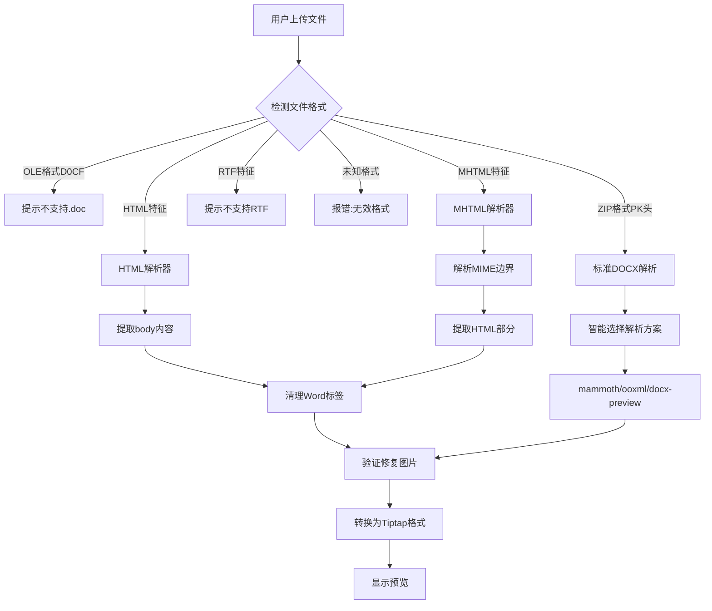

# 解决 DOCX 文件导入解析问题（综合方案）

本计划包含三个核心任务：

1. **解决假 DOCX 文件导入问题** - 支持 HTML/MHTML 格式的伪 docx 文件
2. **重构 wordParser 模块** - 消除代码重复，统一工具函数
3. **修复图片 ERR_INVALID_URL 错误** - 验证和修复 base64 图片数据

---

## 任务一：解决假 DOCX 文件导入问题

### 问题分析

当前系统存在一个关键缺陷：当用户上传的 `.docx` 文件实际上是 HTML/MHTML 格式（仅修改了文件后缀）时，系统会直接报错"无效的文件格式"。

**"假 docx"文件的常见类型**：

1. **纯 HTML 文件**：用户将网页另存为 .html 后直接改后缀为 .docx
2. **MHTML 格式**：Word/WPS "另存为网页" 生成的单文件网页格式（.mht/.mhtml）
3. **HTML Single File**：WPS Office 的 "Web 页面" 导出格式
4. **RTF 伪装**：某些 RTF 文件被改为 .docx 后缀

**当前代码问题**：

`StartToolbar.vue` 第 1102-1107 行直接拒绝非 ZIP 格式的文件：

```typescript
// 验证是否为有效的 .docx 格式
if (!isDocx) {
  ElMessage.error('无效的文件格式，请上传有效的 .docx 文件')
  return
}
```

### 解决方案

#### 1.1 新增文件格式检测函数

在 [wordParser.shared.ts](e:\job-project\collabedit-fe\src\views\training\document\utils\wordParser.shared.ts) 中添加：

```typescript
/**
 * 检测文件是否为 HTML 格式
 */
export const isHtmlFormat = (bytes: Uint8Array): boolean => {
  const decoder = new TextDecoder('utf-8', { fatal: false })
  const text = decoder.decode(bytes.slice(0, 1000)).trim()
  const cleanText = text.replace(/^\ufeff/, '')

  return (
    cleanText.startsWith('<!DOCTYPE') ||
    cleanText.startsWith('<html') ||
    cleanText.startsWith('<HTML') ||
    (cleanText.startsWith('<?xml') && cleanText.includes('<html'))
  )
}

/**
 * 检测文件是否为 MHTML 格式
 */
export const isMhtmlFormat = (bytes: Uint8Array): boolean => {
  const decoder = new TextDecoder('utf-8', { fatal: false })
  const text = decoder.decode(bytes.slice(0, 500))

  return (
    text.includes('MIME-Version:') ||
    text.includes('Content-Type: multipart/related') ||
    text.includes('Content-Type:multipart/related')
  )
}

/**
 * 检测文件是否为 RTF 格式
 */
export const isRtfFormat = (bytes: Uint8Array): boolean => {
  const decoder = new TextDecoder('ascii', { fatal: false })
  const text = decoder.decode(bytes.slice(0, 10))
  return text.startsWith('{\\rtf')
}
```

#### 1.2 新增 HTML/MHTML 解析模块

创建 [wordParser.html.ts](e:\job-project\collabedit-fe\src\views\training\document\utils\wordParser.html.ts)：

```typescript
import type { ParseProgressCallback } from './wordParser/types'
import { cleanWordHtml } from './wordParser.postprocess'

/**
 * 解析纯 HTML 格式的伪 docx 文件
 */
export async function parseHtmlDocument(
  arrayBuffer: ArrayBuffer,
  onProgress?: ParseProgressCallback
): Promise<string> {
  onProgress?.(30, '正在解析 HTML 内容...')

  const decoder = new TextDecoder('utf-8')
  let html = decoder.decode(arrayBuffer)

  // 移除 BOM
  html = html.replace(/^\ufeff/, '')

  // 提取 body 内容
  const bodyMatch = html.match(/<body[^>]*>([\s\S]*?)<\/body>/i)
  if (bodyMatch) {
    html = bodyMatch[1]
  }

  onProgress?.(60, '正在清理样式...')
  html = cleanWordHtmlTags(html)

  onProgress?.(90, '处理完成')
  return html
}

/**
 * 解析 MHTML 格式的伪 docx 文件
 */
export async function parseMhtmlDocument(
  arrayBuffer: ArrayBuffer,
  onProgress?: ParseProgressCallback
): Promise<string> {
  onProgress?.(20, '正在解析 MHTML 内容...')

  const decoder = new TextDecoder('utf-8')
  const content = decoder.decode(arrayBuffer)

  // 提取 HTML 部分
  const html = extractHtmlFromMhtml(content)

  onProgress?.(60, '正在优化内容...')
  return cleanWordHtmlTags(html)
}

/**
 * 从 MHTML 内容中提取 HTML
 */
function extractHtmlFromMhtml(mhtContent: string): string {
  // 尝试提取 HTML 部分
  const htmlMatch = mhtContent.match(
    /Content-Type:\s*text\/html[\s\S]*?\n\n([\s\S]*?)(?=------=|--=_NextPart|$)/i
  )

  if (htmlMatch) {
    let html = htmlMatch[1]

    // 检查编码
    const encodingMatch = mhtContent.match(/Content-Transfer-Encoding:\s*([\w-]+)/i)
    const encoding = encodingMatch ? encodingMatch[1].toLowerCase() : ''

    if (encoding === 'base64') {
      try {
        const cleanBase64 = html.replace(/\s/g, '')
        html = atob(cleanBase64)
      } catch (e) {
        console.warn('Base64 解码失败')
      }
    } else if (encoding === 'quoted-printable') {
      html = html
        .replace(/=\r?\n/g, '')
        .replace(/=([0-9A-F]{2})/gi, (_, hex) => String.fromCharCode(parseInt(hex, 16)))
    }

    // 提取 body
    const bodyMatch = html.match(/<body[^>]*>([\s\S]*?)<\/body>/i)
    if (bodyMatch) {
      return bodyMatch[1]
    }
    return html
  }

  // 直接查找 HTML 标签
  const directHtmlMatch = mhtContent.match(/<html[\s\S]*?<\/html>/i)
  if (directHtmlMatch) {
    const bodyMatch = directHtmlMatch[0].match(/<body[^>]*>([\s\S]*?)<\/body>/i)
    if (bodyMatch) {
      return bodyMatch[1]
    }
    return directHtmlMatch[0]
  }

  return mhtContent
}

/**
 * 清理 Word/WPS 特有的 HTML 标签和样式
 */
function cleanWordHtmlTags(html: string): string {
  // 移除 XML 声明
  html = html.replace(/<\?xml[^>]*\?>/gi, '')

  // 移除 Office 命名空间标签
  html = html.replace(/<o:[^>]*>[\s\S]*?<\/o:[^>]*>/gi, '')
  html = html.replace(/<v:[^>]*>[\s\S]*?<\/v:[^>]*>/gi, '')
  html = html.replace(/<w:[^>]*>[\s\S]*?<\/w:[^>]*>/gi, '')
  html = html.replace(/<m:[^>]*>[\s\S]*?<\/m:[^>]*>/gi, '')

  // 移除 mso-* 样式
  html = html.replace(/mso-[^;:"']+:[^;:"']+;?\s*/gi, '')

  // 移除 Word 特有的 class
  html = html.replace(/\s*class="Mso[^"]*"/gi, '')

  // 移除 xmlns 属性
  html = html.replace(/\s*xmlns[^=]*="[^"]*"/gi, '')

  // 移除注释
  html = html.replace(/<!--[\s\S]*?-->/g, '')

  // 清理空标签
  html = html.replace(/<span[^>]*>\s*<\/span>/gi, '')
  html = html.replace(/<p[^>]*>\s*<\/p>/gi, '')

  // 移除空的 style 属性
  html = html.replace(/\s*style="\s*"/gi, '')

  return html.trim()
}
```

#### 1.3 修改上传检测流程

修改 [StartToolbar.vue](e:\job-project\collabedit-fe\src\views\training\document\components\toolbar\StartToolbar.vue) 第 1086-1108 行。

---

## 任务二：重构 wordParser 模块

### 当前问题

经过分析，`wordParser` 模块存在大量代码重复：

**2.1 HTML 清理函数重复（4 个版本）**

| 文件                        | 函数                         | 行数    |
| --------------------------- | ---------------------------- | ------- |
| `wordParser/utils.ts`       | `cleanWordHtml`              | 83-106  |
| `wordParser.postprocess.ts` | `cleanWordHtml`              | 8-89    |
| `wordParser.redhead.ts`     | `cleanRedHeadHtml`           | 208-392 |
| `wordParser.preview.ts`     | `postProcessDocxPreviewHtml` | 113-282 |

**2.2 颜色处理函数重复（4 个版本）**

| 文件                        | 函数                                            |
| --------------------------- | ----------------------------------------------- |
| `wordParser.ooxml.ts`       | `normalizeHighlightColor`, `normalizeFillColor` |
| `wordParser.postprocess.ts` | `normalizeBgColor`                              |
| `wordParser.preview.ts`     | `normalizeInlineColor`                          |

**2.3 基础工具函数重复**

`wordParser.shared.ts` 和 `wordParser/utils.ts` 中重复定义：

- `base64ToUint8Array`
- `isZipFormat`
- `isDocFormat`
- `detectWordFormat`
- `escapeHtml`

### 重构方案

#### 2.1 统一基础工具函数

删除 `wordParser/utils.ts` 中的重复函数，统一从 `wordParser.shared.ts` 导入。

#### 2.2 统一颜色处理函数

在 `wordParser.shared.ts` 中添加统一的颜色规范化函数：

```typescript
/**
 * 统一的颜色规范化函数
 * 将各种颜色格式转换为标准 #RRGGBB 格式
 */
export const normalizeColor = (value: string): string => {
  const raw = value.trim()
  if (!raw) return ''

  const lowered = raw.toLowerCase()
  if (lowered === 'auto' || lowered === 'none' || lowered === 'transparent') return ''

  // 处理纯 6 位十六进制
  if (/^[0-9a-f]{6}$/i.test(raw)) return `#${raw.toUpperCase()}`

  // 处理纯 3 位十六进制
  if (/^[0-9a-f]{3}$/i.test(raw)) {
    return `#${raw[0]}${raw[0]}${raw[1]}${raw[1]}${raw[2]}${raw[2]}`.toUpperCase()
  }

  // 处理带 # 的十六进制
  if (raw.startsWith('#')) {
    if (raw.length === 4) {
      return `#${raw[1]}${raw[1]}${raw[2]}${raw[2]}${raw[3]}${raw[3]}`.toUpperCase()
    }
    return raw.toUpperCase()
  }

  // 处理 rgb() 格式
  const rgbMatch = raw.match(/rgb\((\d+),\s*(\d+),\s*(\d+)\)/i)
  if (rgbMatch) {
    const [, r, g, b] = rgbMatch.map((v) => parseInt(v, 10))
    return (
      '#' +
      [r, g, b]
        .map((x) => x.toString(16).padStart(2, '0'))
        .join('')
        .toUpperCase()
    )
  }

  // 处理命名颜色
  const namedColorMap: Record<string, string> = {
    yellow: '#FFFF00',
    green: '#00FF00',
    cyan: '#00FFFF',
    magenta: '#FF00FF',
    blue: '#0000FF',
    red: '#FF0000',
    darkblue: '#00008B',
    darkcyan: '#008B8B',
    darkgreen: '#006400',
    darkmagenta: '#8B008B',
    darkred: '#8B0000',
    darkyellow: '#808000',
    darkgray: '#A9A9A9',
    lightgray: '#D3D3D3',
    black: '#000000',
    white: '#FFFFFF'
  }

  return namedColorMap[lowered] || raw
}
```

---

## 任务三：修复图片 ERR_INVALID_URL 错误

### 问题分析

错误信息：

```
GET data:image/png;base64,iVBORw0KGgoAAAANS... net::ERR_INVALID_URL
```

**原因**：base64 图片数据有问题，被浏览器当作 URL 请求了。

可能的具体原因：

1. base64 数据包含换行符、空格等非法字符
2. base64 数据过长超过浏览器限制（Chrome 约 2MB）
3. 某些图片数据损坏

### 解决方案

在 `StartToolbar.vue` 赋值前添加图片验证函数：

```typescript
/**
 * 验证和修复图片 base64 数据
 */
const validateAndFixImages = (html: string): string => {
  return html.replace(
    /]*)src="data:image\/([^;]+);base64,([^"]*)"([^>]*)>/gi,
    (match, before, type, base64Data, after) => {
      // 1. 移除 base64 中的空白字符
      const cleanBase64 = base64Data.replace(/[\s\r\n]/g, '')

      // 2. 验证 base64 是否有效
      if (!/^[A-Za-z0-9+/=]+$/.test(cleanBase64)) {
        console.warn('无效的 base64 图片数据，已移除')
        return ``
      }

      // 3. 检查是否超过大小限制（约 1.5MB base64 字符）
      if (cleanBase64.length > 2000000) {
        console.warn('图片数据过大，可能导致显示问题')
      }

      return ``
    }
  )
}
```

---

## 数据流程图



---

## 涉及文件清单

| 文件                        | 修改类型 | 说明                               |
| --------------------------- | -------- | ---------------------------------- |
| `wordParser.shared.ts`      | 修改     | 新增格式检测函数、统一颜色处理函数 |
| `wordParser.html.ts`        | 新建     | HTML/MHTML 解析模块                |
| `StartToolbar.vue`          | 修改     | 增强上传检测流程、添加图片验证     |
| `wordParser/utils.ts`       | 修改     | 删除重复函数，改为导入             |
| `wordParser.ts`             | 修改     | 导出新模块                         |
| `wordParser.postprocess.ts` | 修改     | 引用统一的颜色函数                 |
| `wordParser.ooxml.ts`       | 修改     | 引用统一的颜色函数                 |

---

## 测试用例

1. **纯 HTML 文件改后缀**：上传一个 `.html` 文件改为 `.docx` 后缀
2. **Word 另存为网页**：使用 Word 另存为 "单个文件网页 (.mht)"
3. **WPS 导出网页**：使用 WPS 导出为 Web 页面格式
4. **标准 DOCX**：验证不影响正常 DOCX 解析
5. **包含大图片的文档**：验证图片能正确显示，不报 ERR_INVALID_URL
6. **包含特殊字符图片**：验证 base64 数据被正确清理
