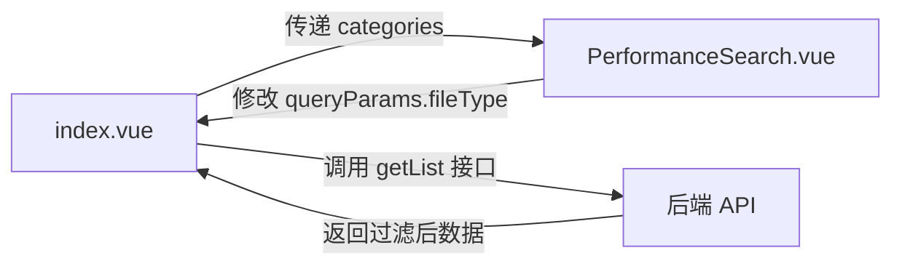

# 修改方案评估

## 需求概述

根据参考图片，需要：

1. **隐藏左侧文档分类侧边栏**（当前占据 4 列布局）
2. **在查询组件中添加"文档分类"下拉框**，位置在"所属学院"后面
3. **保持现有功能不变**：接口、数据流、查询逻辑保持一致
4. **不影响其他功能**：表格、标签页、操作按钮等功能完全不变

## 影响范围分析

### 1. 主页面修改 - `index.vue`

**需要修改的部分：**

- 布局结构：移除左侧 4 列的分类侧边栏（第 5-26 行）
- 主内容区：从 20 列调整为 24 列（全宽）
- 数据获取：保留 `getCategories()` 调用，因为查询组件需要这些数据
- 分类选择逻辑：移除 `handleCategorySelect` 方法（第 408-427 行）
- 数据传递：需要将 `categories` 数据传递给 `PerformanceSearch` 组件

**不需要修改的部分：**

- 所有查询参数（`queryParams`）
- 所有数据获取接口（`getList`, `getCategories` 等）
- 所有业务逻辑（审核、发布、删除等）
- 表格和对话框组件

### 2. 查询组件修改 - `PerformanceSearch.vue`

**需要添加的部分：**

- 新增 `fileType` 表单项（文档分类下拉框）
- 新增 `categories` prop，接收分类数据
- 在"所属学院"后面插入文档分类下拉框
- 重置逻辑中增加 `fileType` 的重置

**不需要修改的部分：**

- 现有的表单字段和验证逻辑
- 查询和重置事件的触发机制

## 详细修改计划

### 修改 1: `index.vue` 布局调整

**重要：将左侧分类栏代码注释，不要删除**

```vue
<!-- 注释掉第 4-26 行的左侧分类栏，使用 HTML 注释包裹 -->
<!-- 
<el-col :span="4" :xs="24" class="h-full">
  <ContentWrap class="category-wrap">
    ...左侧分类完整代码...
  </ContentWrap>
</el-col>
-->

<!-- 将主内容区从 :span="20" 改为 :span="24" -->
<el-row :gutter="20" class="h-full">
  <!-- 左侧分类栏 - 已注释，如需恢复请取消注释 -->
  <!-- <el-col :span="4">...</el-col> -->
  
  <el-col :span="24" :xs="24" class="h-full">
    <div class="h-full flex flex-col">
      <!-- 搜索栏 - 传递 categories -->
      <PerformanceSearch
        ref="searchRef"
        v-model="queryParams"
        :categories="categories"
        @search="handleQuery"
        @reset="resetQuery"
      />
      <!-- 其余内容保持不变 -->
    </div>
  </el-col>
</el-row>
```

### 修改 2: `index.vue` 脚本部分

**重要：使用 JavaScript 注释保留原有代码**

需要修改：

- 注释 `selectedCategory` 响应式变量（第 323 行）
  ```typescript
  // const selectedCategory = ref('0') // 已注释：改为下拉框方式，如需恢复请取消注释
  ```
- 注释 `handleCategorySelect` 方法（第 408-427 行）
  ```typescript
  // 文档分类选择 - 已注释：改为下拉框方式
  // const handleCategorySelect = (index: string) => {
  //   selectedCategory.value = index
  //   ...完整方法代码...
  // }
  ```
- 修改 `resetQuery` 方法中的分类重置逻辑（第 399-405 行）
  ```typescript
  const resetQuery = () => {
    searchRef.value?.resetFields()
    // selectedCategory.value = '0' // 已注释：改为下拉框方式
    queryParams.fileType = undefined // 保持此行
    activeTab.value = 'recent'
    handleQuery()
  }
  ```

保持不变：

- `categories` 数据和 `getCategories()` 方法
- `queryParams.fileType` 参数（查询组件直接修改）

### 修改 3: `PerformanceSearch.vue` 组件

在"所属学院"表单项后面添加文档分类：

```vue
<el-form-item label="所属学院" prop="collegeCode">
  <!-- 现有的所属学院下拉框 -->
</el-form-item>

<!-- 新增：文档分类 -->
<el-form-item label="文档分类" prop="fileType">
  <el-select
    v-model="localParams.fileType"
    placeholder="请选择"
    clearable
    class="!w-260px"
  >
    <el-option
      v-for="item in fileTypeOptions"
      :key="item.value"
      :label="item.label"
      :value="item.label"
    />
  </el-select>
</el-form-item>
```

Props 接收：

```typescript
interface Props {
  modelValue: TrainingPerformancePageReqVO
  categories: DocCategoryVO[] // 新增
}
```

计算属性：

```typescript
// 过滤掉"全部"选项
const fileTypeOptions = computed(() => {
  return props.categories.filter((item) => item.value !== '0')
})
```

## 数据流说明



当前数据流：

1. `index.vue` 调用 `getCategories()` 获取分类数据
2. 分类数据传递给 `PerformanceSearch` 组件
3. 用户在查询组件中选择分类，直接修改 `queryParams.fileType`
4. 点击查询按钮，触发 `getList()` 接口，传递 `fileType` 参数
5. 后端根据 `fileType` 过滤数据并返回

## 风险评估

### 低风险

- ✅ 接口不变：`queryParams.fileType` 参数名称保持一致
- ✅ 数据格式不变：仍然使用 `label` 作为查询值
- ✅ 业务逻辑不变：只是 UI 位置调整

### 注意事项

1. **样式调整**：移除左侧分类栏后，主内容区宽度变大，需确保表格显示正常
2. **重置逻辑**：确保重置按钮同时重置文档分类下拉框
3. **数据传递**：`categories` 数据需要从父组件传递到子组件
4. **代码保留原则**：所有被替换或移除的代码必须使用注释保留，不要删除。这样后续如果需要改回来可以快速恢复

## 测试要点

1. ✅ 查询功能：选择文档分类后查询，验证数据过滤正确
2. ✅ 重置功能：点击重置按钮，验证文档分类下拉框清空
3. ✅ 组合查询：文档分类与其他条件组合查询
4. ✅ 表格显示：验证移除左侧栏后表格布局正常
5. ✅ 响应式布局：验证不同屏幕尺寸下的显示效果

## 相关文件

- `[index.vue](e:\job-project\collabedit-fe\src\views\training\performance\index.vue)` - 主页面，需要调整布局和数据传递
- `[PerformanceSearch.vue](e:\job-project\collabedit-fe\src\views\training\performance\components\PerformanceSearch.vue)` - 查询组件，需要添加文档分类下拉框
- `[categories.ts](e:\job-project\collabedit-fe\src\views\training\performance\config\categories.ts)` - 分类配置（如果存在）

## 实施步骤总结

1. 修改 `index.vue` 布局结构（**注释**左侧分类栏，不删除）
2. 修改 `index.vue` 数据传递（添加 categories prop）
3. 修改 `index.vue` 脚本逻辑（**注释**分类选择方法和变量，不删除）
4. 修改 `PerformanceSearch.vue` 添加文档分类下拉框
5. 调整样式确保布局美观（**注释**旧样式，不删除）
6. 测试所有查询功能

**代码保留原则：所有修改都采用注释方式保留原有代码，方便后续恢复**
